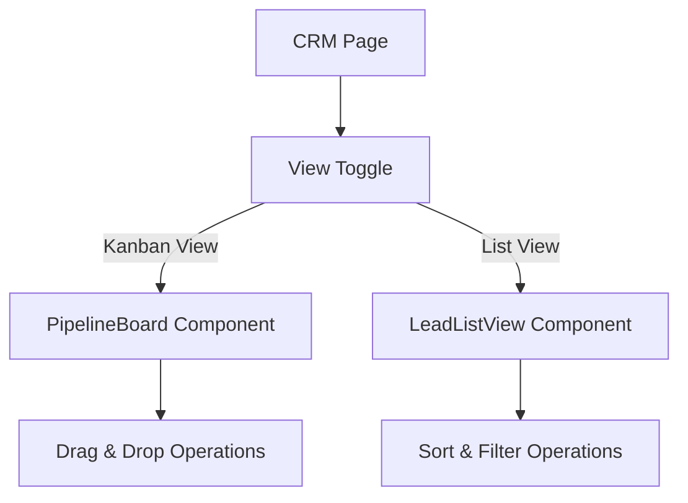
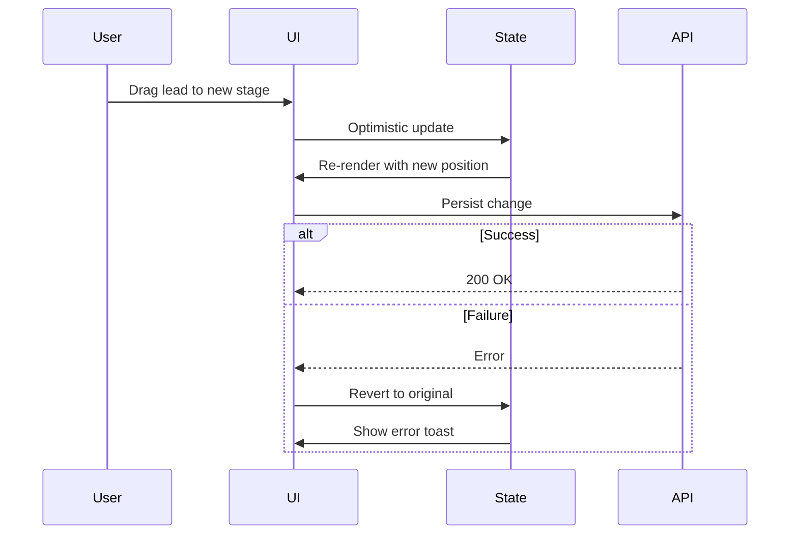

# CRM Dashboard Enhancement Plan

## Overview
This plan outlines the enhancements to the existing CRM dashboard to provide a professional, feature-rich lead management experience with both Kanban and List views.

## Current State Analysis

### Existing Components
- **CRM Page** (`src/app/crm/page.tsx`): Main CRM interface with pipeline selection
- **PipelineBoard** (`src/components/crm/PipelineBoard.tsx`): Kanban board with drag-and-drop
- **LeadModal** (`src/components/crm/LeadModal.tsx`): Form for adding/editing leads
- **AppShell** (`src/components/AppShell.tsx`): Navigation and branding header

### Existing Features
✅ Pipeline-based lead organization
✅ Drag-and-drop lead movement across stages
✅ Lead CRUD operations
✅ Lead list management
✅ Basic modal form with fields

### Gaps to Address
❌ No list view option
❌ Limited sorting capabilities
❌ No filtering functionality
❌ Basic input validation
❌ Relies on refreshKey for updates (not truly instant)
❌ Limited visual feedback during operations

## Enhancement Architecture

### 1. View Toggle System
**Location**: Near pipeline selector dropdown in CRM page header

**Component**: `ViewToggle` (new)
- Toggle between Kanban (board) and List (table) views
- Persist view preference in localStorage
- Smooth transition animations between views



### 2. LeadListView Component
**File**: `src/components/crm/LeadListView.tsx`

**Features**:
- Tabular display of all leads in selected pipeline
- Sortable columns (name, company, value, status, stage, created date)
- Filterable by status, stage, source, tags
- Inline editing capabilities
- Bulk actions (optional future enhancement)
- Responsive design (horizontal scroll on mobile)

**Column Structure**:
| Column | Type | Sortable | Filterable |
|--------|------|----------|------------|
| Name | String | ✅ | ✅ (text search) |
| Company | String | ✅ | ✅ (text search) |
| Email | String | ✅ | ✅ (text search) |
| Status | Select | ✅ | ✅ (dropdown) |
| Stage | Select | ✅ | ✅ (dropdown) |
| Value | Currency | ✅ | ✅ (range) |
| Source | String | ✅ | ✅ (dropdown) |
| Tags | Array | - | ✅ (multi-select) |
| Actions | Buttons | - | - |

### 3. Enhanced LeadModal
**File**: `src/components/crm/LeadModal.tsx` (enhance existing)

**Validation Enhancements**:
- Real-time email format validation
- Phone number format validation
- Required field validation with visual feedback
- Minimum/maximum value constraints for deal value
- Duplicate lead detection (email uniqueness)
- Character limits for text fields

**UX Improvements**:
- Auto-save draft functionality (localStorage)
- Clear error messages with field highlighting
- Loading states during API calls
- Success animations on save

### 4. Optimistic Updates
**Implementation Strategy**:
- Update local state immediately on user action
- Revert on API failure with error notification
- Use React's `useOptimistic` hook or custom implementation
- Maintain data consistency across views

**Flow**:


### 5. Enhanced Drag-and-Drop
**Visual Feedback**:
- Highlight drop zones during drag
- Show ghost element with lead preview
- Smooth animations for card movement
- Loading indicators during API calls

**Improvements**:
- Better touch support for mobile devices
- Keyboard accessibility (arrow keys to move)
- Prevent invalid drops (e.g., wrong pipeline)

## Implementation Details

### File Structure
```
src/
├── app/
│   └── crm/
│       └── page.tsx (enhance - add view toggle)
├── components/
│   └── crm/
│       ├── PipelineBoard.tsx (enhance - add optimistic updates)
│       ├── LeadModal.tsx (enhance - add validation)
│       ├── LeadListView.tsx (new)
│       └── ViewToggle.tsx (new)
└── lib/
    └── crm-utils.ts (new - shared utilities)
```

### State Management
**CRM Page State**:
```typescript
interface CRMPageState {
  pipelines: Pipeline[];
  selectedPipeline: Pipeline | null;
  leads: Lead[];
  viewMode: 'kanban' | 'list';
  sortConfig: { field: string; direction: 'asc' | 'desc' };
  filterConfig: FilterConfig;
}
```

### API Considerations
All existing API endpoints are sufficient:
- `GET /api/leads?pipelineId={id}` - Fetch leads
- `POST /api/leads` - Create lead
- `PUT /api/leads/{id}` - Update lead
- `DELETE /api/leads/{id}` - Delete lead

**Potential Enhancements**:
- Add pagination for large datasets
- Add batch update endpoint for bulk operations

## Design Specifications

### Color Scheme (Material Design 3)
- Primary: `#6750A4` (Secondary color in theme)
- Surface: `#FDF7FF`
- Surface Container: `#F3EDF7`
- Error: `#B3261E`
- Success: `#386A20`

### Typography
- Display: Large headings (32px)
- Headline: Section headings (24px)
- Title: Card titles (16px)
- Body: Content text (14px)
- Label: Small labels (12px)

### Spacing
- Card padding: 16px
- Gap between items: 8px (small), 16px (medium), 24px (large)
- Section margins: 24px

### Responsive Breakpoints
- Mobile: < 768px
- Tablet: 768px - 1024px
- Desktop: > 1024px

## Testing Strategy

### Unit Tests
- LeadListView rendering
- Sorting logic
- Filtering logic
- Validation functions
- Optimistic update rollback

### Integration Tests
- View toggle functionality
- Drag-and-drop operations
- Form submission with validation
- API error handling

### E2E Tests
- Complete lead creation flow
- Lead movement across stages
- View switching and data persistence
- Filter application and clearing

## Performance Considerations

### Optimization Techniques
- Virtual scrolling for large lead lists (100+ leads)
- Debounced search input (300ms)
- Memoized sort/filter computations
- Lazy loading of lead details

### Bundle Size
- Keep LeadListView under 50KB gzipped
- Use tree-shaking for unused utilities
- Code-split modal components

## Accessibility

### WCAG 2.1 AA Compliance
- Keyboard navigation for all interactive elements
- ARIA labels for icons and buttons
- Focus indicators on all focusable elements
- Color contrast ratio ≥ 4.5:1
- Screen reader announcements for state changes

### Keyboard Shortcuts
- `Ctrl/Cmd + K`: Toggle view
- `Ctrl/Cmd + F`: Focus filter input
- `Escape`: Close modals
- `Enter`: Submit forms

## Migration Path

### Phase 1: Core Components
1. Create LeadListView component
2. Create ViewToggle component
3. Integrate view toggle in CRM page

### Phase 2: Functionality
4. Implement sorting in LeadListView
5. Implement filtering in LeadListView
6. Add optimistic updates

### Phase 3: Polish
7. Enhance LeadModal validation
8. Improve drag-and-drop feedback
9. Add animations and transitions

### Phase 4: Testing & Refinement
10. Write tests
11. Fix bugs
12. Performance optimization

## Success Criteria

### Functional Requirements
✅ Users can toggle between Kanban and List views
✅ List view supports sorting by all columns
✅ List view supports filtering by status, stage, source, tags
✅ Lead modal validates all inputs with clear error messages
✅ Drag-and-drop provides instant visual feedback
✅ All operations update the UI immediately (optimistic updates)

### Non-Functional Requirements
✅ Page load time < 2 seconds
✅ Drag-and-drop animation < 300ms
✅ Filter application < 500ms
✅ Works on mobile devices (iOS Safari, Chrome Mobile)
✅ Passes accessibility audit (Lighthouse score > 90)

## Future Enhancements (Out of Scope)

- Advanced analytics dashboard
- Export leads to CSV/PDF
- Email integration (send emails from lead card)
- Calendar integration (schedule follow-ups)
- Lead scoring system
- Automated lead assignment rules
- Custom fields support
- Activity timeline for each lead
- Team collaboration features (comments, mentions)

## Dependencies

### Existing Dependencies
- `@hello-pangea/dnd` - Drag and drop
- `next-auth` - Authentication
- `prisma` - Database ORM
- `lucide-react` - Icons

### Potential New Dependencies
- `date-fns` - Date formatting (if needed)
- `react-table` - Advanced table features (optional)
- `zod` - Schema validation (optional, for stricter validation)

## Risks & Mitigations

### Risk 1: Performance with large datasets
**Mitigation**: Implement virtual scrolling and pagination

### Risk 2: State synchronization issues
**Mitigation**: Use single source of truth with proper state management

### Risk 3: Mobile drag-and-drop usability
**Mitigation**: Add touch-friendly controls and fallback to tap-to-move

### Risk 4: Complex filtering logic bugs
**Mitigation**: Write comprehensive unit tests for filter combinations

## Timeline

- Phase 1: 2-3 days
- Phase 2: 2-3 days
- Phase 3: 1-2 days
- Phase 4: 2-3 days

**Total Estimated Effort**: 7-11 days

## Conclusion

This enhancement plan transforms the existing CRM into a professional, feature-rich lead management system that provides users with flexibility (Kanban/List views), efficiency (sorting/filtering), and confidence (validation/instant feedback). The implementation follows React best practices, maintains accessibility standards, and ensures a smooth user experience across all devices.
