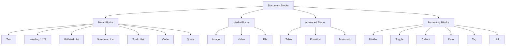

# Document Blocks Enhancement Plan

## Overview
This plan details the implementation of additional Notion-like document blocks for the page editor at `/pages/[id]`.

## Current State
The page editor currently supports these block types:
- Text
- Heading 1, 2, 3
- Bulleted List
- Numbered List
- To-do List
- Code
- Quote

## New Blocks to Implement

### 1. Divider Block
**Type:** `divider`
**Description:** Horizontal line separator
**Complexity:** Low
**Content Structure:** No content needed
**Icon:** `Minus` (lucide-react)

**Component Structure:**
```tsx
function DividerBlock() {
    return <hr className="my-4 border-gray-200 dark:border-outline-variant/50" />
}
```

---

### 2. Callout Block
**Type:** `callout`
**Description:** Colored boxes with icons for important notes
**Complexity:** Medium
**Content Structure:**
```typescript
{
    text: string,
    icon: string (emoji),
    color: 'gray' | 'blue' | 'green' | 'yellow' | 'red' | 'purple'
}
```
**Icon:** `Info` (lucide-react)

**Component Structure:**
```tsx
function CalloutBlock({ value, onChange, placeholder, className, color, icon, onColorChange, onIconChange }: any) {
    const colorClasses = {
        gray: 'bg-gray-50 dark:bg-surface-container-low border-gray-200 dark:border-outline-variant/50',
        blue: 'bg-blue-50 dark:bg-blue-900/20 border-blue-200 dark:border-blue-800',
        green: 'bg-green-50 dark:bg-green-900/20 border-green-200 dark:border-green-800',
        yellow: 'bg-yellow-50 dark:bg-yellow-900/20 border-yellow-200 dark:border-yellow-800',
        red: 'bg-red-50 dark:bg-red-900/20 border-red-200 dark:border-red-800',
        purple: 'bg-purple-50 dark:bg-purple-900/20 border-purple-200 dark:border-purple-800',
    }
    
    return (
        <div className={`p-4 rounded-lg border ${colorClasses[color] || colorClasses.gray}`}>
            <div className="flex items-start gap-3">
                <span className="text-xl">{icon || '💡'}</span>
                <textarea
                    value={value}
                    onChange={onChange}
                    placeholder={placeholder}
                    rows={2}
                    className="flex-1 bg-transparent focus:outline-none resize-none"
                />
            </div>
        </div>
    )
}
```

---

### 3. Toggle Block
**Type:** `toggle`
**Description:** Collapsible content blocks
**Complexity:** Medium
**Content Structure:**
```typescript
{
    title: string,
    content: string,
    isOpen: boolean
}
```
**Icon:** `ChevronRight` (lucide-react)

**Component Structure:**
```tsx
function ToggleBlock({ value, onChange, placeholder, className, isOpen, onToggle }: any) {
    return (
        <div>
            <button
                onClick={onToggle}
                className="flex items-center gap-2 w-full text-left"
            >
                <ChevronRight 
                    className={`h-4 w-4 transition-transform ${isOpen ? 'rotate-90' : ''}`} 
                />
                <input
                    type="text"
                    value={value}
                    onChange={onChange}
                    placeholder="Toggle title..."
                    className="flex-1 bg-transparent focus:outline-none"
                />
            </button>
            {isOpen && (
                <textarea
                    placeholder="Toggle content..."
                    rows={3}
                    className="w-full mt-2 ml-6 bg-transparent focus:outline-none resize-none"
                />
            )}
        </div>
    )
}
```

---

### 4. Image Block
**Type:** `image`
**Description:** Upload and display images
**Complexity:** Medium
**Content Structure:**
```typescript
{
    url: string,
    caption: string,
    alt: string
}
```
**Icon:** `Image` (lucide-react)

**Component Structure:**
```tsx
function ImageBlock({ value, onChange, placeholder, className, url, caption, onCaptionChange, onUpload }: any) {
    return (
        <div>
            {url ? (
                <div className="relative group">
                    
                    <input
                        type="text"
                        value={caption}
                        onChange={onCaptionChange}
                        placeholder="Add a caption..."
                        className="mt-2 w-full text-sm bg-transparent focus:outline-none"
                    />
                </div>
            ) : (
                <div className="border-2 border-dashed border-gray-300 dark:border-outline-variant/50 rounded-lg p-8 text-center">
                    <input type="file" accept="image/*" onChange={onUpload} className="hidden" id={`image-upload-${blockId}`} />
                    <label htmlFor={`image-upload-${blockId}`} className="cursor-pointer">
                        <Image className="h-12 w-12 mx-auto mb-2 text-gray-400" />
                        <p className="text-sm text-gray-500">Click to upload an image</p>
                    </label>
                </div>
            )}
        </div>
    )
}
```

---

### 5. Table Block
**Type:** `table`
**Description:** Simple tables with rows/columns
**Complexity:** High
**Content Structure:**
```typescript
{
    headers: string[],
    rows: string[][]
}
```
**Icon:** `Table` (lucide-react)

**Component Structure:**
```tsx
function TableBlock({ value, onChange, headers, rows, onAddRow, onAddColumn, onDeleteRow, onDeleteColumn }: any) {
    return (
        <div className="overflow-x-auto">
            <table className="w-full border-collapse">
                <thead>
                    <tr>
                        {headers.map((header, index) => (
                            <th key={index} className="border border-gray-200 dark:border-outline-variant/50 p-2">
                                <input
                                    type="text"
                                    value={header}
                                    onChange={(e) => onHeaderChange(index, e.target.value)}
                                    className="w-full bg-transparent focus:outline-none"
                                />
                            </th>
                        ))}
                        <th className="border border-gray-200 dark:border-outline-variant/50 p-2 w-10">
                            <button onClick={onAddColumn} className="text-gray-400 hover:text-gray-600">+</button>
                        </th>
                    </tr>
                </thead>
                <tbody>
                    {rows.map((row, rowIndex) => (
                        <tr key={rowIndex}>
                            {row.map((cell, cellIndex) => (
                                <td key={cellIndex} className="border border-gray-200 dark:border-outline-variant/50 p-2">
                                    <input
                                        type="text"
                                        value={cell}
                                        onChange={(e) => onCellChange(rowIndex, cellIndex, e.target.value)}
                                        className="w-full bg-transparent focus:outline-none"
                                    />
                                </td>
                            ))}
                            <td className="border border-gray-200 dark:border-outline-variant/50 p-2 w-10">
                                <button onClick={() => onDeleteRow(rowIndex)} className="text-gray-400 hover:text-red-500">×</button>
                            </td>
                        </tr>
                    ))}
                </tbody>
            </table>
            <button onClick={onAddRow} className="mt-2 text-sm text-gray-500 hover:text-gray-700">+ Add row</button>
        </div>
    )
}
```

---

### 6. Link Block
**Type:** `link`
**Description:** External link blocks
**Complexity:** Low
**Content Structure:**
```typescript
{
    url: string,
    title: string
}
```
**Icon:** `Link` (lucide-react)

**Component Structure:**
```tsx
function LinkBlock({ value, onChange, placeholder, className, url, title, onUrlChange, onTitleChange }: any) {
    return (
        <div>
            <input
                type="text"
                value={url}
                onChange={onUrlChange}
                placeholder="Paste or type a link..."
                className="w-full px-4 py-2 bg-gray-50 dark:bg-surface-container-low rounded-lg focus:outline-none"
            />
            {url && (
                <a
                    href={url}
                    target="_blank"
                    rel="noopener noreferrer"
                    className="mt-2 flex items-center gap-2 text-blue-600 dark:text-secondary hover:underline"
                >
                    <Link className="h-4 w-4" />
                    <span>{title || url}</span>
                </a>
            )}
        </div>
    )
}
```

---

### 7. Bookmark Block
**Type:** `bookmark`
**Description:** Link preview cards
**Complexity:** Medium
**Content Structure:**
```typescript
{
    url: string,
    title: string,
    description: string,
    image: string
}
```
**Icon:** `Bookmark` (lucide-react)

**Component Structure:**
```tsx
function BookmarkBlock({ value, onChange, placeholder, className, url, title, description, image, onUrlChange }: any) {
    return (
        <div>
            {!url ? (
                <div className="border border-gray-200 dark:border-outline-variant/50 rounded-lg p-4">
                    <input
                        type="text"
                        value={value}
                        onChange={onChange}
                        placeholder="Paste a link to create a bookmark..."
                        className="w-full bg-transparent focus:outline-none"
                    />
                </div>
            ) : (
                <a
                    href={url}
                    target="_blank"
                    rel="noopener noreferrer"
                    className="block border border-gray-200 dark:border-outline-variant/50 rounded-lg overflow-hidden hover:shadow-md transition-shadow"
                >
                    {image && }
                    <div className="p-4">
                        <h4 className="font-medium text-gray-900 dark:text-on-surface mb-1">{title}</h4>
                        <p className="text-sm text-gray-500 dark:text-on-surface-variant line-clamp-2">{description}</p>
                        <p className="text-xs text-gray-400 mt-2">{url}</p>
                    </div>
                </a>
            )}
        </div>
    )
}
```

---

### 8. Date Block
**Type:** `date`
**Description:** Date picker with optional reminder
**Complexity:** Medium
**Content Structure:**
```typescript
{
    date: string (ISO format),
    reminder: boolean,
    reminderTime: string
}
```
**Icon:** `Calendar` (lucide-react)

**Component Structure:**
```tsx
function DateBlock({ value, onChange, placeholder, className, date, reminder, onDateChange, onReminderToggle }: any) {
    return (
        <div className="flex items-center gap-3">
            <Calendar className="h-4 w-4 text-gray-400" />
            <input
                type="date"
                value={date}
                onChange={onDateChange}
                className="bg-transparent focus:outline-none"
            />
            <label className="flex items-center gap-2">
                <input
                    type="checkbox"
                    checked={reminder}
                    onChange={onReminderToggle}
                    className="rounded"
                />
                <span className="text-sm text-gray-500">Remind me</span>
            </label>
        </div>
    )
}
```

---

### 9. Tag Block
**Type:** `tag`
**Description:** Colored tags
**Complexity:** Low
**Content Structure:**
```typescript
{
    text: string,
    color: 'gray' | 'blue' | 'green' | 'yellow' | 'red' | 'purple' | 'pink' | 'orange'
}
```
**Icon:** `Tag` (lucide-react)

**Component Structure:**
```tsx
function TagBlock({ value, onChange, placeholder, className, color, onColorChange }: any) {
    const colorClasses = {
        gray: 'bg-gray-100 dark:bg-surface-container-high text-gray-700 dark:text-on-surface-variant',
        blue: 'bg-blue-100 dark:bg-blue-900/30 text-blue-700 dark:text-blue-300',
        green: 'bg-green-100 dark:bg-green-900/30 text-green-700 dark:text-green-300',
        yellow: 'bg-yellow-100 dark:bg-yellow-900/30 text-yellow-700 dark:text-yellow-300',
        red: 'bg-red-100 dark:bg-red-900/30 text-red-700 dark:text-red-300',
        purple: 'bg-purple-100 dark:bg-purple-900/30 text-purple-700 dark:text-purple-300',
        pink: 'bg-pink-100 dark:bg-pink-900/30 text-pink-700 dark:text-pink-300',
        orange: 'bg-orange-100 dark:bg-orange-900/30 text-orange-700 dark:text-orange-300',
    }
    
    return (
        <div className="flex items-center gap-2">
            <span className={`px-3 py-1 rounded-full text-sm font-medium ${colorClasses[color] || colorClasses.gray}`}>
                {value || 'Tag'}
            </span>
            <input
                type="text"
                value={value}
                onChange={onChange}
                placeholder="Type a tag..."
                className="flex-1 bg-transparent focus:outline-none"
            />
        </div>
    )
}
```

---

### 10. Video Block
**Type:** `video`
**Description:** Embed YouTube/Vimeo videos
**Complexity:** Medium
**Content Structure:**
```typescript
{
    url: string,
    platform: 'youtube' | 'vimeo',
    videoId: string
}
```
**Icon:** `Video` (lucide-react)

**Component Structure:**
```tsx
function VideoBlock({ value, onChange, placeholder, className, url, onUrlChange }: any) {
    const getVideoEmbed = (url: string) => {
        // Parse YouTube URL
        const youtubeMatch = url.match(/(?:youtube\.com\/watch\?v=|youtu\.be\/)([^&]+)/)
        if (youtubeMatch) {
            return { platform: 'youtube', videoId: youtubeMatch[1] }
        }
        // Parse Vimeo URL
        const vimeoMatch = url.match(/vimeo\.com\/(\d+)/)
        if (vimeoMatch) {
            return { platform: 'vimeo', videoId: vimeoMatch[1] }
        }
        return null
    }
    
    const video = getVideoEmbed(url)
    
    return (
        <div>
            {!video ? (
                <div className="border border-gray-200 dark:border-outline-variant/50 rounded-lg p-4">
                    <input
                        type="text"
                        value={value}
                        onChange={onChange}
                        placeholder="Paste a YouTube or Vimeo link..."
                        className="w-full bg-transparent focus:outline-none"
                    />
                </div>
            ) : (
                <div className="aspect-video rounded-lg overflow-hidden">
                    {video.platform === 'youtube' ? (
                        <iframe
                            src={`https://www.youtube.com/embed/${video.videoId}`}
                            className="w-full h-full"
                            allowFullScreen
                        />
                    ) : (
                        <iframe
                            src={`https://player.vimeo.com/video/${video.videoId}`}
                            className="w-full h-full"
                            allowFullScreen
                        />
                    )}
                </div>
            )}
        </div>
    )
}
```

---

### 11. File Block
**Type:** `file`
**Description:** Attach files
**Complexity:** High
**Content Structure:**
```typescript
{
    name: string,
    url: string,
    size: number,
    type: string
}
```
**Icon:** `File` (lucide-react)

**Component Structure:**
```tsx
function FileBlock({ value, onChange, placeholder, className, file, onUpload }: any) {
    const formatFileSize = (bytes: number) => {
        if (bytes < 1024) return bytes + ' B'
        if (bytes < 1024 * 1024) return (bytes / 1024).toFixed(1) + ' KB'
        return (bytes / (1024 * 1024)).toFixed(1) + ' MB'
    }
    
    return (
        <div>
            {file ? (
                <a
                    href={file.url}
                    download={file.name}
                    className="flex items-center gap-3 p-4 border border-gray-200 dark:border-outline-variant/50 rounded-lg hover:bg-gray-50 dark:hover:bg-surface-container-low transition-colors"
                >
                    <File className="h-8 w-8 text-gray-400" />
                    <div className="flex-1 min-w-0">
                        <p className="text-sm font-medium text-gray-900 dark:text-on-surface truncate">{file.name}</p>
                        <p className="text-xs text-gray-500">{formatFileSize(file.size)}</p>
                    </div>
                </a>
            ) : (
                <div className="border-2 border-dashed border-gray-300 dark:border-outline-variant/50 rounded-lg p-8 text-center">
                    <input type="file" onChange={onUpload} className="hidden" id={`file-upload-${blockId}`} />
                    <label htmlFor={`file-upload-${blockId}`} className="cursor-pointer">
                        <File className="h-12 w-12 mx-auto mb-2 text-gray-400" />
                        <p className="text-sm text-gray-500">Click to upload a file</p>
                    </label>
                </div>
            )}
        </div>
    )
}
```

---

### 12. Equation Block
**Type:** `equation`
**Description:** Math equations with LaTeX
**Complexity:** High
**Content Structure:**
```typescript
{
    latex: string
}
```
**Icon:** `Sigma` (lucide-react)

**Component Structure:**
```tsx
function EquationBlock({ value, onChange, placeholder, className }: any) {
    // Note: This would require KaTeX or MathJax library
    return (
        <div className="border border-gray-200 dark:border-outline-variant/50 rounded-lg p-4">
            <div className="bg-gray-50 dark:bg-surface-container-highest rounded p-4 mb-2 text-center">
                <span className="text-lg font-mono">{value || 'E = mc^2'}</span>
            </div>
            <input
                type="text"
                value={value}
                onChange={onChange}
                placeholder="Enter LaTeX equation..."
                className="w-full bg-transparent focus:outline-none font-mono text-sm"
            />
        </div>
    )
}
```

---

## Implementation Steps

### Phase 1: Type Updates
1. Update `src/types/index.ts` to include all new block types
2. Update `BlockType` union type
3. Update `BlockContent` interface to support all new content structures

### Phase 2: Component Creation
Create all 12 new block components in `src/app/pages/[id]/page.tsx`:
- DividerBlock
- CalloutBlock
- ToggleBlock
- ImageBlock
- TableBlock
- LinkBlock
- BookmarkBlock
- DateBlock
- TagBlock
- VideoBlock
- FileBlock
- EquationBlock

### Phase 3: Integration
1. Update `blockTypes` array to include all new blocks
2. Update `renderBlock` function to handle all new block types
3. Organize blocks into categories in the slash command menu:
   - Basic blocks (existing)
   - Media blocks (Image, Video, File)
   - Advanced blocks (Table, Equation, Bookmark)
   - Formatting blocks (Divider, Toggle, Callout, Date, Tag, Link)

### Phase 4: Testing
1. Test each block type individually
2. Test block reordering
3. Test block deletion
4. Test saving and loading
5. Test dark mode compatibility

### Phase 5: Documentation
1. Update README with new block types
2. Add usage examples for each block type

---

## Required Dependencies

Consider adding these libraries for enhanced functionality:
- `katex` or `mathjax` for equation rendering
- `react-dropzone` for file uploads
- `date-fns` for date formatting

---

## Database Considerations

For blocks that store files or images, consider:
1. File storage solution (local, S3, Cloudinary, etc.)
2. File size limits
3. Allowed file types
4. Cleanup of unused files

---

## Priority Order

1. **Quick Wins** (Low complexity):
   - Divider
   - Link
   - Tag

2. **Medium Complexity**:
   - Callout
   - Toggle
   - Image
   - Bookmark
   - Date
   - Video

3. **High Complexity**:
   - Table
   - File
   - Equation

---

## Mermaid Diagram: Block Type Hierarchy


