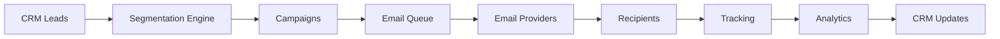

# Email Marketing Integration - Complete Technical Implementation Plan

## Executive Summary

This comprehensive technical implementation plan outlines the integration of email marketing and automated email sending capabilities into the CRM system. The plan covers customer segmentation, third-party API integration with email service providers, campaign management workflows, and performance tracking metrics.

**Total Implementation Duration**: 12-16 weeks  
**Estimated Development Effort**: 6-8 developers  
**Key Deliverables**: Full-featured email marketing system with automation, analytics, and multi-provider support

## Table of Contents

1. [Customer Segmentation Strategies and Logic](#part-1-customer-segmentation-strategies-and-logic)
2. [Database Schema Extensions](#part-2-database-schema-extensions)
3. [Email Service Provider Integration](#part-3-email-service-provider-integration)
4. [Campaign Management Workflow](#part-4-campaign-management-workflow)
5. [Performance Tracking Metrics](#part-5-performance-tracking-metrics)
6. [API Endpoints and Service Layer](#part-6-api-endpoints-and-service-layer)
7. [Frontend Components and UI Design](#part-7-frontend-components-and-ui-design)
8. [Implementation Roadmap](#part-8-implementation-roadmap)

---

## Part 1: Customer Segmentation Strategies and Logic

### Overview

Customer segmentation is the foundation of targeted email marketing. This section defines strategies for dividing customers into groups based on shared characteristics, enabling personalized and relevant email campaigns.

### Key Features

**Segmentation Dimensions**:
- **Demographic Segmentation**: Company size, industry, geographic location, job role
- **Behavioral Segmentation**: Lead source, engagement level, activity timeline, response patterns
- **Sales Stage Segmentation**: Pipeline stage, lead status, deal value, velocity
- **Custom Segmentation**: Tag-based, lead list membership, custom attributes

**Segmentation Operators**:
- Comparison: `==`, `!=`, `>`, `<`, `>=`, `<=`
- String: `contains`, `starts with`, `ends with`, `matches regex`
- Collection: `in list`, `not in list`, `contains any`, `contains all`
- Date: `before`, `after`, `between`, `in last X days`, `in next X days`
- Logical: `AND`, `OR`, `NOT`

**Predefined Segmentation Templates**:
- New Leads (Last 7 Days)
- High-Value Opportunities
- Dormant Leads (30+ Days)
- Decision Makers
- Pipeline Stage - Negotiation

### Technical Implementation

**Segmentation Rule Structure**:
```typescript
interface SegmentationRule {
  id: string
  name: string
  description?: string
  workspaceId: string
  criteria: Criterion[]
  logicOperator: 'AND' | 'OR'
  isActive: boolean
  estimatedSize?: number
  lastCalculated?: DateTime
}
```

**Performance Optimization**:
- Result caching (15-60 minutes)
- Partial updates for changed leads
- Database indexing on frequently filtered fields
- Batch queries for large segments

**Document**: [`email-marketing-part1-segmentation.md`](./email-marketing-part1-segmentation.md)

---

## Part 2: Database Schema Extensions

### Overview

The database schema extensions provide the foundation for storing and managing email marketing data. The schema builds upon the existing Prisma schema with 15 new models.

### New Models

1. **EmailCampaign** - Main campaign entity
2. **EmailTemplate** - Reusable email templates
3. **Email** - Individual email messages
4. **EmailRecipient** - Email-to-lead mapping
5. **EmailTracking** - Email engagement tracking
6. **EmailAutomation** - Automated email sequences
7. **AutomationTrigger** - Trigger conditions for automation
8. **AutomationStep** - Individual steps in automation
9. **SegmentationRule** - Customer segmentation rules
10. **SegmentMember** - Lead-to-segment mapping
11. **EmailProvider** - Email service provider configuration
12. **EmailQueue** - Email sending queue
13. **EmailBounce** - Bounced email tracking
14. **EmailUnsubscribe** - Unsubscribe management
15. **EmailSuppression** - Suppression list management

### Key Schema Features

**Campaign Model**:
```prisma
model EmailCampaign {
  id                String            @id @default(cuid())
  name              String
  type              String            @default("broadcast")
  status            String            @default("draft")
  workspaceId       String
  totalRecipients   Int               @default(0)
  sentCount         Int               @default(0)
  deliveredCount    Int               @default(0)
  openedCount       Int               @default(0)
  clickedCount      Int               @default(0)
  bouncedCount      Int               @default(0)
  // ... additional fields
}
```

**Performance Indexes**:
- Workspace and status indexes for fast filtering
- Scheduled date indexes for campaign scheduling
- Email and recipient indexes for tracking
- Segment member indexes for fast lookups

### Migration Strategy

1. Create migration file: `npx prisma migrate dev --name add_email_marketing_models`
2. Seed initial data (default templates, provider configs)
3. Backfill existing data (map leads to default segments)
4. Validate data integrity

**Document**: [`email-marketing-part2-database-schema.md`](./email-marketing-part2-database-schema.md)

---

## Part 3: Email Service Provider Integration

### Overview

Multi-provider integration architecture ensures flexibility, redundancy, and optimization for email delivery across different use cases and volumes.

### Supported Providers

**SendGrid**:
- Use Cases: Marketing campaigns, transactional emails
- Features: Advanced analytics, template management, A/B testing
- Integration: REST API with event webhooks

**AWS SES**:
- Use Cases: Transactional emails, cost-effective high-volume sending
- Features: Low cost at scale, high deliverability, dedicated IPs
- Integration: AWS SDK with SNS notifications

**Resend**:
- Use Cases: Modern email delivery, developer-friendly API
- Features: Simple API, built-in templates, real-time analytics
- Integration: REST API with webhook support

**Mailgun**:
- Use Cases: Marketing campaigns, transactional emails
- Features: Powerful API, email validation, webhooks
- Integration: REST API with webhook support

**Postmark**:
- Use Cases: Transactional emails, high deliverability requirements
- Features: Excellent deliverability, fast delivery, detailed analytics
- Integration: REST API with webhook support

### Architecture Components

**Provider Manager**:
- Unified interface for all providers
- Provider registration and management
- Load balancing across providers
- Failover to backup providers

**Load Balancing Strategies**:
- Round-robin: Equal distribution
- Least connections: Route to least busy provider
- Weighted: Based on provider capacity
- Cost-optimized: Select lowest cost provider

**Failover Mechanism**:
- Health checks every 60 seconds
- Automatic provider switching on failure
- Cooldown period for failed providers
- Multiple backup providers

**Webhook Handling**:
- Provider-specific webhook parsers
- Event normalization
- Real-time tracking updates
- Signature verification

**Document**: [`email-marketing-part3-provider-integration.md`](./email-marketing-part3-provider-integration.md)

---

## Part 4: Campaign Management Workflow

### Overview

Campaign management encompasses the complete lifecycle of email campaigns from creation to completion, including broadcast, drip, triggered, behavioral, and transactional campaigns.

### Campaign Types

**Broadcast Campaigns**:
- One-time email blasts to specific segments
- Targeted to specific segments
- Scheduled or immediate send
- Performance tracking

**Drip Campaigns**:
- Automated email sequences over time
- Time-based delays between emails
- Conditional logic for progression
- Lead nurturing focus

**Triggered Automations**:
- Emails sent based on specific events or actions
- Event-driven triggers
- Real-time or near-real-time sending
- Context-aware content

**Behavioral Campaigns**:
- Emails based on recipient behavior
- Behavior-based triggers
- Personalized content
- Multi-path sequences

**Transactional Emails**:
- System-generated emails for specific transactions
- High priority
- Immediate delivery
- Regulatory compliance

### Campaign Lifecycle

**States**: `draft` → `scheduled` → `sending` → `sent` / `paused` / `cancelled`

**Workflow**:
1. Campaign Creation (select type, configure content, define audience)
2. Campaign Approval (optional approval workflow)
3. Campaign Scheduling (set send time or schedule immediately)
4. Campaign Execution (prepare emails, queue for sending)
5. Campaign Monitoring (track progress, handle issues)
6. Campaign Analysis (review metrics, gather insights)

### Automation Rules Engine

**Rule Definition**:
```typescript
interface AutomationRule {
  id: string
  name: string
  triggers: RuleTrigger[]
  conditions: RuleCondition[]
  actions: RuleAction[]
  isActive: boolean
  priority: number
}
```

**Trigger Types**:
- `lead_created`: New lead created
- `stage_changed`: Lead stage changed
- `status_changed`: Lead status changed
- `tag_added`: Tag added to lead
- `custom_event`: Custom event triggered
- `time_based`: Time-based trigger

**Action Types**:
- `send_email`: Send email
- `update_lead`: Update lead data
- `add_tag`: Add tag to lead
- `remove_tag`: Remove tag from lead
- `create_task`: Create task
- `webhook`: Call external webhook

**Document**: [`email-marketing-part4-campaign-workflow.md`](./email-marketing-part4-campaign-workflow.md)

---

## Part 5: Performance Tracking Metrics

### Overview

Comprehensive performance tracking provides insights into email campaign effectiveness, enabling data-driven optimization and continuous improvement.

### Key Performance Indicators (KPIs)

**Delivery Metrics**:
- Delivery Rate: > 95% is good
- Bounce Rate: < 2% is acceptable
- Complaint Rate: < 0.1% is acceptable

**Engagement Metrics**:
- Open Rate: 15-25% average
- Click-Through Rate (CTR): 2-5% average
- Click-to-Open Rate (CTOR): 10-20% average

**Conversion Metrics**:
- Conversion Rate: 1-5% average
- Revenue per Email: Average revenue per email sent
- ROI: Return on investment for campaigns
- Cost per Acquisition (CPA): Cost to acquire one customer

**List Health Metrics**:
- List Growth Rate: Net growth over time
- Unsubscribe Rate: < 0.5% is acceptable
- Suppression List Size: Monitor growth

**Time-Based Metrics**:
- Time to Open: < 2 hours is good
- Time to Click: Average time to first click
- Peak Engagement Time: Best time to send

### Analytics Dashboard

**Overview Dashboard**:
- Key metrics cards with trends
- Email volume chart
- Engagement funnel
- Device breakdown
- Geographic distribution

**Campaign Dashboard**:
- Campaign list with filtering
- Campaign detail view
- Performance metrics
- Recipient breakdown
- Link performance

**Recipient Dashboard**:
- Recipient list with engagement scores
- Recipient detail view
- Email history
- Journey map

**Trends Dashboard**:
- Time series analysis
- Funnel analysis
- Cohort analysis
- Predictive analytics

### Real-Time Tracking

**Tracking Service**:
- Open tracking (1x1 pixel)
- Click tracking (redirect URLs)
- Conversion tracking
- Device and browser tracking

**Real-Time Updates**:
- WebSocket connections for live updates
- Event-driven architecture
- Dashboard refresh on new data

**Document**: [`email-marketing-part5-performance-metrics.md`](./email-marketing-part5-performance-metrics.md)

---

## Part 6: API Endpoints and Service Layer

### Overview

RESTful API design provides comprehensive access to email marketing functionality with consistent responses, proper error handling, and secure authentication.

### API Structure

```
/api/v1/email-marketing/
├── campaigns/        # Campaign CRUD and management
├── templates/        # Template CRUD and preview
├── segments/         # Segment CRUD and calculation
├── automations/      # Automation CRUD and enrollment
├── emails/          # Email tracking and details
├── providers/       # Provider management
├── analytics/       # Metrics and reporting
├── webhooks/       # Provider webhook endpoints
└── tracking/        # Tracking pixel and links
```

### Key Endpoints

**Campaign Endpoints**:
- `GET /campaigns` - List campaigns
- `POST /campaigns` - Create campaign
- `GET /campaigns/:id` - Get campaign details
- `PUT /campaigns/:id` - Update campaign
- `POST /campaigns/:id/send` - Send campaign
- `POST /campaigns/:id/test` - Send test email
- `GET /campaigns/:id/metrics` - Get campaign metrics

**Template Endpoints**:
- `GET /templates` - List templates
- `POST /templates` - Create template
- `GET /templates/:id/preview` - Preview template

**Segment Endpoints**:
- `GET /segments` - List segments
- `POST /segments` - Create segment
- `POST /segments/:id/calculate` - Calculate segment
- `GET /segments/:id/members` - Get segment members

**Analytics Endpoints**:
- `GET /analytics/overview` - Get overview metrics
- `GET /analytics/campaigns` - Get campaign analytics
- `GET /analytics/trends` - Get trend data

### Service Layer Architecture

**Campaign Service**:
- Campaign CRUD operations
- Campaign execution
- Email preparation
- Personalization

**Segmentation Service**:
- Segment calculation
- Criteria evaluation
- Member management
- Caching

**Analytics Service**:
- Metrics calculation
- Trend analysis
- Report generation
- Data aggregation

**Provider Manager**:
- Provider registration
- Email sending
- Load balancing
- Failover handling

### Authentication and Authorization

**Authentication**:
- JWT token verification
- Session management
- Token refresh

**Authorization**:
- Workspace-level access control
- Role-based permissions
- Resource ownership validation

**Rate Limiting**:
- Endpoint-specific limits
- Sliding window algorithm
- Graceful degradation

**Document**: [`email-marketing-part6-api-design.md`](./email-marketing-part6-api-design.md)

---

## Part 7: Frontend Components and UI Design

### Overview

User interface design provides intuitive workflows for managing email marketing campaigns, with consistent design system integration and responsive layouts.

### Page Structure

**Email Marketing Dashboard** (`/email-marketing`):
- Key metrics cards
- Recent campaigns table
- Quick actions

**Campaigns Page** (`/email-marketing/campaigns`):
- Campaign list with filtering
- Campaign creation wizard
- Campaign detail view

**Templates Page** (`/email-marketing/templates`):
- Template grid
- Template editor with preview
- Variable management

**Segments Page** (`/email-marketing/segments`):
- Segment list
- Segment builder
- Segment preview

**Analytics Dashboard** (`/email-marketing/analytics`):
- Overview metrics
- Performance charts
- Trend analysis

### Component Library

**Core Components**:
- `CampaignCard` - Campaign display card
- `CampaignBuilder` - Campaign creation wizard
- `EmailEditor` - Template editor with preview
- `SegmentBuilder` - Segment creation interface
- `AnalyticsDashboard` - Analytics visualization

**Shared Components**:
- `MetricCard` - Metric display with trend
- `Stat` - Statistic display
- `Badge` - Status badge
- `Loading` - Loading indicator
- `Toast` - Notification toast

### Design System Integration

**Color Palette**:
- Primary: `#6366f1` (Indigo)
- Secondary: `#8b5cf6` (Purple)
- Success: `#10b981` (Green)
- Warning: `#f59e0b` (Amber)
- Error: `#ef4444` (Red)
- Info: `#3b82f6` (Blue)

**Typography**:
- Font Family: System fonts
- Font Sizes: 12px to 36px scale
- Font Weights: 400, 500, 600, 700

**Spacing**:
- Scale: 4px to 96px
- Consistent padding and margins

**Responsive Design**:
- Breakpoints: 640px, 768px, 1024px, 1280px
- Mobile-first approach
- Grid and flexbox layouts

### Accessibility

**WCAG 2.1 AA Compliance**:
- Semantic HTML
- ARIA attributes
- Keyboard navigation
- Focus management
- Screen reader support

**Document**: [`email-marketing-part7-frontend-ui.md`](./email-marketing-part7-frontend-ui.md)

---

## Part 8: Implementation Roadmap

### Overview

Comprehensive implementation plan spanning 12-16 weeks, organized into 6 phases with clear deliverables and milestones.

### Phase Breakdown

**Phase 1: Foundation and Infrastructure (Weeks 1-3)**
- Week 1: Setup and planning
- Week 2: Database schema implementation
- Week 3: Core infrastructure services

**Phase 2: Core Email Functionality (Weeks 4-6)**
- Week 4: Template management
- Week 5: Segmentation engine
- Week 6: Email sending core

**Phase 3: Campaign Management (Weeks 7-9)**
- Week 7: Broadcast campaigns
- Week 8: Drip campaigns
- Week 9: Triggered automations

**Phase 4: Advanced Features (Weeks 10-12)**
- Week 10: Analytics and reporting
- Week 11: Provider management
- Week 12: Advanced features

**Phase 5: Testing and Optimization (Weeks 13-14)**
- Week 13: Comprehensive testing
- Week 14: Security and compliance

**Phase 6: Deployment and Migration (Weeks 15-16)**
- Week 15: Staging deployment
- Week 16: Production deployment

### Resource Requirements

**Development Team**:
- 2 Backend Developers (Node.js/TypeScript)
- 2 Frontend Developers (React/Next.js)
- 1 DevOps Engineer
- 1 QA Engineer
- 1 Product Manager
- 1 UI/UX Designer

### Migration Strategy

**Data Migration**:
- Pre-migration preparation and backup
- Migration script development and testing
- Migration execution (8-10 hours)
- Post-migration validation

**Feature Rollout**:
- Phase 1: Internal testing (Week 1)
- Phase 2: Beta testing (Week 2)
- Phase 3: Limited release (Week 3)
- Phase 4: Full release (Week 4)

### Risk Management

**Key Risks**:
- Database migration failure
- Email provider API downtime
- Data breach or unauthorized access
- GDPR or CAN-SPAM violation
- Poor user adoption

**Mitigation Strategies**:
- Comprehensive testing and validation
- Multiple providers with failover
- Security best practices and monitoring
- Legal review and compliance features
- User training and documentation

### Success Metrics

**Technical Metrics**:
- API Response Time: < 500ms
- Email Delivery Rate: > 95%
- System Uptime: > 99.9%
- Error Rate: < 0.1%
- Test Coverage: > 80%

**Business Metrics**:
- User Adoption: > 70%
- Campaign Creation: > 10/week
- Email Volume: > 10,000/month
- Open Rate: > 20%
- Click Rate: > 3%
- Conversion Rate: > 2%

**Document**: [`email-marketing-part8-implementation-roadmap.md`](./email-marketing-part8-implementation-roadmap.md)

---

## Integration with Existing CRM

### Current CRM Features

The email marketing system integrates seamlessly with existing CRM features:

**Lead Management**:
- Use existing lead data for segmentation
- Link email campaigns to leads
- Track email interactions on lead profiles
- Update lead status based on email engagement

**Pipeline Management**:
- Trigger automations based on pipeline stage changes
- Create campaigns for specific pipeline stages
- Track conversion through pipeline
- Analyze performance by pipeline

**Lead Lists**:
- Use lead lists as campaign targets
- Create segments from lead lists
- Track email engagement by list
- Manage list subscriptions

**Workspace Management**:
- Workspace-level isolation
- Multi-tenant support
- Role-based access control
- Workspace-specific settings

### Data Flow



---

## Security and Compliance

### Security Measures

**Data Protection**:
- API key encryption
- Data at rest encryption
- Secure transmission (HTTPS)
- Role-based access control

**Monitoring**:
- Security audit logging
- Intrusion detection
- Anomaly detection
- Real-time alerts

### Compliance

**GDPR Compliance**:
- Explicit consent for marketing emails
- Right to opt-out
- Data deletion requests
- Data export functionality

**CAN-SPAM Compliance**:
- Clear opt-out mechanisms
- Accurate sender information
- Physical address inclusion
- Honor opt-out requests promptly

---

## Monitoring and Maintenance

### Monitoring Strategy

**Application Metrics**:
- API response time
- Error rate
- Email send success rate
- Queue processing time
- Cache hit rate

**Infrastructure Metrics**:
- CPU usage
- Memory usage
- Disk usage
- Network throughput
- Database connections

**Business Metrics**:
- Emails sent
- Open rate
- Click rate
- Conversion rate
- Revenue generated

### Maintenance Schedule

**Daily**:
- Monitor system health
- Review error logs
- Check email queue status
- Verify provider health

**Weekly**:
- Review performance metrics
- Analyze campaign performance
- Update documentation
- Address user feedback

**Monthly**:
- Security audit
- Performance optimization
- Feature updates
- Capacity planning

**Quarterly**:
- Comprehensive review
- Strategic planning
- Major feature releases
- Infrastructure upgrades

---

## Conclusion

This comprehensive technical implementation plan provides a detailed roadmap for integrating email marketing capabilities into the CRM system. The plan covers:

1. **Customer Segmentation**: Advanced segmentation strategies with flexible criteria
2. **Database Schema**: Comprehensive schema extensions with 15 new models
3. **Provider Integration**: Multi-provider support with load balancing and failover
4. **Campaign Management**: Complete campaign lifecycle for multiple campaign types
5. **Performance Tracking**: Comprehensive KPIs and analytics dashboard
6. **API Design**: RESTful API with proper authentication and error handling
7. **Frontend Design**: Intuitive UI with responsive design and accessibility
8. **Implementation Roadmap**: 12-16 week phased implementation plan

The phased approach ensures risk mitigation, quality assurance, user adoption, and successful delivery. The plan balances speed with quality, ensuring a successful implementation that meets business objectives and user needs.

---

## Document Index

| Part | Document | Description |
|-------|-----------|-------------|
| 1 | [`email-marketing-part1-segmentation.md`](./email-marketing-part1-segmentation.md) | Customer Segmentation Strategies and Logic |
| 2 | [`email-marketing-part2-database-schema.md`](./email-marketing-part2-database-schema.md) | Database Schema Extensions |
| 3 | [`email-marketing-part3-provider-integration.md`](./email-marketing-part3-provider-integration.md) | Email Service Provider Integration |
| 4 | [`email-marketing-part4-campaign-workflow.md`](./email-marketing-part4-campaign-workflow.md) | Campaign Management Workflow |
| 5 | [`email-marketing-part5-performance-metrics.md`](./email-marketing-part5-performance-metrics.md) | Performance Tracking Metrics |
| 6 | [`email-marketing-part6-api-design.md`](./email-marketing-part6-api-design.md) | API Endpoints and Service Layer |
| 7 | [`email-marketing-part7-frontend-ui.md`](./email-marketing-part7-frontend-ui.md) | Frontend Components and UI Design |
| 8 | [`email-marketing-part8-implementation-roadmap.md`](./email-marketing-part8-implementation-roadmap.md) | Implementation Roadmap |

---

**Document Status**: Complete  
**Last Updated**: 2026-03-27  
**Version**: 1.0
