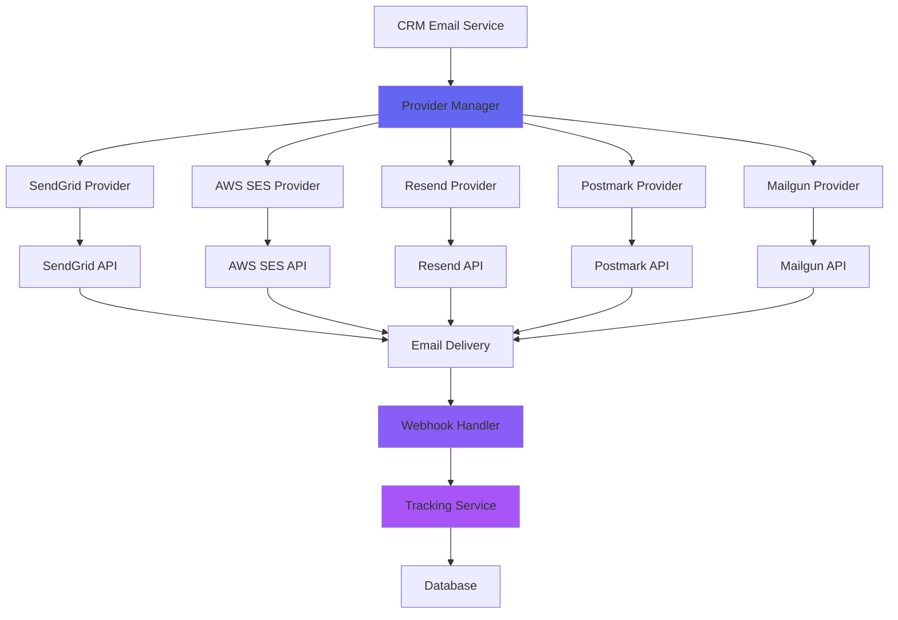

# Email Marketing Integration - Part 3: Third-Party Email Service Provider Integration

## Executive Summary

This document outlines the architecture for integrating multiple third-party email service providers (ESPs) into the CRM system. The integration provides flexibility, redundancy, and optimization for email delivery across different use cases and volumes.

## 1. Integration Architecture Overview

### 1.1 Design Principles

1. **Provider Abstraction**: Unified interface for all providers
2. **Multi-Provider Support**: Ability to use multiple providers simultaneously
3. **Failover Mechanism**: Automatic fallback to backup providers
4. **Load Balancing**: Distribute load across providers based on capacity
5. **Provider Selection**: Intelligent routing based on email type, volume, and cost
6. **Unified Tracking**: Standardized tracking across all providers

### 1.2 Architecture Diagram



## 2. Supported Email Service Providers

### 2.1 SendGrid

**Use Cases**: Marketing campaigns, transactional emails, high-volume sending

**Features**:
- Advanced analytics and reporting
- Template management
- A/B testing
- Event webhooks
- Subuser management

**Integration Points**:
```typescript
interface SendGridConfig {
  apiKey: string
  fromEmail: string
  fromName?: string
  replyTo?: string
  categories?: string[]
  customArgs?: Record<string, any>
}

interface SendGridEmail {
  to: string
  subject: string
  html: string
  text?: string
  from?: string
  replyTo?: string
  categories?: string[]
  customArgs?: Record<string, any>
  trackingSettings?: {
    clickTracking?: boolean
    openTracking?: boolean
    subscriptionTracking?: boolean
  }
}
```

**API Integration**:
```typescript
import sgMail from '@sendgrid/mail'

class SendGridProvider implements EmailProvider {
  private client: typeof sgMail
  
  constructor(config: SendGridConfig) {
    sgMail.setApiKey(config.apiKey)
    this.client = sgMail
  }
  
  async sendEmail(email: SendGridEmail): Promise<SendResult> {
    try {
      const response = await this.client.send(email)
      return {
        success: true,
        messageId: response[0].headers['x-message-id'],
        provider: 'sendgrid'
      }
    } catch (error) {
      return {
        success: false,
        error: error.message,
        provider: 'sendgrid'
      }
    }
  }
  
  async sendBatch(emails: SendGridEmail[]): Promise<BatchSendResult> {
    const results = await Promise.allSettled(
      emails.map(email => this.sendEmail(email))
    )
    
    return {
      total: emails.length,
      successful: results.filter(r => r.status === 'fulfilled').length,
      failed: results.filter(r => r.status === 'rejected').length,
      results
    }
  }
}
```

### 2.2 AWS SES (Simple Email Service)

**Use Cases**: Transactional emails, cost-effective high-volume sending

**Features**:
- Low cost at scale
- High deliverability
- Dedicated IPs
- Reputation management
- Bounce/Complaint handling

**Integration Points**:
```typescript
import { SESClient, SendEmailCommand, SendBulkEmailCommand } from '@aws-sdk/client-ses'

interface SESConfig {
  region: string
  accessKeyId: string
  secretAccessKey: string
  fromEmail: string
  fromName?: string
  configurationSetName?: string
}

class SESProvider implements EmailProvider {
  private client: SESClient
  private config: SESConfig
  
  constructor(config: SESConfig) {
    this.client = new SESClient({
      region: config.region,
      credentials: {
        accessKeyId: config.accessKeyId,
        secretAccessKey: config.secretAccessKey
      }
    })
    this.config = config
  }
  
  async sendEmail(email: SESEmail): Promise<SendResult> {
    const command = new SendEmailCommand({
      Source: this.config.fromEmail,
      Destination: { ToAddresses: [email.to] },
      Message: {
        Subject: { Data: email.subject },
        Body: {
          Html: { Data: email.html },
          Text: { Data: email.text || '' }
        }
      },
      ConfigurationSetName: this.config.configurationSetName
    })
    
    try {
      const response = await this.client.send(command)
      return {
        success: true,
        messageId: response.MessageId,
        provider: 'ses'
      }
    } catch (error) {
      return {
        success: false,
        error: error.message,
        provider: 'ses'
      }
    }
  }
}
```

### 2.3 Resend

**Use Cases**: Modern email delivery, developer-friendly API

**Features**:
- Simple API
- Built-in templates
- Real-time analytics
- Webhook support
- Good deliverability

**Integration Points**:
```typescript
import { Resend } from 'resend'

interface ResendConfig {
  apiKey: string
  fromEmail: string
  fromName?: string
}

class ResendProvider implements EmailProvider {
  private client: Resend
  private config: ResendConfig
  
  constructor(config: ResendConfig) {
    this.client = new Resend(config.apiKey)
    this.config = config
  }
  
  async sendEmail(email: ResendEmail): Promise<SendResult> {
    try {
      const response = await this.client.emails.send({
        from: `${this.config.fromName || ''} <${this.config.fromEmail}>`,
        to: email.to,
        subject: email.subject,
        html: email.html,
        text: email.text
      })
      
      return {
        success: true,
        messageId: response.data.id,
        provider: 'resend'
      }
    } catch (error) {
      return {
        success: false,
        error: error.message,
        provider: 'resend'
      }
    }
  }
}
```

### 2.4 Mailgun

**Use Cases**: Marketing campaigns, transactional emails

**Features**:
- Powerful API
- Email validation
- Webhooks
- Analytics
- Template management

**Integration Points**:
```typescript
import formData from 'form-data'
import Mailgun from 'mailgun.js'

interface MailgunConfig {
  apiKey: string
  domain: string
  fromEmail: string
  fromName?: string
}

class MailgunProvider implements EmailProvider {
  private client: any
  private config: MailgunConfig
  
  constructor(config: MailgunConfig) {
    const mailgun = new Mailgun(formData)
    this.client = mailgun.client({
      username: 'api',
      key: config.apiKey
    })
    this.config = config
  }
  
  async sendEmail(email: MailgunEmail): Promise<SendResult> {
    try {
      const response = await this.client.messages.create(this.config.domain, {
        from: `${this.config.fromName || ''} <${this.config.fromEmail}>`,
        to: [email.to],
        subject: email.subject,
        html: email.html,
        text: email.text
      })
      
      return {
        success: true,
        messageId: response.id,
        provider: 'mailgun'
      }
    } catch (error) {
      return {
        success: false,
        error: error.message,
        provider: 'mailgun'
      }
    }
  }
}
```

### 2.5 Postmark

**Use Cases**: Transactional emails, high deliverability requirements

**Features**:
- Excellent deliverability
- Fast delivery
- Detailed analytics
- Template management
- Bounce handling

**Integration Points**:
```typescript
import postmark from 'postmark'

interface PostmarkConfig {
  serverToken: string
  fromEmail: string
  fromName?: string
}

class PostmarkProvider implements EmailProvider {
  private client: postmark.ServerClient
  private config: PostmarkConfig
  
  constructor(config: PostmarkConfig) {
    this.client = new postmark.ServerClient(config.serverToken)
    this.config = config
  }
  
  async sendEmail(email: PostmarkEmail): Promise<SendResult> {
    try {
      const response = await this.client.sendEmail({
        From: `${this.config.fromName || ''} <${this.config.fromEmail}>`,
        To: email.to,
        Subject: email.subject,
        HtmlBody: email.html,
        TextBody: email.text
      })
      
      return {
        success: true,
        messageId: response.MessageID,
        provider: 'postmark'
      }
    } catch (error) {
      return {
        success: false,
        error: error.message,
        provider: 'postmark'
      }
    }
  }
}
```

## 3. Provider Manager Architecture

### 3.1 Provider Interface

```typescript
interface EmailProvider {
  sendEmail(email: EmailData): Promise<SendResult>
  sendBatch(emails: EmailData[]): Promise<BatchSendResult>
  getStats(): Promise<ProviderStats>
  validateConfig(): Promise<boolean>
  getType(): string
}

interface EmailData {
  to: string
  subject: string
  html: string
  text?: string
  from?: string
  replyTo?: string
  metadata?: Record<string, any>
}

interface SendResult {
  success: boolean
  messageId?: string
  error?: string
  provider: string
  timestamp: Date
}

interface BatchSendResult {
  total: number
  successful: number
  failed: number
  results: Array<PromiseSettledResult<SendResult>>
}

interface ProviderStats {
  totalSent: number
  totalDelivered: number
  totalOpened: number
  totalClicked: number
  totalBounced: number
  averageDeliveryTime: number
  lastUsedAt: Date
}
```

### 3.2 Provider Manager Implementation

```typescript
class ProviderManager {
  private providers: Map<string, EmailProvider> = new Map()
  private providerConfigs: Map<string, EmailProviderConfig> = new Map()
  private loadBalancer: LoadBalancer
  private failoverManager: FailoverManager
  
  constructor() {
    this.loadBalancer = new LoadBalancer(this.providers)
    this.failoverManager = new FailoverManager(this.providers)
  }
  
  async registerProvider(config: EmailProviderConfig): Promise<void> {
    let provider: EmailProvider
    
    switch (config.type) {
      case 'sendgrid':
        provider = new SendGridProvider(config)
        break
      case 'ses':
        provider = new SESProvider(config)
        break
      case 'resend':
        provider = new ResendProvider(config)
        break
      case 'mailgun':
        provider = new MailgunProvider(config)
        break
      case 'postmark':
        provider = new PostmarkProvider(config)
        break
      default:
        throw new Error(`Unsupported provider type: ${config.type}`)
    }
    
    const isValid = await provider.validateConfig()
    if (!isValid) {
      throw new Error(`Invalid configuration for provider: ${config.type}`)
    }
    
    this.providers.set(config.id, provider)
    this.providerConfigs.set(config.id, config)
  }
  
  async sendEmail(
    email: EmailData,
    options?: SendOptions
  ): Promise<SendResult> {
    const provider = this.selectProvider(options)
    const result = await provider.sendEmail(email)
    
    if (!result.success && options?.retryOnFailure) {
      return this.retryWithFailover(email, options)
    }
    
    return result
  }
  
  async sendBatch(
    emails: EmailData[],
    options?: BatchSendOptions
  ): Promise<BatchSendResult> {
    const provider = this.selectProvider(options)
    return await provider.sendBatch(emails)
  }
  
  private selectProvider(options?: SendOptions): EmailProvider {
    // Priority: explicit provider > load balancer > default provider
    if (options?.providerId) {
      const provider = this.providers.get(options.providerId)
      if (provider) return provider
    }
    
    return this.loadBalancer.selectProvider(options)
  }
  
  private async retryWithFailover(
    email: EmailData,
    options: SendOptions
  ): Promise<SendResult> {
    const backupProvider = this.failoverManager.selectBackup(options)
    if (backupProvider) {
      return await backupProvider.sendEmail(email)
    }
    
    throw new Error('No backup providers available')
  }
}
```

## 4. Load Balancing Strategy

### 4.1 Load Balancer Implementation

```typescript
class LoadBalancer {
  private providers: Map<string, EmailProvider>
  private providerStats: Map<string, ProviderStats> = new Map()
  
  constructor(providers: Map<string, EmailProvider>) {
    this.providers = providers
    this.initializeStats()
  }
  
  selectProvider(options?: SendOptions): EmailProvider {
    const strategy = options?.loadBalanceStrategy || 'round-robin'
    
    switch (strategy) {
      case 'round-robin':
        return this.roundRobin()
      case 'least-connections':
        return this.leastConnections()
      case 'weighted':
        return this.weighted()
      case 'cost-optimized':
        return this.costOptimized()
      default:
        return this.roundRobin()
    }
  }
  
  private roundRobin(): EmailProvider {
    const providers = Array.from(this.providers.values())
    const index = this.getRoundRobinIndex() % providers.length
    return providers[index]
  }
  
  private leastConnections(): EmailProvider {
    let selectedProvider: EmailProvider | null = null
    let minConnections = Infinity
    
    for (const [id, provider] of this.providers) {
      const stats = this.providerStats.get(id)
      if (stats && stats.totalSent < minConnections) {
        minConnections = stats.totalSent
        selectedProvider = provider
      }
    }
    
    return selectedProvider || this.providers.values().next().value
  }
  
  private weighted(): EmailProvider {
    // Implement weighted selection based on provider capacity
    // Higher capacity = higher weight
    const providers = Array.from(this.providers.entries())
    const totalWeight = providers.reduce((sum, [id, _]) => {
      const config = this.providerConfigs.get(id)
      return sum + (config?.weight || 1)
    }, 0)
    
    let random = Math.random() * totalWeight
    
    for (const [id, provider] of providers) {
      const config = this.providerConfigs.get(id)
      random -= (config?.weight || 1)
      if (random <= 0) {
        return provider
      }
    }
    
    return providers[0][1]
  }
  
  private costOptimized(): EmailProvider {
    // Select provider with lowest cost per email
    let selectedProvider: EmailProvider | null = null
    let minCost = Infinity
    
    for (const [id, provider] of this.providers) {
      const config = this.providerConfigs.get(id)
      if (config && config.costPerEmail < minCost) {
        minCost = config.costPerEmail
        selectedProvider = provider
      }
    }
    
    return selectedProvider || this.providers.values().next().value
  }
}
```

### 4.2 Provider Configuration

```typescript
interface EmailProviderConfig {
  id: string
  type: 'sendgrid' | 'ses' | 'resend' | 'mailgun' | 'postmark'
  workspaceId: string
  apiKey: string
  fromEmail: string
  fromName?: string
  replyTo?: string
  isActive: boolean
  isDefault: boolean
  priority: number // 1-10, lower is higher priority
  weight: number // For load balancing
  costPerEmail: number
  dailyLimit?: number
  monthlyLimit?: number
  region?: string // For AWS SES
  domain?: string // For Mailgun
  serverToken?: string // For Postmark
  metadata?: Record<string, any>
}
```

## 5. Failover Mechanism

### 5.1 Failover Manager

```typescript
class FailoverManager {
  private providers: Map<string, EmailProvider>
  private providerHealth: Map<string, ProviderHealth> = new Map()
  private healthCheckInterval: NodeJS.Timeout | null = null
  
  constructor(providers: Map<string, EmailProvider>) {
    this.providers = providers
    this.initializeHealthChecks()
  }
  
  selectBackup(options?: SendOptions): EmailProvider | null {
    const healthyProviders = Array.from(this.providers.entries())
      .filter(([id, _]) => this.isProviderHealthy(id))
      .sort((a, b) => {
        const configA = this.providerConfigs.get(a[0])
        const configB = this.providerConfigs.get(b[0])
        return (configA?.priority || 10) - (configB?.priority || 10)
      })
    
    return healthyProviders[0]?.[1] || null
  }
  
  private isProviderHealthy(providerId: string): boolean {
    const health = this.providerHealth.get(providerId)
    if (!health) return true
    
    // Check if provider is in cooldown
    if (health.lastFailure && health.failureCount >= 3) {
      const cooldownEnd = new Date(health.lastFailure.getTime() + health.cooldownPeriod)
      if (new Date() < cooldownEnd) {
        return false
      }
    }
    
    return health.status === 'healthy'
  }
  
  private initializeHealthChecks(): void {
    this.healthCheckInterval = setInterval(() => {
      this.performHealthChecks()
    }, 60000) // Check every minute
  }
  
  private async performHealthChecks(): Promise<void> {
    for (const [id, provider] of this.providers) {
      try {
        const stats = await provider.getStats()
        this.updateHealth(id, 'healthy', stats)
      } catch (error) {
        this.updateHealth(id, 'unhealthy', undefined, error)
      }
    }
  }
  
  private updateHealth(
    providerId: string,
    status: 'healthy' | 'unhealthy',
    stats?: ProviderStats,
    error?: Error
  ): void {
    const currentHealth = this.providerHealth.get(providerId) || {
      status: 'healthy',
      failureCount: 0,
      lastFailure: null,
      cooldownPeriod: 300000 // 5 minutes
    }
    
    if (status === 'unhealthy') {
      currentHealth.failureCount++
      currentHealth.lastFailure = new Date()
    } else {
      currentHealth.failureCount = 0
      currentHealth.lastFailure = null
    }
    
    currentHealth.status = status
    currentHealth.lastChecked = new Date()
    currentHealth.stats = stats
    
    this.providerHealth.set(providerId, currentHealth)
  }
}
```

## 6. Webhook Handling

### 6.1 Webhook Handler Architecture

```typescript
class WebhookHandler {
  private providerHandlers: Map<string, ProviderWebhookHandler> = new Map()
  
  constructor() {
    this.registerHandlers()
  }
  
  private registerHandlers(): void {
    this.providerHandlers.set('sendgrid', new SendGridWebhookHandler())
    this.providerHandlers.set('ses', new SESWebhookHandler())
    this.providerHandlers.set('resend', new ResendWebhookHandler())
    this.providerHandlers.set('mailgun', new MailgunWebhookHandler())
    this.providerHandlers.set('postmark', new PostmarkWebhookHandler())
  }
  
  async handleWebhook(
    providerType: string,
    payload: any,
    signature?: string
  ): Promise<WebhookResult> {
    const handler = this.providerHandlers.get(providerType)
    
    if (!handler) {
      throw new Error(`No handler for provider: ${providerType}`)
    }
    
    // Verify signature if provided
    if (signature && !handler.verifySignature(payload, signature)) {
      throw new Error('Invalid webhook signature')
    }
    
    // Parse and normalize webhook data
    const events = handler.parseEvents(payload)
    
    // Process each event
    const results = await Promise.allSettled(
      events.map(event => this.processEvent(event))
    )
    
    return {
      success: true,
      processed: results.filter(r => r.status === 'fulfilled').length,
      failed: results.filter(r => r.status === 'rejected').length
    }
  }
  
  private async processEvent(event: NormalizedEvent): Promise<void> {
    switch (event.type) {
      case 'delivered':
        await this.handleDelivered(event)
        break
      case 'opened':
        await this.handleOpened(event)
        break
      case 'clicked':
        await this.handleClicked(event)
        break
      case 'bounced':
        await this.handleBounced(event)
        break
      case 'complained':
        await this.handleComplained(event)
        break
      case 'unsubscribed':
        await this.handleUnsubscribed(event)
        break
      default:
        console.warn(`Unknown event type: ${event.type}`)
    }
  }
  
  private async handleDelivered(event: NormalizedEvent): Promise<void> {
    // Update email status to delivered
    await updateEmailStatus(event.messageId, 'delivered')
    await updateRecipientStatus(event.recipientId, 'delivered')
  }
  
  private async handleOpened(event: NormalizedEvent): Promise<void> {
    // Increment open count
    await incrementEmailOpenCount(event.messageId)
    await updateRecipientStatus(event.recipientId, 'opened')
    
    // Update tracking data
    await updateTrackingData(event.messageId, {
      openCount: 1,
      firstOpenAt: event.timestamp,
      lastOpenAt: event.timestamp,
      deviceInfo: event.deviceInfo
    })
  }
  
  private async handleClicked(event: NormalizedEvent): Promise<void> {
    // Increment click count
    await incrementEmailClickCount(event.messageId)
    await updateRecipientClickCount(event.recipientId)
    
    // Update tracking data
    await updateTrackingData(event.messageId, {
      clickCount: 1,
      firstClickAt: event.timestamp,
      lastClickAt: event.timestamp,
      links: [{ url: event.url, clickCount: 1 }]
    })
  }
  
  private async handleBounced(event: NormalizedEvent): Promise<void> {
    // Update email status to bounced
    await updateEmailStatus(event.messageId, 'bounced')
    await updateRecipientStatus(event.recipientId, 'bounced', event.reason)
    
    // Record bounce
    await recordBounce({
      email: event.recipientEmail,
      type: event.bounceType,
      reason: event.reason,
      providerType: event.providerType,
      providerMessage: event.providerMessage
    })
    
    // Add to suppression list if hard bounce
    if (event.bounceType === 'hard') {
      await addToSuppressionList(event.recipientEmail, 'bounce', event.reason)
    }
  }
  
  private async handleComplained(event: NormalizedEvent): Promise<void> {
    // Add to suppression list
    await addToSuppressionList(event.recipientEmail, 'complaint', 'Spam complaint')
    
    // Unsubscribe recipient
    await unsubscribeRecipient(event.recipientEmail, 'spam complaint')
  }
  
  private async handleUnsubscribed(event: NormalizedEvent): Promise<void> {
    // Unsubscribe recipient
    await unsubscribeRecipient(event.recipientEmail, event.reason)
  }
}
```

### 6.2 Normalized Event Structure

```typescript
interface NormalizedEvent {
  type: 'delivered' | 'opened' | 'clicked' | 'bounced' | 'complained' | 'unsubscribed'
  messageId: string
  recipientId?: string
  recipientEmail: string
  timestamp: Date
  providerType: string
  providerMessage?: string
  deviceInfo?: DeviceInfo
  url?: string
  bounceType?: 'hard' | 'soft' | 'spam' | 'blocked'
  reason?: string
}

interface DeviceInfo {
  userAgent: string
  deviceType: 'desktop' | 'mobile' | 'tablet'
  os: string
  browser: string
  ipAddress?: string
}
```

## 7. Tracking and Analytics

### 7.1 Tracking Pixel Implementation

```typescript
class TrackingService {
  generateTrackingPixel(emailId: string, recipientId: string): string {
    const trackingId = this.generateTrackingId(emailId, recipientId)
    const baseUrl = process.env.NEXT_PUBLIC_APP_URL || 'http://localhost:3000'
    return `${baseUrl}/api/tracking/pixel?trackingId=${trackingId}`
  }
  
  generateTrackingLink(
    emailId: string,
    recipientId: string,
    url: string
  ): string {
    const trackingId = this.generateTrackingId(emailId, recipientId)
    const baseUrl = process.env.NEXT_PUBLIC_APP_URL || 'http://localhost:3000'
    return `${baseUrl}/api/tracking/click?trackingId=${trackingId}&url=${encodeURIComponent(url)}`
  }
  
  private generateTrackingId(emailId: string, recipientId: string): string {
    // Generate unique tracking ID
    const data = `${emailId}:${recipientId}:${Date.now()}`
    return Buffer.from(data).toString('base64')
  }
  
  async trackOpen(trackingId: string, deviceInfo: DeviceInfo): Promise<void> {
    const { emailId, recipientId } = this.parseTrackingId(trackingId)
    
    await incrementEmailOpenCount(emailId)
    await updateRecipientStatus(recipientId, 'opened')
    await updateTrackingData(emailId, {
      openCount: 1,
      firstOpenAt: new Date(),
      lastOpenAt: new Date(),
      deviceInfo
    })
  }
  
  async trackClick(
    trackingId: string,
    url: string,
    deviceInfo: DeviceInfo
  ): Promise<string> {
    const { emailId, recipientId } = this.parseTrackingId(trackingId)
    
    await incrementEmailClickCount(emailId)
    await updateRecipientClickCount(recipientId)
    await updateTrackingData(emailId, {
      clickCount: 1,
      firstClickAt: new Date(),
      lastClickAt: new Date(),
      links: [{ url, clickCount: 1 }]
    })
    
    return url // Return original URL for redirect
  }
  
  private parseTrackingId(trackingId: string): { emailId: string; recipientId: string } {
    const data = Buffer.from(trackingId, 'base64').toString()
    const [emailId, recipientId] = data.split(':')
    return { emailId, recipientId }
  }
}
```

## 8. Email Queue Management

### 8.1 Queue Implementation

```typescript
class EmailQueue {
  private queue: Map<string, QueuedEmail> = new Map()
  private processing: Set<string> = new Set()
  private scheduler: NodeJS.Timeout | null = null
  
  constructor(private providerManager: ProviderManager) {
    this.startScheduler()
  }
  
  async enqueue(email: EmailData, options?: QueueOptions): Promise<string> {
    const queuedEmail: QueuedEmail = {
      id: generateId(),
      email,
      status: 'pending',
      priority: options?.priority || 5,
      scheduledFor: options?.scheduledFor || new Date(),
      attempts: 0,
      maxAttempts: options?.maxAttempts || 3,
      providerId: options?.providerId,
      createdAt: new Date()
    }
    
    this.queue.set(queuedEmail.id, queuedEmail)
    return queuedEmail.id
  }
  
  async enqueueBatch(emails: EmailData[], options?: BatchQueueOptions): Promise<string[]> {
    const ids = await Promise.all(
      emails.map(email => this.enqueue(email, options))
    )
    return ids
  }
  
  private startScheduler(): void {
    this.scheduler = setInterval(() => {
      this.processQueue()
    }, 1000) // Process every second
  }
  
  private async processQueue(): Promise<void> {
    const now = new Date()
    const readyEmails = Array.from(this.queue.values())
      .filter(email => 
        email.status === 'pending' &&
        email.scheduledFor <= now &&
        !this.processing.has(email.id)
      )
      .sort((a, b) => a.priority - b.priority)
    
    for (const queuedEmail of readyEmails) {
      this.processing.add(queuedEmail.id)
      this.processEmail(queuedEmail).finally(() => {
        this.processing.delete(queuedEmail.id)
      })
    }
  }
  
  private async processEmail(queuedEmail: QueuedEmail): Promise<void> {
    queuedEmail.attempts++
    queuedEmail.lastAttemptAt = new Date()
    
    try {
      const result = await this.providerManager.sendEmail(queuedEmail.email, {
        providerId: queuedEmail.providerId,
        retryOnFailure: queuedEmail.attempts < queuedEmail.maxAttempts
      })
      
      if (result.success) {
        queuedEmail.status = 'completed'
        queuedEmail.completedAt = new Date()
        queuedEmail.messageId = result.messageId
      } else {
        throw new Error(result.error)
      }
    } catch (error) {
      if (queuedEmail.attempts >= queuedEmail.maxAttempts) {
        queuedEmail.status = 'failed'
        queuedEmail.error = error.message
        queuedEmail.failedAt = new Date()
      } else {
        // Schedule retry with exponential backoff
        const backoffDelay = Math.pow(2, queuedEmail.attempts) * 1000
        queuedEmail.scheduledFor = new Date(Date.now() + backoffDelay)
        queuedEmail.status = 'pending'
      }
    }
    
    // Update database
    await updateQueuedEmail(queuedEmail)
  }
}
```

## 9. Security Considerations

### 9.1 API Key Management

```typescript
class ApiKeyManager {
  private encryptionKey: string
  
  constructor() {
    this.encryptionKey = process.env.ENCRYPTION_KEY || ''
  }
  
  encryptApiKey(apiKey: string): string {
    const iv = crypto.randomBytes(16)
    const cipher = crypto.createCipheriv('aes-256-gcm', this.encryptionKey, iv)
    let encrypted = cipher.update(apiKey, 'utf8', 'hex')
    encrypted += cipher.final('hex')
    const authTag = cipher.getAuthTag()
    return `${iv.toString('hex')}:${authTag.toString('hex')}:${encrypted}`
  }
  
  decryptApiKey(encryptedApiKey: string): string {
    const [ivHex, authTagHex, encrypted] = encryptedApiKey.split(':')
    const iv = Buffer.from(ivHex, 'hex')
    const authTag = Buffer.from(authTagHex, 'hex')
    const decipher = crypto.createDecipheriv('aes-256-gcm', this.encryptionKey, iv)
    decipher.setAuthTag(authTag)
    let decrypted = decipher.update(encrypted, 'hex', 'utf8')
    decrypted += decipher.final('utf8')
    return decrypted
  }
}
```

### 9.2 Webhook Security

```typescript
class WebhookSecurity {
  verifySignature(
    payload: string,
    signature: string,
    secret: string
  ): boolean {
    const expectedSignature = crypto
      .createHmac('sha256', secret)
      .update(payload)
      .digest('hex')
    
    return crypto.timingSafeEqual(
      Buffer.from(signature),
      Buffer.from(expectedSignature)
    )
  }
}
```

## 10. Monitoring and Alerting

### 10.1 Provider Health Monitoring

```typescript
class ProviderMonitor {
  private alerts: Map<string, Alert> = new Map()
  
  async checkProviderHealth(providerId: string): Promise<HealthStatus> {
    const provider = this.providerManager.getProvider(providerId)
    
    try {
      const stats = await provider.getStats()
      const health = this.evaluateHealth(stats)
      
      if (health.status === 'unhealthy') {
        await this.triggerAlert({
          type: 'provider_unhealthy',
          providerId,
          severity: 'high',
          message: health.message
        })
      }
      
      return health
    } catch (error) {
      await this.triggerAlert({
        type: 'provider_error',
        providerId,
        severity: 'critical',
        message: error.message
      })
      
      return {
        status: 'unhealthy',
        message: error.message
      }
    }
  }
  
  private evaluateHealth(stats: ProviderStats): HealthStatus {
    const bounceRate = stats.totalBounced / stats.totalSent
    const deliveryRate = stats.totalDelivered / stats.totalSent
    
    if (bounceRate > 0.1) {
      return {
        status: 'unhealthy',
        message: 'High bounce rate detected'
      }
    }
    
    if (deliveryRate < 0.9) {
      return {
        status: 'degraded',
        message: 'Low delivery rate detected'
      }
    }
    
    return {
      status: 'healthy',
      message: 'Provider is operating normally'
    }
  }
}
```

## 11. Next Steps

This provider integration architecture provides:
1. Multi-provider support with unified interface
2. Intelligent load balancing and failover
3. Comprehensive webhook handling
4. Real-time tracking and analytics
5. Robust security measures

The next part will detail the campaign management workflow and automation rules.

---

**Document Status**: Part 3 of 8
**Related Documents**: 
- Part 1: Customer Segmentation Strategies and Logic
- Part 2: Database Schema Extensions
- Part 4: Campaign Management Workflow
- Part 5: Performance Tracking Metrics
- Part 6: API Endpoints and Service Layer
- Part 7: Frontend Components and UI Design
- Part 8: Implementation Roadmap
