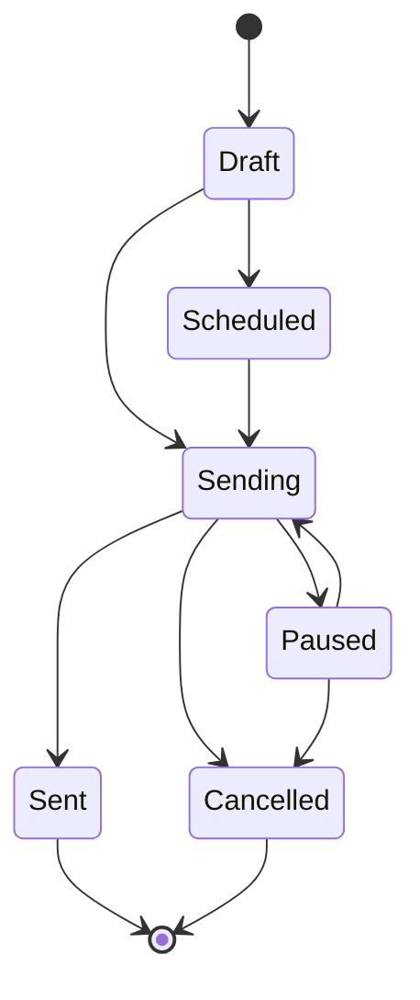
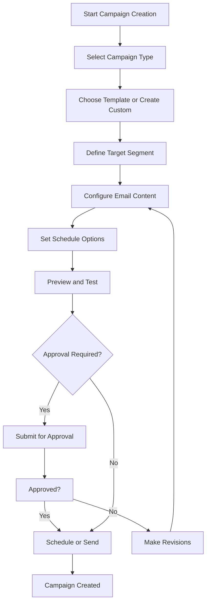

# Email Marketing Integration - Part 4: Campaign Management Workflow and Automation Rules

## Executive Summary

This document details the campaign management workflow and automation rules for the email marketing system. It covers the complete lifecycle of email campaigns from creation to completion, including drip campaigns, triggered automations, and behavioral sequences.

## 1. Campaign Types and Use Cases

### 1.1 Campaign Types

#### 1.1.1 Broadcast Campaigns
**Use Case**: One-time email blasts to specific segments

**Characteristics**:
- Single email send
- Targeted to specific segments
- Scheduled or immediate send
- Performance tracking

**Example Scenarios**:
- Product announcements
- Special promotions
- Newsletter distribution
- Event invitations

#### 1.1.2 Drip Campaigns
**Use Case**: Automated email sequences over time

**Characteristics**:
- Multiple emails in sequence
- Time-based delays between emails
- Conditional logic for progression
- Lead nurturing focus

**Example Scenarios**:
- Welcome series for new leads
- Onboarding sequences
- Re-engagement campaigns
- Educational content series

#### 1.1.3 Triggered Automations
**Use Case**: Emails sent based on specific events or actions

**Characteristics**:
- Event-driven triggers
- Real-time or near-real-time sending
- Single or multi-step sequences
- Context-aware content

**Example Scenarios**:
- Lead creation confirmation
- Stage change notifications
- Quote/invoice delivery
- Follow-up after inactivity

#### 1.1.4 Behavioral Campaigns
**Use Case**: Emails based on recipient behavior

**Characteristics**:
- Behavior-based triggers
- Personalized content
- Multi-path sequences
- Dynamic segmentation

**Example Scenarios**:
- Abandoned cart recovery
- Browse abandonment
- Click-based follow-ups
- Engagement-based nurturing

#### 1.1.5 Transactional Emails
**Use Case**: System-generated emails for specific transactions

**Characteristics**:
- High priority
- Immediate delivery
- Template-based
- Regulatory compliance

**Example Scenarios**:
- Password resets
- Account confirmations
- Order confirmations
- Receipts and invoices

## 2. Campaign Lifecycle Management

### 2.1 Campaign States



**State Definitions**:

| State | Description | Allowed Transitions |
|-------|-------------|-------------------|
| `draft` | Campaign being created and edited | → scheduled, sending, cancelled |
| `scheduled` | Campaign scheduled for future send | → sending, cancelled |
| `sending` | Campaign actively sending emails | → sent, paused, cancelled |
| `paused` | Campaign temporarily stopped | → sending, cancelled |
| `sent` | Campaign completed | → [*] |
| `cancelled` | Campaign cancelled before completion | → [*] |

### 2.2 Campaign Creation Workflow



### 2.3 Campaign Configuration

#### 2.3.1 Basic Configuration

```typescript
interface CampaignConfig {
  // Basic Information
  name: string
  description?: string
  type: 'broadcast' | 'drip' | 'triggered' | 'behavioral' | 'transactional'
  
  // Targeting
  segmentationRuleId?: string
  leadListIds?: string[]
  manualRecipients?: ManualRecipient[]
  
  // Content
  templateId?: string
  subject: string
  htmlContent: string
  textContent?: string
  fromEmail?: string
  fromName?: string
  replyTo?: string
  
  // Scheduling
  scheduleType: 'immediate' | 'scheduled' | 'recurring'
  scheduledAt?: Date
  timezone?: string
  recurringConfig?: RecurringConfig
  
  // Options
  trackOpens: boolean
  trackClicks: boolean
  enableUnsubscribe: boolean
  customUnsubscribeUrl?: string
  
  // Limits
  dailyLimit?: number
  totalLimit?: number
  
  // Metadata
  tags?: string[]
  metadata?: Record<string, any>
}

interface ManualRecipient {
  email: string
  name?: string
  leadId?: string
  variables?: Record<string, any>
}

interface RecurringConfig {
  frequency: 'daily' | 'weekly' | 'monthly'
  interval: number
  endDate?: Date
  occurrences?: number
}
```

#### 2.3.2 Drip Campaign Configuration

```typescript
interface DripCampaignConfig extends CampaignConfig {
  type: 'drip'
  steps: DripStep[]
  entryCriteria?: EntryCriteria
  exitCriteria?: ExitCriteria
  sendOnWeekends: boolean
  sendOnHolidays: boolean
}

interface DripStep {
  id: string
  order: number
  name: string
  templateId?: string
  subject: string
  htmlContent: string
  textContent?: string
  delayMinutes: number
  delayType: 'absolute' | 'relative'
  sendCondition?: StepCondition
  skipCondition?: StepCondition
}

interface StepCondition {
  field: string
  operator: string
  value: any
}

interface EntryCriteria {
  type: 'segment' | 'event' | 'manual'
  segmentId?: string
  eventType?: string
  eventConditions?: Record<string, any>
}

interface ExitCriteria {
  type: 'completed' | 'unsubscribed' | 'bounced' | 'custom'
  customConditions?: Record<string, any>
}
```

#### 2.3.3 Triggered Automation Configuration

```typescript
interface TriggeredAutomationConfig extends CampaignConfig {
  type: 'triggered'
  triggers: AutomationTrigger[]
  steps: AutomationStep[]
  enrollmentLimit?: EnrollmentLimit
  reentryRules: ReentryRules
}

interface AutomationTrigger {
  id: string
  type: 'lead_created' | 'stage_changed' | 'status_changed' | 'tag_added' | 'tag_removed' | 'custom_event' | 'time_based'
  conditions: TriggerCondition[]
  isActive: boolean
}

interface TriggerCondition {
  field: string
  operator: string
  value: any
  negate?: boolean
}

interface AutomationStep {
  id: string
  order: number
  name: string
  templateId?: string
  subject: string
  htmlContent: string
  textContent?: string
  delayMinutes: number
  sendCondition?: StepCondition[]
  skipIfCondition?: StepCondition[]
}

interface EnrollmentLimit {
  type: 'unlimited' | 'once' | 'per_period'
  period?: 'day' | 'week' | 'month' | 'year'
  maxEnrollments?: number
}

interface ReentryRules {
  allowReentry: boolean
  reentryCondition?: StepCondition[]
  cooldownPeriod?: number // in minutes
}
```

## 3. Campaign Execution Engine

### 3.1 Campaign Manager

```typescript
class CampaignManager {
  private queue: EmailQueue
  private providerManager: ProviderManager
  private segmentationService: SegmentationService
  private templateService: TemplateService
  
  constructor(
    queue: EmailQueue,
    providerManager: ProviderManager,
    segmentationService: SegmentationService,
    templateService: TemplateService
  ) {
    this.queue = queue
    this.providerManager = providerManager
    this.segmentationService = segmentationService
    this.templateService = templateService
  }
  
  async createCampaign(config: CampaignConfig): Promise<string> {
    // Validate configuration
    await this.validateCampaignConfig(config)
    
    // Create campaign in database
    const campaign = await this.createCampaignRecord(config)
    
    // If immediate send, start execution
    if (config.scheduleType === 'immediate') {
      await this.executeCampaign(campaign.id)
    }
    
    return campaign.id
  }
  
  async executeCampaign(campaignId: string): Promise<void> {
    const campaign = await this.getCampaign(campaignId)
    
    // Update campaign status
    await this.updateCampaignStatus(campaignId, 'sending')
    
    try {
      switch (campaign.type) {
        case 'broadcast':
          await this.executeBroadcastCampaign(campaign)
          break
        case 'drip':
          await this.executeDripCampaign(campaign)
          break
        case 'triggered':
          await this.executeTriggeredCampaign(campaign)
          break
        case 'behavioral':
          await this.executeBehavioralCampaign(campaign)
          break
        case 'transactional':
          await this.executeTransactionalCampaign(campaign)
          break
      }
      
      await this.updateCampaignStatus(campaignId, 'sent')
    } catch (error) {
      await this.updateCampaignStatus(campaignId, 'failed')
      throw error
    }
  }
  
  private async executeBroadcastCampaign(campaign: EmailCampaign): Promise<void> {
    // Get target recipients
    const recipients = await this.getTargetRecipients(campaign)
    
    // Update total recipients
    await this.updateCampaignRecipients(campaign.id, recipients.length)
    
    // Prepare emails
    const emails = await this.prepareEmails(campaign, recipients)
    
    // Enqueue emails for sending
    const emailIds = await this.queue.enqueueBatch(emails, {
      priority: 5,
      scheduledFor: campaign.scheduledAt || new Date()
    })
    
    // Create email records
    await this.createEmailRecords(campaign.id, emailIds, recipients)
  }
  
  private async executeDripCampaign(campaign: EmailCampaign): Promise<void> {
    // Get leads matching entry criteria
    const leads = await this.getLeadsMatchingEntryCriteria(campaign)
    
    // Enroll leads in drip campaign
    for (const lead of leads) {
      await this.enrollLeadInDrip(campaign.id, lead.id)
    }
    
    // Schedule first step for each enrolled lead
    for (const lead of leads) {
      await this.scheduleDripStep(campaign.id, lead.id, 0)
    }
  }
  
  private async executeTriggeredCampaign(campaign: EmailCampaign): Promise<void> {
    // Set up event listeners for triggers
    for (const trigger of campaign.triggers) {
      await this.setupTriggerListener(campaign.id, trigger)
    }
  }
  
  private async executeBehavioralCampaign(campaign: EmailCampaign): Promise<void> {
    // Set up behavioral tracking
    await this.setupBehavioralTracking(campaign.id)
  }
  
  private async executeTransactionalCampaign(campaign: EmailCampaign): Promise<void> {
    // Transactional campaigns are sent immediately upon trigger
    // This is handled by the trigger system
  }
  
  private async getTargetRecipients(campaign: EmailCampaign): Promise<Recipient[]> {
    const recipients: Recipient[] = []
    
    // Add segment members
    if (campaign.segmentationRuleId) {
      const segmentMembers = await this.segmentationService.getSegmentMembers(
        campaign.segmentationRuleId
      )
      recipients.push(...segmentMembers)
    }
    
    // Add lead list members
    if (campaign.leadListIds) {
      for (const listId of campaign.leadListIds) {
        const listMembers = await this.getLeadListMembers(listId)
        recipients.push(...listMembers)
      }
    }
    
    // Add manual recipients
    if (campaign.manualRecipients) {
      recipients.push(...campaign.manualRecipients)
    }
    
    // Remove duplicates and suppressions
    return await this.deduplicateAndSuppress(recipients)
  }
  
  private async prepareEmails(
    campaign: EmailCampaign,
    recipients: Recipient[]
  ): Promise<EmailData[]> {
    const emails: EmailData[] = []
    
    for (const recipient of recipients) {
      // Get or generate template content
      const content = campaign.templateId
        ? await this.templateService.getTemplateContent(campaign.templateId, recipient)
        : {
            subject: campaign.subject,
            html: campaign.htmlContent,
            text: campaign.textContent
          }
      
      // Personalize content
      const personalized = await this.personalizeContent(content, recipient)
      
      // Add tracking
      const tracked = await this.addTracking(personalized, recipient, campaign)
      
      emails.push({
        to: recipient.email,
        subject: tracked.subject,
        html: tracked.html,
        text: tracked.text,
        from: campaign.fromEmail,
        replyTo: campaign.replyTo,
        metadata: {
          campaignId: campaign.id,
          recipientId: recipient.id
        }
      })
    }
    
    return emails
  }
  
  private async personalizeContent(
    content: EmailContent,
    recipient: Recipient
  ): Promise<EmailContent> {
    const variables = await this.getRecipientVariables(recipient)
    
    return {
      subject: this.replaceVariables(content.subject, variables),
      html: this.replaceVariables(content.html, variables),
      text: content.text ? this.replaceVariables(content.text, variables) : undefined
    }
  }
  
  private replaceVariables(content: string, variables: Record<string, any>): string {
    return content.replace(/\{\{(\w+)\}\}/g, (match, key) => {
      return variables[key] !== undefined ? String(variables[key]) : match
    })
  }
  
  private async addTracking(
    content: EmailContent,
    recipient: Recipient,
    campaign: EmailCampaign
  ): Promise<EmailContent> {
    const trackingService = new TrackingService()
    
    // Add tracking pixel for open tracking
    let html = content.html
    if (campaign.trackOpens) {
      const trackingPixel = trackingService.generateTrackingPixel(
        'temp-id',
        recipient.id
      )
      html = html.replace('</body>', `</body>`)
    }
    
    // Add tracking links for click tracking
    if (campaign.trackClicks) {
      html = this.replaceLinks(html, (url) => {
        return trackingService.generateTrackingLink('temp-id', recipient.id, url)
      })
    }
    
    return {
      ...content,
      html
    }
  }
  
  private replaceLinks(html: string, replacer: (url: string) => string): string {
    return html.replace(/href="([^"]+)"/g, (match, url) => {
      return `href="${replacer(url)}"`
    })
  }
}
```

### 3.2 Drip Campaign Execution

```typescript
class DripCampaignExecutor {
  private campaignManager: CampaignManager
  private queue: EmailQueue
  
  constructor(campaignManager: CampaignManager, queue: EmailQueue) {
    this.campaignManager = campaignManager
    this.queue = queue
  }
  
  async enrollLeadInDrip(campaignId: string, leadId: string): Promise<void> {
    // Check if lead is already enrolled
    const existingEnrollment = await this.getEnrollment(campaignId, leadId)
    if (existingEnrollment) {
      return
    }
    
    // Create enrollment record
    await this.createEnrollment(campaignId, leadId)
    
    // Update campaign stats
    await this.incrementCampaignEnrollments(campaignId)
  }
  
  async scheduleDripStep(
    campaignId: string,
    leadId: string,
    stepOrder: number
  ): Promise<void> {
    const campaign = await this.getCampaign(campaignId)
    const step = campaign.steps[stepOrder]
    
    // Calculate send time
    const sendTime = this.calculateSendTime(step.delayMinutes, step.delayType)
    
    // Check send conditions
    const shouldSend = await this.checkSendConditions(step, leadId)
    if (!shouldSend) {
      // Skip to next step
      await this.scheduleDripStep(campaignId, leadId, stepOrder + 1)
      return
    }
    
    // Check skip conditions
    const shouldSkip = await this.checkSkipConditions(step, leadId)
    if (shouldSkip) {
      // Skip to next step
      await this.scheduleDripStep(campaignId, leadId, stepOrder + 1)
      return
    }
    
    // Schedule email
    const emailId = await this.queue.enqueue(
      {
        to: '', // Will be filled at send time
        subject: step.subject,
        html: step.htmlContent,
        text: step.textContent
      },
      {
        priority: 5,
        scheduledFor: sendTime,
        metadata: {
          campaignId,
          leadId,
          stepOrder
        }
      }
    )
    
    // Create scheduled step record
    await this.createScheduledStep(campaignId, leadId, stepOrder, emailId, sendTime)
  }
  
  private calculateSendTime(delayMinutes: number, delayType: string): Date {
    const now = new Date()
    
    if (delayType === 'absolute') {
      return new Date(now.getTime() + delayMinutes * 60 * 1000)
    } else {
      // Relative to business hours
      return this.calculateBusinessTime(now, delayMinutes)
    }
  }
  
  private calculateBusinessTime(startDate: Date, delayMinutes: number): Date {
    // Implement business hours calculation
    // Skip weekends and holidays if configured
    let currentDate = new Date(startDate)
    let remainingMinutes = delayMinutes
    
    while (remainingMinutes > 0) {
      currentDate = new Date(currentDate.getTime() + 60 * 1000)
      
      // Skip weekends
      if (currentDate.getDay() === 0 || currentDate.getDay() === 6) {
        continue
      }
      
      remainingMinutes--
    }
    
    return currentDate
  }
  
  private async checkSendConditions(step: DripStep, leadId: string): Promise<boolean> {
    if (!step.sendCondition) return true
    
    const lead = await this.getLead(leadId)
    return this.evaluateCondition(step.sendCondition, lead)
  }
  
  private async checkSkipConditions(step: DripStep, leadId: string): Promise<boolean> {
    if (!step.skipIfCondition) return false
    
    const lead = await this.getLead(leadId)
    return this.evaluateCondition(step.skipIfCondition, lead)
  }
  
  private evaluateCondition(condition: StepCondition, lead: Lead): boolean {
    const value = this.getLeadValue(lead, condition.field)
    
    switch (condition.operator) {
      case 'equals':
        return value === condition.value
      case 'not_equals':
        return value !== condition.value
      case 'contains':
        return String(value).includes(String(condition.value))
      case 'greater_than':
        return Number(value) > Number(condition.value)
      case 'less_than':
        return Number(value) < Number(condition.value)
      default:
        return false
    }
  }
  
  private getLeadValue(lead: Lead, field: string): any {
    const fields = field.split('.')
    let value: any = lead
    
    for (const f of fields) {
      value = value?.[f]
    }
    
    return value
  }
}
```

### 3.3 Triggered Automation Execution

```typescript
class TriggeredAutomationExecutor {
  private campaignManager: CampaignManager
  private eventBus: EventBus
  
  constructor(campaignManager: CampaignManager, eventBus: EventBus) {
    this.campaignManager = campaignManager
    this.eventBus = eventBus
  }
  
  async setupTriggerListener(campaignId: string, trigger: AutomationTrigger): Promise<void> {
    switch (trigger.type) {
      case 'lead_created':
        this.eventBus.on('lead.created', async (event) => {
          await this.handleLeadCreatedEvent(campaignId, trigger, event)
        })
        break
        
      case 'stage_changed':
        this.eventBus.on('lead.stage_changed', async (event) => {
          await this.handleStageChangedEvent(campaignId, trigger, event)
        })
        break
        
      case 'status_changed':
        this.eventBus.on('lead.status_changed', async (event) => {
          await this.handleStatusChangedEvent(campaignId, trigger, event)
        })
        break
        
      case 'tag_added':
        this.eventBus.on('lead.tag_added', async (event) => {
          await this.handleTagAddedEvent(campaignId, trigger, event)
        })
        break
        
      case 'custom_event':
        this.eventBus.on(trigger.eventType || 'custom.event', async (event) => {
          await this.handleCustomEvent(campaignId, trigger, event)
        })
        break
        
      case 'time_based':
        await this.setupTimeBasedTrigger(campaignId, trigger)
        break
    }
  }
  
  private async handleLeadCreatedEvent(
    campaignId: string,
    trigger: AutomationTrigger,
    event: LeadCreatedEvent
  ): Promise<void> {
    // Check if lead matches trigger conditions
    const matches = await this.checkTriggerConditions(trigger, event.lead)
    if (!matches) return
    
    // Enroll lead in automation
    await this.enrollLeadInAutomation(campaignId, event.lead.id)
    
    // Execute first step
    await this.executeAutomationStep(campaignId, event.lead.id, 0)
  }
  
  private async handleStageChangedEvent(
    campaignId: string,
    trigger: AutomationTrigger,
    event: StageChangedEvent
  ): Promise<void> {
    // Check if lead matches trigger conditions
    const matches = await this.checkTriggerConditions(trigger, event.lead)
    if (!matches) return
    
    // Enroll lead in automation
    await this.enrollLeadInAutomation(campaignId, event.lead.id)
    
    // Execute first step
    await this.executeAutomationStep(campaignId, event.lead.id, 0)
  }
  
  private async checkTriggerConditions(
    trigger: AutomationTrigger,
    lead: Lead
  ): Promise<boolean> {
    if (!trigger.conditions || trigger.conditions.length === 0) {
      return true
    }
    
    for (const condition of trigger.conditions) {
      const matches = this.evaluateCondition(condition, lead)
      if (!matches) {
        return false
      }
    }
    
    return true
  }
  
  private async enrollLeadInAutomation(campaignId: string, leadId: string): Promise<void> {
    // Check enrollment limits
    const campaign = await this.getCampaign(campaignId)
    const enrollmentLimit = campaign.enrollmentLimit
    
    if (enrollmentLimit?.type === 'once') {
      const existingEnrollment = await this.getEnrollment(campaignId, leadId)
      if (existingEnrollment) {
        return
      }
    }
    
    // Check reentry rules
    if (!campaign.reentryRules.allowReentry) {
      const existingEnrollment = await this.getEnrollment(campaignId, leadId)
      if (existingEnrollment && !existingEnrollment.completedAt) {
        return
      }
    }
    
    // Create enrollment record
    await this.createEnrollment(campaignId, leadId)
  }
  
  private async executeAutomationStep(
    campaignId: string,
    leadId: string,
    stepOrder: number
  ): Promise<void> {
    const campaign = await this.getCampaign(campaignId)
    const step = campaign.steps[stepOrder]
    
    // Check if step exists
    if (!step) {
      // Mark enrollment as completed
      await this.completeEnrollment(campaignId, leadId)
      return
    }
    
    // Calculate send time
    const sendTime = new Date(Date.now() + step.delayMinutes * 60 * 1000)
    
    // Prepare and send email
    const emailData = await this.prepareEmail(campaign, step, leadId)
    await this.queue.enqueue(emailData, {
      priority: 3, // Higher priority for triggered emails
      scheduledFor: sendTime,
      metadata: {
        campaignId,
        leadId,
        stepOrder
      }
    })
    
    // Schedule next step
    await this.scheduleNextStep(campaignId, leadId, stepOrder + 1)
  }
  
  private async scheduleNextStep(
    campaignId: string,
    leadId: string,
    nextStepOrder: number
  ): Promise<void> {
    const campaign = await this.getCampaign(campaignId)
    
    // Check if next step exists
    if (!campaign.steps[nextStepOrder]) {
      return
    }
    
    // Schedule next step
    const nextStep = campaign.steps[nextStepOrder]
    const sendTime = new Date(Date.now() + nextStep.delayMinutes * 60 * 1000)
    
    // Create scheduled step record
    await this.createScheduledStep(campaignId, leadId, nextStepOrder, sendTime)
  }
}
```

## 4. Automation Rules Engine

### 4.1 Rule Definition

```typescript
interface AutomationRule {
  id: string
  name: string
  description?: string
  workspaceId: string
  triggers: RuleTrigger[]
  conditions: RuleCondition[]
  actions: RuleAction[]
  isActive: boolean
  priority: number
  createdAt: DateTime
  updatedAt: DateTime
}

interface RuleTrigger {
  type: 'event' | 'schedule' | 'condition'
  eventType?: string
  schedule?: ScheduleConfig
  condition?: RuleCondition
}

interface RuleCondition {
  field: string
  operator: string
  value: any
  negate?: boolean
}

interface RuleAction {
  type: 'send_email' | 'update_lead' | 'add_tag' | 'remove_tag' | 'create_task' | 'webhook'
  config: ActionConfig
}

interface ActionConfig {
  templateId?: string
  updateData?: Record<string, any>
  tag?: string
  taskData?: TaskData
  webhookUrl?: string
  webhookMethod?: 'GET' | 'POST' | 'PUT' | 'DELETE'
  webhookHeaders?: Record<string, string>
  webhookBody?: Record<string, any>
}
```

### 4.2 Rules Engine Implementation

```typescript
class AutomationRulesEngine {
  private rules: Map<string, AutomationRule> = new Map()
  private eventBus: EventBus
  private campaignManager: CampaignManager
  
  constructor(eventBus: EventBus, campaignManager: CampaignManager) {
    this.eventBus = eventBus
    this.campaignManager = campaignManager
    this.initializeEventListeners()
  }
  
  async registerRule(rule: AutomationRule): Promise<void> {
    this.rules.set(rule.id, rule)
    
    // Register event listeners for event triggers
    for (const trigger of rule.triggers) {
      if (trigger.type === 'event' && trigger.eventType) {
        this.eventBus.on(trigger.eventType, async (event) => {
          await this.handleEvent(rule.id, event)
        })
      }
    }
    
    // Register scheduled triggers
    for (const trigger of rule.triggers) {
      if (trigger.type === 'schedule' && trigger.schedule) {
        this.scheduleTrigger(rule.id, trigger.schedule)
      }
    }
  }
  
  private async handleEvent(ruleId: string, event: any): Promise<void> {
    const rule = this.rules.get(ruleId)
    if (!rule || !rule.isActive) return
    
    // Check conditions
    const conditionsMet = await this.checkConditions(rule.conditions, event)
    if (!conditionsMet) return
    
    // Execute actions
    for (const action of rule.actions) {
      await this.executeAction(action, event)
    }
  }
  
  private async checkConditions(
    conditions: RuleCondition[],
    context: any
  ): Promise<boolean> {
    for (const condition of conditions) {
      const value = this.getValue(context, condition.field)
      const matches = this.evaluateCondition(condition, value)
      
      if (condition.negate) {
        if (matches) return false
      } else {
        if (!matches) return false
      }
    }
    
    return true
  }
  
  private evaluateCondition(condition: RuleCondition, value: any): boolean {
    switch (condition.operator) {
      case 'equals':
        return value === condition.value
      case 'not_equals':
        return value !== condition.value
      case 'contains':
        return String(value).includes(String(condition.value))
      case 'greater_than':
        return Number(value) > Number(condition.value)
      case 'less_than':
        return Number(value) < Number(condition.value)
      case 'in_list':
        return Array.isArray(condition.value) && condition.value.includes(value)
      case 'not_in_list':
        return Array.isArray(condition.value) && !condition.value.includes(value)
      default:
        return false
    }
  }
  
  private async executeAction(action: RuleAction, context: any): Promise<void> {
    switch (action.type) {
      case 'send_email':
        await this.executeSendEmailAction(action, context)
        break
      case 'update_lead':
        await this.executeUpdateLeadAction(action, context)
        break
      case 'add_tag':
        await this.executeAddTagAction(action, context)
        break
      case 'remove_tag':
        await this.executeRemoveTagAction(action, context)
        break
      case 'create_task':
        await this.executeCreateTaskAction(action, context)
        break
      case 'webhook':
        await this.executeWebhookAction(action, context)
        break
    }
  }
  
  private async executeSendEmailAction(action: RuleAction, context: any): Promise<void> {
    const templateId = action.config.templateId
    const leadId = context.leadId
    
    if (!templateId || !leadId) return
    
    // Get lead
    const lead = await this.getLead(leadId)
    
    // Prepare email
    const emailData = await this.prepareEmailFromTemplate(templateId, lead)
    
    // Send email
    await this.campaignManager.queue.enqueue(emailData, {
      priority: 3,
      scheduledFor: new Date()
    })
  }
  
  private async executeWebhookAction(action: RuleAction, context: any): Promise<void> {
    const url = action.config.webhookUrl
    const method = action.config.webhookMethod || 'POST'
    const headers = action.config.webhookHeaders || {}
    const body = action.config.webhookBody || context
    
    if (!url) return
    
    await fetch(url, {
      method,
      headers: {
        'Content-Type': 'application/json',
        ...headers
      },
      body: JSON.stringify(body)
    })
  }
}
```

## 5. Campaign Analytics and Reporting

### 5.1 Real-time Metrics

```typescript
interface CampaignMetrics {
  // Basic Metrics
  totalRecipients: number
  sentCount: number
  deliveredCount: number
  openedCount: number
  uniqueOpenCount: number
  clickCount: number
  uniqueClickCount: number
  bouncedCount: number
  unsubscribedCount: number
  
  // Calculated Metrics
  deliveryRate: number
  openRate: number
  clickRate: number
  clickToOpenRate: number
  bounceRate: number
  unsubscribeRate: number
  
  // Engagement Metrics
  averageTimeToOpen: number
  averageTimeToClick: number
  deviceBreakdown: DeviceBreakdown
  linkPerformance: LinkPerformance[]
  
  // Conversion Metrics
  conversionRate: number
  revenueGenerated: number
  costPerAcquisition: number
}

interface DeviceBreakdown {
  desktop: number
  mobile: number
  tablet: number
  other: number
}

interface LinkPerformance {
  url: string
  clickCount: number
  uniqueClickCount: number
  clickRate: number
}
```

### 5.2 Analytics Dashboard

```typescript
class CampaignAnalytics {
  async getCampaignMetrics(campaignId: string): Promise<CampaignMetrics> {
    const campaign = await this.getCampaign(campaignId)
    const emails = await this.getCampaignEmails(campaignId)
    
    return {
      totalRecipients: campaign.totalRecipients,
      sentCount: campaign.sentCount,
      deliveredCount: campaign.deliveredCount,
      openedCount: campaign.openedCount,
      uniqueOpenCount: await this.getUniqueOpenCount(emails),
      clickCount: campaign.clickedCount,
      uniqueClickCount: await this.getUniqueClickCount(emails),
      bouncedCount: campaign.bouncedCount,
      unsubscribedCount: campaign.unsubscribedCount,
      deliveryRate: this.calculateDeliveryRate(campaign),
      openRate: this.calculateOpenRate(campaign),
      clickRate: this.calculateClickRate(campaign),
      clickToOpenRate: this.calculateClickToOpenRate(campaign),
      bounceRate: this.calculateBounceRate(campaign),
      unsubscribeRate: this.calculateUnsubscribeRate(campaign),
      averageTimeToOpen: await this.getAverageTimeToOpen(emails),
      averageTimeToClick: await this.getAverageTimeToClick(emails),
      deviceBreakdown: await this.getDeviceBreakdown(emails),
      linkPerformance: await this.getLinkPerformance(emails),
      conversionRate: await this.getConversionRate(campaign),
      revenueGenerated: await this.getRevenueGenerated(campaign),
      costPerAcquisition: await this.getCostPerAcquisition(campaign)
    }
  }
  
  private calculateDeliveryRate(campaign: EmailCampaign): number {
    if (campaign.sentCount === 0) return 0
    return (campaign.deliveredCount / campaign.sentCount) * 100
  }
  
  private calculateOpenRate(campaign: EmailCampaign): number {
    if (campaign.deliveredCount === 0) return 0
    return (campaign.openedCount / campaign.deliveredCount) * 100
  }
  
  private calculateClickRate(campaign: EmailCampaign): number {
    if (campaign.deliveredCount === 0) return 0
    return (campaign.clickedCount / campaign.deliveredCount) * 100
  }
  
  private calculateClickToOpenRate(campaign: EmailCampaign): number {
    if (campaign.openedCount === 0) return 0
    return (campaign.clickedCount / campaign.openedCount) * 100
  }
  
  private calculateBounceRate(campaign: EmailCampaign): number {
    if (campaign.sentCount === 0) return 0
    return (campaign.bouncedCount / campaign.sentCount) * 100
  }
  
  private calculateUnsubscribeRate(campaign: EmailCampaign): number {
    if (campaign.deliveredCount === 0) return 0
    return (campaign.unsubscribedCount / campaign.deliveredCount) * 100
  }
}
```

## 6. Campaign Testing and Preview

### 6.1 Test Email Sending

```typescript
class CampaignTester {
  async sendTestEmail(
    campaignId: string,
    testEmails: string[]
  ): Promise<TestResult[]> {
    const campaign = await this.getCampaign(campaignId)
    const results: TestResult[] = []
    
    for (const testEmail of testEmails) {
      try {
        // Prepare test email
        const emailData = await this.prepareTestEmail(campaign, testEmail)
        
        // Send test email
        const result = await this.providerManager.sendEmail(emailData, {
          providerId: campaign.providerId
        })
        
        results.push({
          email: testEmail,
          success: result.success,
          messageId: result.messageId,
          error: result.error
        })
      } catch (error) {
        results.push({
          email: testEmail,
          success: false,
          error: error.message
        })
      }
    }
    
    return results
  }
  
  async previewCampaign(
    campaignId: string,
    sampleLeadId?: string
  ): Promise<CampaignPreview> {
    const campaign = await this.getCampaign(campaignId)
    const lead = sampleLeadId ? await this.getLead(sampleLeadId) : null
    
    const content = campaign.templateId
      ? await this.templateService.getTemplateContent(campaign.templateId, lead)
      : {
          subject: campaign.subject,
          html: campaign.htmlContent,
          text: campaign.textContent
        }
    
    const personalized = lead
      ? await this.personalizeContent(content, lead)
      : content
    
    return {
      subject: personalized.subject,
      html: personalized.html,
      text: personalized.text,
      fromEmail: campaign.fromEmail,
      fromName: campaign.fromName,
      replyTo: campaign.replyTo,
      estimatedRecipients: await this.getEstimatedRecipients(campaign),
      estimatedCost: await this.getEstimatedCost(campaign)
    }
  }
}
```

## 7. Next Steps

This campaign management workflow provides:
1. Complete campaign lifecycle management
2. Support for multiple campaign types
3. Advanced automation and triggers
4. Real-time analytics and reporting
5. Testing and preview capabilities

The next part will detail performance tracking metrics and analytics dashboard.

---

**Document Status**: Part 4 of 8
**Related Documents**: 
- Part 1: Customer Segmentation Strategies and Logic
- Part 2: Database Schema Extensions
- Part 3: Email Service Provider Integration
- Part 5: Performance Tracking Metrics
- Part 6: API Endpoints and Service Layer
- Part 7: Frontend Components and UI Design
- Part 8: Implementation Roadmap
