# Email Marketing Integration - Part 5: Performance Tracking Metrics and Analytics Dashboard

## Executive Summary

This document outlines the comprehensive performance tracking metrics and analytics dashboard for the email marketing system. It defines key performance indicators (KPIs), tracking mechanisms, data visualization, and reporting capabilities.

## 1. Key Performance Indicators (KPIs)

### 1.1 Delivery Metrics

#### 1.1.1 Delivery Rate
**Definition**: Percentage of emails successfully delivered to recipients' inboxes

**Calculation**:
```
Delivery Rate = (Delivered Emails / Sent Emails) × 100
```

**Benchmark**: > 95% is good, < 90% requires investigation

**Factors Affecting**:
- Email list quality
- Sender reputation
- Content filtering
- Technical issues

#### 1.1.2 Bounce Rate
**Definition**: Percentage of emails that could not be delivered

**Calculation**:
```
Bounce Rate = (Bounced Emails / Sent Emails) × 100
```

**Types**:
- **Hard Bounces**: Permanent failures (invalid email, domain doesn't exist)
- **Soft Bounces**: Temporary failures (inbox full, server down)

**Benchmark**: < 2% is acceptable, > 5% requires action

#### 1.1.3 Complaint Rate
**Definition**: Percentage of recipients marking emails as spam

**Calculation**:
```
Complaint Rate = (Complaints / Delivered Emails) × 100
```

**Benchmark**: < 0.1% is acceptable, > 0.5% is critical

### 1.2 Engagement Metrics

#### 1.2.1 Open Rate
**Definition**: Percentage of delivered emails that were opened

**Calculation**:
```
Open Rate = (Unique Opens / Delivered Emails) × 100
```

**Benchmark**: 15-25% average, varies by industry

**Factors Affecting**:
- Subject line quality
- Sender reputation
- Send time
- Relevance to recipient

#### 1.2.2 Click-Through Rate (CTR)
**Definition**: Percentage of delivered emails that resulted in at least one click

**Calculation**:
```
CTR = (Unique Clicks / Delivered Emails) × 100
```

**Benchmark**: 2-5% average, varies by industry

#### 1.2.3 Click-to-Open Rate (CTOR)
**Definition**: Percentage of opened emails that resulted in at least one click

**Calculation**:
```
CTOR = (Unique Clicks / Unique Opens) × 100
```

**Benchmark**: 10-20% average

#### 1.2.4 Total Clicks
**Definition**: Total number of link clicks across all recipients

**Calculation**:
```
Total Clicks = Sum of all clicks
```

#### 1.2.5 Clicks per Email
**Definition**: Average number of clicks per email opened

**Calculation**:
```
Clicks per Email = Total Clicks / Unique Opens
```

### 1.3 Conversion Metrics

#### 1.3.1 Conversion Rate
**Definition**: Percentage of recipients who completed a desired action

**Calculation**:
```
Conversion Rate = (Conversions / Delivered Emails) × 100
```

**Benchmark**: 1-5% average, varies by goal

#### 1.3.2 Revenue per Email
**Definition**: Average revenue generated per email sent

**Calculation**:
```
Revenue per Email = Total Revenue / Sent Emails
```

#### 1.3.3 Revenue per Open
**Definition**: Average revenue generated per email opened

**Calculation**:
```
Revenue per Open = Total Revenue / Unique Opens
```

#### 1.3.4 Return on Investment (ROI)
**Definition**: Return on investment for email marketing campaigns

**Calculation**:
```
ROI = ((Revenue - Cost) / Cost) × 100
```

#### 1.3.5 Cost per Acquisition (CPA)
**Definition**: Cost to acquire one customer through email marketing

**Calculation**:
```
CPA = Total Campaign Cost / Number of Acquisitions
```

### 1.4 List Health Metrics

#### 1.4.1 List Growth Rate
**Definition**: Net growth of email list over time

**Calculation**:
```
List Growth Rate = ((New Subscribers - Unsubscribes - Bounces) / Starting List Size) × 100
```

#### 1.4.2 Unsubscribe Rate
**Definition**: Percentage of recipients who unsubscribe

**Calculation**:
```
Unsubscribe Rate = (Unsubscribes / Delivered Emails) × 100
```

**Benchmark**: < 0.5% is acceptable, > 1% requires review

#### 1.4.3 Suppression List Size
**Definition**: Number of emails on suppression list

**Tracking**: Monitor growth rate and reasons

### 1.5 Time-Based Metrics

#### 1.5.1 Time to Open
**Definition**: Average time between email delivery and first open

**Calculation**:
```
Time to Open = Sum of (Open Time - Delivery Time) / Number of Opens
```

**Benchmark**: < 2 hours is good

#### 1.5.2 Time to Click
**Definition**: Average time between email delivery and first click

**Calculation**:
```
Time to Click = Sum of (Click Time - Delivery Time) / Number of Clicks
```

#### 1.5.3 Peak Engagement Time
**Definition**: Time of day with highest engagement rates

**Tracking**: Analyze opens and clicks by hour

### 1.6 Device and Platform Metrics

#### 1.6.1 Device Breakdown
**Definition**: Distribution of opens by device type

**Metrics**:
- Desktop opens
- Mobile opens
- Tablet opens

#### 1.6.2 Email Client Breakdown
**Definition**: Distribution of opens by email client

**Common Clients**:
- Gmail
- Outlook
- Apple Mail
- Yahoo Mail
- Others

#### 1.6.3 Browser Breakdown
**Definition**: Distribution of clicks by browser

**Metrics**: Chrome, Safari, Firefox, Edge, Others

### 1.7 Content Metrics

#### 1.7.1 Link Performance
**Definition**: Performance of individual links within emails

**Metrics**:
- Click count per link
- Click rate per link
- Most clicked links
- Least clicked links

#### 1.7.2 Subject Line Performance
**Definition**: Performance comparison of different subject lines

**Metrics**:
- Open rate by subject line
- Click rate by subject line
- Conversion rate by subject line

## 2. Metrics Data Structure

### 2.1 Campaign Metrics

```typescript
interface CampaignMetrics {
  // Campaign Information
  campaignId: string
  campaignName: string
  campaignType: string
  workspaceId: string
  period: MetricsPeriod
  
  // Delivery Metrics
  totalRecipients: number
  sentCount: number
  deliveredCount: number
  deliveryRate: number
  bouncedCount: number
  bounceRate: number
  hardBounceCount: number
  softBounceCount: number
  complaintCount: number
  complaintRate: number
  
  // Engagement Metrics
  openedCount: number
  uniqueOpenCount: number
  openRate: number
  clickCount: number
  uniqueClickCount: number
  clickRate: number
  clickToOpenRate: number
  clicksPerEmail: number
  
  // Conversion Metrics
  conversionCount: number
  conversionRate: number
  revenueGenerated: number
  revenuePerEmail: number
  revenuePerOpen: number
  roi: number
  costPerAcquisition: number
  
  // List Health Metrics
  unsubscribeCount: number
  unsubscribeRate: number
  suppressionCount: number
  
  // Time-Based Metrics
  averageTimeToOpen: number // in minutes
  averageTimeToClick: number // in minutes
  peakEngagementTime: string
  
  // Device Metrics
  deviceBreakdown: DeviceBreakdown
  emailClientBreakdown: EmailClientBreakdown
  browserBreakdown: BrowserBreakdown
  
  // Content Metrics
  linkPerformance: LinkPerformance[]
  topPerformingLinks: LinkPerformance[]
  bottomPerformingLinks: LinkPerformance[]
  
  // Trend Data
  trends: MetricsTrend[]
  
  // Comparisons
  comparisonToPrevious?: MetricsComparison
  comparisonToBenchmark?: MetricsComparison
  
  // Timestamps
  calculatedAt: DateTime
}

interface MetricsPeriod {
  startDate: DateTime
  endDate: DateTime
  type: 'day' | 'week' | 'month' | 'quarter' | 'year' | 'custom'
}

interface DeviceBreakdown {
  desktop: DeviceMetrics
  mobile: DeviceMetrics
  tablet: DeviceMetrics
  other: DeviceMetrics
}

interface DeviceMetrics {
  count: number
  percentage: number
  openRate: number
  clickRate: number
}

interface EmailClientBreakdown {
  [client: string]: ClientMetrics
}

interface ClientMetrics {
  count: number
  percentage: number
  openRate: number
  clickRate: number
}

interface BrowserBreakdown {
  [browser: string]: BrowserMetrics
}

interface BrowserMetrics {
  count: number
  percentage: number
  clickRate: number
}

interface LinkPerformance {
  url: string
  displayText?: string
  clickCount: number
  uniqueClickCount: number
  clickRate: number
  position: number
}

interface MetricsTrend {
  date: DateTime
  sentCount: number
  deliveredCount: number
  openedCount: number
  clickedCount: number
  conversionCount: number
}

interface MetricsComparison {
  metric: string
  currentValue: number
  previousValue: number
  benchmarkValue?: number
  percentageChange: number
  direction: 'up' | 'down' | 'neutral'
  isPositive: boolean
}
```

### 2.2 Recipient Metrics

```typescript
interface RecipientMetrics {
  recipientId: string
  email: string
  leadId?: string
  
  // Engagement History
  totalEmailsReceived: number
  totalOpens: number
  totalClicks: number
  totalConversions: number
  
  // Engagement Rates
  openRate: number
  clickRate: number
  conversionRate: number
  
  // Last Activity
  lastEmailReceivedAt?: DateTime
  lastOpenedAt?: DateTime
  lastClickedAt?: DateTime
  lastConvertedAt?: DateTime
  
  // Engagement Score
  engagementScore: number
  engagementLevel: 'high' | 'medium' | 'low'
  
  // Preferences
  preferredSendTime?: string
  preferredContentType?: string
  
  // Status
  status: 'active' | 'inactive' | 'unsubscribed' | 'bounced' | 'suppressed'
  statusSince?: DateTime
  
  // Trends
  engagementTrend: 'increasing' | 'decreasing' | 'stable'
  
  // Segmentation
  segments: string[]
  tags: string[]
}
```

### 2.3 Aggregate Metrics

```typescript
interface AggregateMetrics {
  workspaceId: string
  period: MetricsPeriod
  
  // Campaign Summary
  totalCampaigns: number
  activeCampaigns: number
  completedCampaigns: number
  
  // Email Summary
  totalEmailsSent: number
  totalEmailsDelivered: number
  totalEmailsOpened: number
  totalEmailsClicked: number
  
  // Aggregate Rates
  averageDeliveryRate: number
  averageOpenRate: number
  averageClickRate: number
  averageConversionRate: number
  
  // Revenue Summary
  totalRevenue: number
  averageRevenuePerCampaign: number
  averageRevenuePerEmail: number
  
  // Cost Summary
  totalCost: number
  averageCostPerCampaign: number
  averageCostPerEmail: number
  
  // ROI Summary
  totalROI: number
  averageROI: number
  
  // List Summary
  totalRecipients: number
  activeRecipients: number
  inactiveRecipients: number
  unsubscribedRecipients: number
  bouncedRecipients: number
  
  // Top Performers
  topPerformingCampaigns: CampaignPerformance[]
  worstPerformingCampaigns: CampaignPerformance[]
  topPerformingSegments: SegmentPerformance[]
  
  // Trends
  trends: AggregateTrend[]
  
  // Benchmarks
  benchmarks: MetricsBenchmark[]
  
  calculatedAt: DateTime
}

interface CampaignPerformance {
  campaignId: string
  campaignName: string
  metrics: CampaignMetrics
  score: number
}

interface SegmentPerformance {
  segmentId: string
  segmentName: string
  metrics: SegmentMetrics
  score: number
}

interface SegmentMetrics {
  totalRecipients: number
  openRate: number
  clickRate: number
  conversionRate: number
  revenueGenerated: number
}

interface AggregateTrend {
  date: DateTime
  campaignsSent: number
  emailsSent: number
  opens: number
  clicks: number
  conversions: number
  revenue: number
}

interface MetricsBenchmark {
  metric: string
  industryAverage: number
  topPerformer: number
  bottomPerformer: number
  currentValue: number
  percentile: number
}
```

## 3. Analytics Dashboard Design

### 3.1 Dashboard Overview

```mermaid
graph TB
    A[Analytics Dashboard] --> B[Overview Tab]
    A --> C[Campaigns Tab]
    A --> D[Recipients Tab]
    A --> E[Segments Tab]
    A --> F[Trends Tab]
    A --> G[Reports Tab]
    
    B --> B1[Key Metrics Cards]
    B --> B2[Performance Charts]
    B --> B3[Recent Activity]
    B --> B4[Quick Actions]
    
    C --> C1[Campaign List]
    C --> C2[Campaign Detail]
    C --> C3[A/B Testing]
    C --> C4[Comparison]
    
    D --> D1[Recipient List]
    D --> D2[Recipient Detail]
    D --> D3[Engagement Analysis]
    D --> D4[Segmentation]
    
    E --> E1[Segment List]
    E --> E2[Segment Detail]
    E --> E3[Performance Comparison]
    E --> E4[Overlap Analysis]
    
    F --> F1[Time Series Charts]
    F --> F2[Funnel Analysis]
    F --> F3[Cohort Analysis]
    F --> F4[Predictive Analytics]
    
    G --> G1[Report Templates]
    G --> G2[Custom Reports]
    G --> G3[Schedule Reports]
    G --> G4[Export Data]
```



### 3.2 Overview Dashboard

#### 3.2.1 Key Metrics Cards

```typescript
interface KeyMetricsCard {
  title: string
  value: number | string
  change: number
  changeDirection: 'up' | 'down' | 'neutral'
  changeLabel: string
  trend: number[]
  benchmark?: number
  icon: string
  color: string
}

// Example Cards
const overviewCards: KeyMetricsCard[] = [
  {
    title: 'Total Emails Sent',
    value: 12543,
    change: 12.5,
    changeDirection: 'up',
    changeLabel: 'vs last month',
    trend: [10000, 10500, 11000, 11500, 12000, 12543],
    icon: 'mail',
    color: 'blue'
  },
  {
    title: 'Open Rate',
    value: '23.5%',
    change: 2.3,
    changeDirection: 'up',
    changeLabel: 'vs last month',
    trend: [20, 21, 21.5, 22, 22.8, 23.5],
    benchmark: 21.2,
    icon: 'eye',
    color: 'green'
  },
  {
    title: 'Click Rate',
    value: '4.2%',
    change: -0.5,
    changeDirection: 'down',
    changeLabel: 'vs last month',
    trend: [5.0, 4.8, 4.7, 4.5, 4.3, 4.2],
    benchmark: 3.8,
    icon: 'mouse-pointer',
    color: 'yellow'
  },
  {
    title: 'Conversion Rate',
    value: '2.8%',
    change: 0.8,
    changeDirection: 'up',
    changeLabel: 'vs last month',
    trend: [2.0, 2.1, 2.3, 2.5, 2.6, 2.8],
    benchmark: 2.5,
    icon: 'check-circle',
    color: 'purple'
  },
  {
    title: 'Revenue Generated',
    value: '$45,230',
    change: 15.2,
    changeDirection: 'up',
    changeLabel: 'vs last month',
    trend: [35000, 37000, 39000, 41000, 43000, 45230],
    icon: 'dollar-sign',
    color: 'green'
  },
  {
    title: 'ROI',
    value: '325%',
    change: 25.0,
    changeDirection: 'up',
    changeLabel: 'vs last month',
    trend: [250, 270, 280, 290, 300, 325],
    benchmark: 280,
    icon: 'trending-up',
    color: 'blue'
  }
]
```

#### 3.2.2 Performance Charts

**Chart Types**:

1. **Email Volume Chart**
   - Line chart showing emails sent over time
   - Breakdown by campaign type
   - Comparison with previous period

2. **Engagement Funnel Chart**
   - Funnel visualization: Sent → Delivered → Opened → Clicked → Converted
   - Drop-off percentages at each stage
   - Comparison with benchmarks

3. **Device Breakdown Chart**
   - Pie chart showing opens by device type
   - Click rates by device
   - Conversion rates by device

4. **Email Client Breakdown Chart**
   - Bar chart showing opens by email client
   - Engagement rates by client

5. **Geographic Distribution Chart**
   - Map showing opens by location
   - Engagement rates by region

6. **Time-of-Day Heatmap**
   - Heatmap showing engagement by hour and day
   - Identification of optimal send times

### 3.3 Campaign Dashboard

#### 3.3.1 Campaign List View

```typescript
interface CampaignListItem {
  id: string
  name: string
  type: string
  status: string
  sentDate: DateTime
  recipients: number
  delivered: number
  opens: number
  clicks: number
  conversions: number
  revenue: number
  openRate: number
  clickRate: number
  conversionRate: number
  roi: number
  score: number
}

interface CampaignListFilters {
  status?: string[]
  type?: string[]
  dateRange?: DateRange
  minRecipients?: number
  minOpenRate?: number
  minClickRate?: number
  search?: string
  sortBy?: string
  sortOrder?: 'asc' | 'desc'
}
```

#### 3.3.2 Campaign Detail View

```typescript
interface CampaignDetailView {
  campaign: EmailCampaign
  metrics: CampaignMetrics
  timeline: CampaignTimeline[]
  recipientBreakdown: RecipientBreakdown[]
  linkPerformance: LinkPerformance[]
  deviceBreakdown: DeviceBreakdown
  emailClientBreakdown: EmailClientBreakdown
  geographicBreakdown: GeographicBreakdown[]
  timeSeriesData: TimeSeriesData[]
  comparisons: CampaignComparison[]
  recommendations: Recommendation[]
}

interface CampaignTimeline {
  timestamp: DateTime
  event: string
  description: string
  details?: any
}

interface RecipientBreakdown {
  segmentId: string
  segmentName: string
  recipients: number
  openRate: number
  clickRate: number
  conversionRate: number
  revenue: number
}

interface GeographicBreakdown {
  country: string
  city?: string
  opens: number
  clicks: number
  conversions: number
  openRate: number
  clickRate: number
  conversionRate: number
}

interface CampaignComparison {
  campaignId: string
  campaignName: string
  metrics: CampaignMetrics
  differences: MetricsDifference[]
}

interface MetricsDifference {
  metric: string
  value1: number
  value2: number
  absoluteDifference: number
  percentageDifference: number
  isSignificant: boolean
}

interface Recommendation {
  type: 'improvement' | 'optimization' | 'warning'
  priority: 'high' | 'medium' | 'low'
  title: string
  description: string
  actionable: boolean
  expectedImpact?: string
}
```

### 3.4 Recipient Dashboard

#### 3.4.1 Recipient List View

```typescript
interface RecipientListItem {
  id: string
  email: string
  name?: string
  leadId?: string
  totalEmailsReceived: number
  totalOpens: number
  totalClicks: number
  totalConversions: number
  openRate: number
  clickRate: number
  conversionRate: number
  engagementScore: number
  engagementLevel: 'high' | 'medium' | 'low'
  lastActivity: DateTime
  status: string
  segments: string[]
  tags: string[]
}

interface RecipientListFilters {
  status?: string[]
  engagementLevel?: string[]
  segments?: string[]
  tags?: string[]
  dateRange?: DateRange
  minEngagementScore?: number
  search?: string
  sortBy?: string
  sortOrder?: 'asc' | 'desc'
}
```

#### 3.4.2 Recipient Detail View

```typescript
interface RecipientDetailView {
  recipient: RecipientMetrics
  emailHistory: EmailHistoryItem[]
  engagementTimeline: EngagementTimeline[]
  journeyMap: JourneyMap
  preferences: RecipientPreferences
  recommendations: Recommendation[]
}

interface EmailHistoryItem {
  emailId: string
  campaignId: string
  campaignName: string
  sentAt: DateTime
  openedAt?: DateTime
  clickedAt?: DateTime
  convertedAt?: DateTime
  status: string
  subject: string
  preview?: string
}

interface EngagementTimeline {
  date: DateTime
  event: 'opened' | 'clicked' | 'converted' | 'unsubscribed' | 'bounced'
  campaignId: string
  campaignName: string
  details?: any
}

interface JourneyMap {
  stages: JourneyStage[]
  currentStage: string
  timeInCurrentStage: number
  nextActions: string[]
}

interface JourneyStage {
  id: string
  name: string
  enteredAt: DateTime
  exitedAt?: DateTime
  duration?: number
  actions: JourneyAction[]
}

interface JourneyAction {
  type: string
  timestamp: DateTime
  details?: any
}

interface RecipientPreferences {
  preferredSendTime?: string
  preferredContentType?: string
  preferredFrequency?: string
  communicationChannel?: string
  language?: string
}
```

### 3.5 Trends Dashboard

#### 3.5.1 Time Series Analysis

```typescript
interface TimeSeriesData {
  timestamp: DateTime
  period: string
  metrics: {
    sent: number
    delivered: number
    opened: number
    clicked: number
    converted: number
    revenue: number
  }
  rates: {
    deliveryRate: number
    openRate: number
    clickRate: number
    conversionRate: number
  }
}

interface TrendAnalysis {
  metric: string
  currentValue: number
  previousValue: number
  change: number
  changePercentage: number
  trend: 'increasing' | 'decreasing' | 'stable'
  trendStrength: 'strong' | 'moderate' | 'weak'
  forecast?: number[]
  seasonality?: SeasonalityPattern
}

interface SeasonalityPattern {
  hasSeasonality: boolean
  peakPeriods: string[]
  lowPeriods: string[]
  pattern: SeasonalityData[]
}

interface SeasonalityData {
  period: string
  average: number
  deviation: number
}
```

#### 3.5.2 Funnel Analysis

```typescript
interface FunnelData {
  funnelName: string
  stages: FunnelStage[]
  overallConversionRate: number
  dropOffPoints: DropOffPoint[]
  bottlenecks: Bottleneck[]
}

interface FunnelStage {
  name: string
  count: number
  percentage: number
  dropOffFromPrevious: number
  averageTimeInStage: number
}

interface DropOffPoint {
  stage: string
  dropOffRate: number
  dropOffCount: number
  potentialReasons: string[]
}

interface Bottleneck {
  stage: string
  severity: 'high' | 'medium' | 'low'
  description: string
  recommendations: string[]
}
```

#### 3.5.3 Cohort Analysis

```typescript
interface CohortData {
  cohort: string
  cohortSize: number
  metrics: CohortMetrics[]
}

interface CohortMetrics {
  period: number
  activeUsers: number
  retentionRate: number
  averageEngagement: number
  averageRevenue: number
}

interface CohortAnalysis {
  metric: string
  cohorts: CohortData[]
  overallTrend: string
  bestPerformingCohort: string
  worstPerformingCohort: string
  insights: string[]
}
```

### 3.6 Reports Dashboard

#### 3.6.1 Report Templates

```typescript
interface ReportTemplate {
  id: string
  name: string
  description: string
  type: 'campaign' | 'recipient' | 'aggregate' | 'custom'
  schedule?: ReportSchedule
  format: 'pdf' | 'excel' | 'csv' | 'html'
  sections: ReportSection[]
  filters: ReportFilters
  recipients: string[]
  createdBy: string
  createdAt: DateTime
  lastRunAt?: DateTime
}

interface ReportSchedule {
  frequency: 'daily' | 'weekly' | 'monthly' | 'quarterly'
  dayOfWeek?: number
  dayOfMonth?: number
  time: string
  timezone: string
}

interface ReportSection {
  id: string
  type: 'summary' | 'chart' | 'table' | 'text'
  title: string
  config: any
  order: number
}

interface ReportFilters {
  dateRange: DateRange
  campaigns?: string[]
  segments?: string[]
  metrics?: string[]
}

interface ReportFilters {
  dateRange: DateRange
  campaigns?: string[]
  segments?: string[]
  metrics?: string[]
}
```

#### 3.6.2 Custom Reports

```typescript
interface CustomReport {
  id: string
  name: string
  description: string
  query: ReportQuery
  visualization: ReportVisualization
  schedule?: ReportSchedule
  recipients: string[]
  createdBy: string
  createdAt: DateTime
  lastRunAt?: DateTime
}

interface ReportQuery {
  type: 'sql' | 'aggregation' | 'custom'
  query: string
  parameters: Record<string, any>
}

interface ReportVisualization {
  type: 'table' | 'line' | 'bar' | 'pie' | 'funnel' | 'heatmap'
  config: any
}
```

## 4. Real-Time Tracking Implementation

### 4.1 Tracking Service

```typescript
class TrackingService {
  private trackingData: Map<string, TrackingData> = new Map()
  
  async trackOpen(trackingId: string, deviceInfo: DeviceInfo): Promise<void> {
    const data = await this.parseTrackingId(trackingId)
    
    // Update email tracking
    await this.incrementEmailOpenCount(data.emailId)
    await this.updateRecipientStatus(data.recipientId, 'opened')
    
    // Update tracking data
    await this.updateTrackingData(data.emailId, {
      openCount: 1,
      firstOpenAt: new Date(),
      lastOpenAt: new Date(),
      deviceInfo
    })
    
    // Emit real-time event
    this.eventBus.emit('email.opened', {
      emailId: data.emailId,
      recipientId: data.recipientId,
      timestamp: new Date(),
      deviceInfo
    })
  }
  
  async trackClick(
    trackingId: string,
    url: string,
    deviceInfo: DeviceInfo
  ): Promise<string> {
    const data = await this.parseTrackingId(trackingId)
    
    // Update email tracking
    await this.incrementEmailClickCount(data.emailId)
    await this.updateRecipientClickCount(data.recipientId)
    
    // Update tracking data
    await this.updateTrackingData(data.emailId, {
      clickCount: 1,
      firstClickAt: new Date(),
      lastClickAt: new Date(),
      links: [{ url, clickCount: 1 }]
    })
    
    // Emit real-time event
    this.eventBus.emit('email.clicked', {
      emailId: data.emailId,
      recipientId: data.recipientId,
      url,
      timestamp: new Date(),
      deviceInfo
    })
    
    return url // Return original URL for redirect
  }
  
  async trackConversion(
    trackingId: string,
    conversionData: ConversionData
  ): Promise<void> {
    const data = await this.parseTrackingId(trackingId)
    
    // Update conversion tracking
    await this.recordConversion(data.emailId, conversionData)
    
    // Emit real-time event
    this.eventBus.emit('email.converted', {
      emailId: data.emailId,
      recipientId: data.recipientId,
      conversionData,
      timestamp: new Date()
    })
  }
}
```

### 4.2 Real-Time Dashboard Updates

```typescript
class RealTimeDashboard {
  private connections: Map<string, WebSocket> = new Map()
  
  subscribeToUpdates(userId: string, socket: WebSocket): void {
    this.connections.set(userId, socket)
    
    // Subscribe to relevant events
    this.eventBus.on('email.opened', (event) => {
      this.sendUpdate(userId, {
        type: 'email_opened',
        data: event
      })
    })
    
    this.eventBus.on('email.clicked', (event) => {
      this.sendUpdate(userId, {
        type: 'email_clicked',
        data: event
      })
    })
    
    this.eventBus.on('email.converted', (event) => {
      this.sendUpdate(userId, {
        type: 'email_converted',
        data: event
      })
    })
  }
  
  private sendUpdate(userId: string, update: DashboardUpdate): void {
    const socket = this.connections.get(userId)
    if (socket && socket.readyState === WebSocket.OPEN) {
      socket.send(JSON.stringify(update))
    }
  }
}
```

## 5. Alerting and Notifications

### 5.1 Alert Rules

```typescript
interface AlertRule {
  id: string
  name: string
  description: string
  type: 'metric' | 'anomaly' | 'threshold'
  metric: string
  condition: AlertCondition
  severity: 'info' | 'warning' | 'critical'
  enabled: boolean
  notificationChannels: NotificationChannel[]
  cooldownPeriod: number // in minutes
  lastTriggeredAt?: DateTime
}

interface AlertCondition {
  operator: 'greater_than' | 'less_than' | 'equals' | 'not_equals' | 'percentage_change'
  threshold: number
  timeWindow?: number // in minutes
}

interface NotificationChannel {
  type: 'email' | 'slack' | 'webhook' | 'sms'
  config: any
}

interface Alert {
  id: string
  ruleId: string
  ruleName: string
  severity: string
  message: string
  data: any
  triggeredAt: DateTime
  acknowledged: boolean
  acknowledgedBy?: string
  acknowledgedAt?: DateTime
  resolved: boolean
  resolvedAt?: DateTime
}
```

### 5.2 Alert Manager

```typescript
class AlertManager {
  private rules: Map<string, AlertRule> = new Map()
  private alerts: Alert[] = []
  
  async checkMetrics(metrics: CampaignMetrics): Promise<void> {
    for (const rule of this.rules.values()) {
      if (!rule.enabled) continue
      
      const shouldAlert = await this.evaluateRule(rule, metrics)
      
      if (shouldAlert) {
        await this.triggerAlert(rule, metrics)
      }
    }
  }
  
  private async evaluateRule(
    rule: AlertRule,
    metrics: CampaignMetrics
  ): Promise<boolean> {
    const currentValue = this.getMetricValue(metrics, rule.metric)
    
    switch (rule.condition.operator) {
      case 'greater_than':
        return currentValue > rule.condition.threshold
      case 'less_than':
        return currentValue < rule.condition.threshold
      case 'equals':
        return currentValue === rule.condition.threshold
      case 'not_equals':
        return currentValue !== rule.condition.threshold
      case 'percentage_change':
        const previousValue = await this.getPreviousMetricValue(rule.metric)
        const change = ((currentValue - previousValue) / previousValue) * 100
        return Math.abs(change) > rule.condition.threshold
      default:
        return false
    }
  }
  
  private async triggerAlert(rule: AlertRule, metrics: CampaignMetrics): Promise<void> {
    // Check cooldown period
    if (rule.lastTriggeredAt) {
      const timeSinceLastTrigger = Date.now() - rule.lastTriggeredAt.getTime()
      if (timeSinceLastTrigger < rule.cooldownPeriod * 60 * 1000) {
        return
      }
    }
    
    // Create alert
    const alert: Alert = {
      id: generateId(),
      ruleId: rule.id,
      ruleName: rule.name,
      severity: rule.severity,
      message: this.generateAlertMessage(rule, metrics),
      data: metrics,
      triggeredAt: new Date(),
      acknowledged: false,
      resolved: false
    }
    
    this.alerts.push(alert)
    
    // Send notifications
    for (const channel of rule.notificationChannels) {
      await this.sendNotification(channel, alert)
    }
    
    // Update rule
    rule.lastTriggeredAt = new Date()
  }
  
  private generateAlertMessage(rule: AlertRule, metrics: CampaignMetrics): string {
    const currentValue = this.getMetricValue(metrics, rule.metric)
    const threshold = rule.condition.threshold
    
    return `${rule.name}: ${rule.metric} is ${currentValue} (threshold: ${threshold})`
  }
  
  private async sendNotification(
    channel: NotificationChannel,
    alert: Alert
  ): Promise<void> {
    switch (channel.type) {
      case 'email':
        await this.sendEmailNotification(channel, alert)
        break
      case 'slack':
        await this.sendSlackNotification(channel, alert)
        break
      case 'webhook':
        await this.sendWebhookNotification(channel, alert)
        break
      case 'sms':
        await this.sendSMSNotification(channel, alert)
        break
    }
  }
}
```

## 6. Next Steps

This performance tracking and analytics system provides:
1. Comprehensive KPIs and metrics
2. Real-time tracking and updates
3. Advanced analytics dashboards
4. Custom reporting capabilities
5. Alerting and notification system

The next part will detail the API endpoints and service layer design.

---

**Document Status**: Part 5 of 8
**Related Documents**: 
- Part 1: Customer Segmentation Strategies and Logic
- Part 2: Database Schema Extensions
- Part 3: Email Service Provider Integration
- Part 4: Campaign Management Workflow
- Part 6: API Endpoints and Service Layer
- Part 7: Frontend Components and UI Design
- Part 8: Implementation Roadmap
