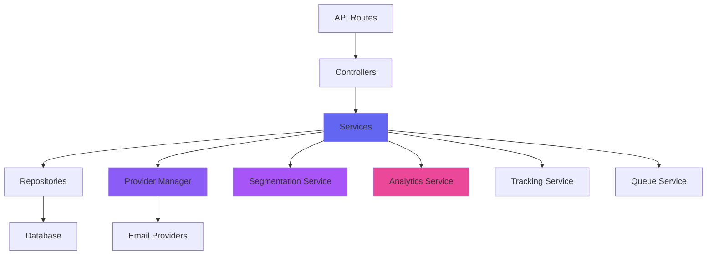

# Email Marketing Integration - Part 6: API Endpoints and Service Layer Design

## Executive Summary

This document outlines the API endpoints and service layer architecture for the email marketing system. It defines RESTful API routes, service layer components, data validation, error handling, and authentication/authorization mechanisms.

## 1. API Architecture Overview

### 1.1 Design Principles

1. **RESTful Design**: Follow REST conventions for resource-based URLs
2. **Consistent Responses**: Standardized response format across all endpoints
3. **Versioning**: API versioning for backward compatibility
4. **Pagination**: Consistent pagination for list endpoints
5. **Filtering and Sorting**: Flexible filtering and sorting capabilities
6. **Rate Limiting**: Protect against abuse and ensure fair usage
7. **Authentication**: Secure authentication and authorization
8. **Error Handling**: Comprehensive error handling with meaningful messages

### 1.2 API Structure

```
/api/v1/email-marketing/
├── campaigns/
│   ├── GET    /                    # List campaigns
│   ├── POST   /                    # Create campaign
│   ├── GET    /:id                 # Get campaign details
│   ├── PUT    /:id                 # Update campaign
│   ├── DELETE /:id                 # Delete campaign
│   ├── POST   /:id/send            # Send campaign
│   ├── POST   /:id/pause           # Pause campaign
│   ├── POST   /:id/resume          # Resume campaign
│   ├── POST   /:id/cancel          # Cancel campaign
│   ├── POST   /:id/test            # Send test email
│   ├── POST   /:id/duplicate       # Duplicate campaign
│   └── GET    /:id/metrics        # Get campaign metrics
├── templates/
│   ├── GET    /                    # List templates
│   ├── POST   /                    # Create template
│   ├── GET    /:id                 # Get template details
│   ├── PUT    /:id                 # Update template
│   ├── DELETE /:id                 # Delete template
│   ├── POST   /:id/duplicate       # Duplicate template
│   └── GET    /:id/preview        # Preview template
├── segments/
│   ├── GET    /                    # List segments
│   ├── POST   /                    # Create segment
│   ├── GET    /:id                 # Get segment details
│   ├── PUT    /:id                 # Update segment
│   ├── DELETE /:id                 # Delete segment
│   ├── POST   /:id/calculate       # Calculate segment
│   ├── GET    /:id/members        # Get segment members
│   └── GET    /:id/preview        # Preview segment
├── automations/
│   ├── GET    /                    # List automations
│   ├── POST   /                    # Create automation
│   ├── GET    /:id                 # Get automation details
│   ├── PUT    /:id                 # Update automation
│   ├── DELETE /:id                 # Delete automation
│   ├── POST   /:id/activate       # Activate automation
│   ├── POST   /:id/deactivate     # Deactivate automation
│   ├── GET    /:id/enrollments    # Get automation enrollments
│   └── GET    /:id/metrics        # Get automation metrics
├── emails/
│   ├── GET    /                    # List emails
│   ├── GET    /:id                 # Get email details
│   ├── GET    /:id/recipients     # Get email recipients
│   └── GET    /:id/tracking       # Get email tracking data
├── providers/
│   ├── GET    /                    # List providers
│   ├── POST   /                    # Add provider
│   ├── GET    /:id                 # Get provider details
│   ├── PUT    /:id                 # Update provider
│   ├── DELETE /:id                 # Delete provider
│   ├── POST   /:id/test            # Test provider
│   └── POST   /:id/set-default    # Set as default provider
├── analytics/
│   ├── GET    /overview            # Get overview metrics
│   ├── GET    /campaigns           # Get campaign analytics
│   ├── GET    /recipients         # Get recipient analytics
│   ├── GET    /segments           # Get segment analytics
│   ├── GET    /trends             # Get trend data
│   ├── GET    /reports            # Get reports
│   └── POST   /reports            # Create report
├── webhooks/
│   ├── POST   /sendgrid           # SendGrid webhook
│   ├── POST   /ses                # AWS SES webhook
│   ├── POST   /resend             # Resend webhook
│   ├── POST   /mailgun            # Mailgun webhook
│   └── POST   /postmark           # Postmark webhook
└── tracking/
    ├── GET    /pixel              # Tracking pixel
    ├── GET    /click              # Click tracking
    └── POST   /conversion         # Conversion tracking
```

## 2. Campaign API Endpoints

### 2.1 List Campaigns

**Endpoint**: `GET /api/v1/email-marketing/campaigns`

**Query Parameters**:
```typescript
interface ListCampaignsQuery {
  workspaceId: string
  status?: string[]
  type?: string[]
  page?: number
  limit?: number
  sortBy?: string
  sortOrder?: 'asc' | 'desc'
  search?: string
  dateFrom?: string
  dateTo?: string
}
```

**Response**:
```typescript
interface ListCampaignsResponse {
  success: boolean
  data: {
    campaigns: CampaignListItem[]
    pagination: PaginationInfo
  }
  error?: string
}

interface CampaignListItem {
  id: string
  name: string
  type: string
  status: string
  workspaceId: string
  totalRecipients: number
  sentCount: number
  deliveredCount: number
  openedCount: number
  clickedCount: number
  bouncedCount: number
  unsubscribedCount: number
  scheduledAt?: DateTime
  startedAt?: DateTime
  completedAt?: DateTime
  createdAt: DateTime
  updatedAt: DateTime
}

interface PaginationInfo {
  page: number
  limit: number
  total: number
  totalPages: number
  hasNext: boolean
  hasPrevious: boolean
}
```

### 2.2 Create Campaign

**Endpoint**: `POST /api/v1/email-marketing/campaigns`

**Request Body**:
```typescript
interface CreateCampaignRequest {
  workspaceId: string
  name: string
  description?: string
  type: 'broadcast' | 'drip' | 'triggered' | 'behavioral' | 'transactional'
  segmentationRuleId?: string
  leadListIds?: string[]
  manualRecipients?: ManualRecipient[]
  templateId?: string
  subject: string
  htmlContent: string
  textContent?: string
  fromEmail?: string
  fromName?: string
  replyTo?: string
  scheduleType: 'immediate' | 'scheduled' | 'recurring'
  scheduledAt?: string
  timezone?: string
  recurringConfig?: RecurringConfig
  trackOpens: boolean
  trackClicks: boolean
  enableUnsubscribe: boolean
  customUnsubscribeUrl?: string
  dailyLimit?: number
  totalLimit?: number
  tags?: string[]
  metadata?: Record<string, any>
}
```

**Response**:
```typescript
interface CreateCampaignResponse {
  success: boolean
  data: {
    campaign: EmailCampaign
  }
  error?: string
}
```

### 2.3 Get Campaign Details

**Endpoint**: `GET /api/v1/email-marketing/campaigns/:id`

**Response**:
```typescript
interface GetCampaignResponse {
  success: boolean
  data: {
    campaign: EmailCampaign
    metrics?: CampaignMetrics
  }
  error?: string
}
```

### 2.4 Update Campaign

**Endpoint**: `PUT /api/v1/email-marketing/campaigns/:id`

**Request Body**: Same as [`CreateCampaignRequest`](plans/email-marketing-part6-api-design.md:1) (all fields optional)

**Response**: Same as [`CreateCampaignResponse`](plans/email-marketing-part6-api-design.md:1)

### 2.5 Send Campaign

**Endpoint**: `POST /api/v1/email-marketing/campaigns/:id/send`

**Request Body**:
```typescript
interface SendCampaignRequest {
  scheduledAt?: string
  providerId?: string
}
```

**Response**:
```typescript
interface SendCampaignResponse {
  success: boolean
  data: {
    campaignId: string
    status: string
    scheduledAt?: DateTime
    estimatedCompletionAt?: DateTime
  }
  error?: string
}
```

### 2.6 Send Test Email

**Endpoint**: `POST /api/v1/email-marketing/campaigns/:id/test`

**Request Body**:
```typescript
interface SendTestEmailRequest {
  testEmails: string[]
  recipientVariables?: Record<string, Record<string, any>>
}
```

**Response**:
```typescript
interface SendTestEmailResponse {
  success: boolean
  data: {
    results: TestResult[]
  }
  error?: string
}

interface TestResult {
  email: string
  success: boolean
  messageId?: string
  error?: string
}
```

### 2.7 Get Campaign Metrics

**Endpoint**: `GET /api/v1/email-marketing/campaigns/:id/metrics`

**Query Parameters**:
```typescript
interface GetCampaignMetricsQuery {
  period?: 'day' | 'week' | 'month' | 'quarter' | 'year' | 'custom'
  dateFrom?: string
  dateTo?: string
  includeTrends?: boolean
  includeComparisons?: boolean
}
```

**Response**:
```typescript
interface GetCampaignMetricsResponse {
  success: boolean
  data: {
    metrics: CampaignMetrics
  }
  error?: string
}
```

## 3. Template API Endpoints

### 3.1 List Templates

**Endpoint**: `GET /api/v1/email-marketing/templates`

**Query Parameters**:
```typescript
interface ListTemplatesQuery {
  workspaceId: string
  type?: string[]
  isActive?: boolean
  page?: number
  limit?: number
  sortBy?: string
  sortOrder?: 'asc' | 'desc'
  search?: string
}
```

**Response**:
```typescript
interface ListTemplatesResponse {
  success: boolean
  data: {
    templates: TemplateListItem[]
    pagination: PaginationInfo
  }
  error?: string
}

interface TemplateListItem {
  id: string
  name: string
  description?: string
  type: string
  workspaceId: string
  subject: string
  isActive: boolean
  isDefault: boolean
  tags?: string[]
  createdAt: DateTime
  updatedAt: DateTime
}
```

### 3.2 Create Template

**Endpoint**: `POST /api/v1/email-marketing/templates`

**Request Body**:
```typescript
interface CreateTemplateRequest {
  workspaceId: string
  name: string
  description?: string
  type: 'marketing' | 'transactional' | 'automation'
  subject: string
  htmlContent: string
  textContent?: string
  variables?: TemplateVariable[]
  isDefault?: boolean
  isActive?: boolean
  tags?: string[]
}

interface TemplateVariable {
  name: string
  type: 'text' | 'number' | 'date' | 'boolean' | 'array' | 'object'
  description?: string
  defaultValue?: any
  required?: boolean
}
```

**Response**:
```typescript
interface CreateTemplateResponse {
  success: boolean
  data: {
    template: EmailTemplate
  }
  error?: string
}
```

### 3.3 Preview Template

**Endpoint**: `GET /api/v1/email-marketing/templates/:id/preview`

**Query Parameters**:
```typescript
interface PreviewTemplateQuery {
  leadId?: string
  variables?: Record<string, any>
}
```

**Response**:
```typescript
interface PreviewTemplateResponse {
  success: boolean
  data: {
    preview: {
      subject: string
      html: string
      text?: string
    }
  }
  error?: string
}
```

## 4. Segment API Endpoints

### 4.1 List Segments

**Endpoint**: `GET /api/v1/email-marketing/segments`

**Query Parameters**:
```typescript
interface ListSegmentsQuery {
  workspaceId: string
  isActive?: boolean
  page?: number
  limit?: number
  sortBy?: string
  sortOrder?: 'asc' | 'desc'
  search?: string
}
```

**Response**:
```typescript
interface ListSegmentsResponse {
  success: boolean
  data: {
    segments: SegmentListItem[]
    pagination: PaginationInfo
  }
  error?: string
}

interface SegmentListItem {
  id: string
  name: string
  description?: string
  workspaceId: string
  isActive: boolean
  estimatedSize?: number
  lastCalculatedAt?: DateTime
  tags?: string[]
  createdAt: DateTime
  updatedAt: DateTime
}
```

### 4.2 Create Segment

**Endpoint**: `POST /api/v1/email-marketing/segments`

**Request Body**:
```typescript
interface CreateSegmentRequest {
  workspaceId: string
  name: string
  description?: string
  criteria: Criterion[]
  logicOperator: 'AND' | 'OR'
  isActive?: boolean
  tags?: string[]
}

interface Criterion {
  field: string
  operator: string
  value: any
  negate?: boolean
}
```

**Response**:
```typescript
interface CreateSegmentResponse {
  success: boolean
  data: {
    segment: SegmentationRule
  }
  error?: string
}
```

### 4.3 Calculate Segment

**Endpoint**: `POST /api/v1/email-marketing/segments/:id/calculate`

**Request Body**:
```typescript
interface CalculateSegmentRequest {
  forceRecalculate?: boolean
}
```

**Response**:
```typescript
interface CalculateSegmentResponse {
  success: boolean
  data: {
    segmentId: string
    size: number
    calculatedAt: DateTime
    sampleMembers?: Lead[]
  }
  error?: string
}
```

### 4.4 Get Segment Members

**Endpoint**: `GET /api/v1/email-marketing/segments/:id/members`

**Query Parameters**:
```typescript
interface GetSegmentMembersQuery {
  page?: number
  limit?: number
  sortBy?: string
  sortOrder?: 'asc' | 'desc'
  search?: string
}
```

**Response**:
```typescript
interface GetSegmentMembersResponse {
  success: boolean
  data: {
    members: Lead[]
    pagination: PaginationInfo
  }
  error?: string
}
```

## 5. Automation API Endpoints

### 5.1 List Automations

**Endpoint**: `GET /api/v1/email-marketing/automations`

**Query Parameters**:
```typescript
interface ListAutomationsQuery {
  workspaceId: string
  status?: string[]
  type?: string[]
  page?: number
  limit?: number
  sortBy?: string
  sortOrder?: 'asc' | 'desc'
  search?: string
}
```

**Response**:
```typescript
interface ListAutomationsResponse {
  success: boolean
  data: {
    automations: AutomationListItem[]
    pagination: PaginationInfo
  }
  error?: string
}

interface AutomationListItem {
  id: string
  name: string
  description?: string
  type: string
  status: string
  workspaceId: string
  totalEnrolled: number
  activeEnrolled: number
  completedCount: number
  tags?: string[]
  createdAt: DateTime
  updatedAt: DateTime
}
```

### 5.2 Create Automation

**Endpoint**: `POST /api/v1/email-marketing/automations`

**Request Body**:
```typescript
interface CreateAutomationRequest {
  workspaceId: string
  name: string
  description?: string
  type: 'drip' | 'trigger' | 'behavioral'
  triggers: AutomationTrigger[]
  steps: AutomationStep[]
  entryCriteria?: EntryCriteria
  exitCriteria?: ExitCriteria
  tags?: string[]
}
```

**Response**:
```typescript
interface CreateAutomationResponse {
  success: boolean
  data: {
    automation: EmailAutomation
  }
  error?: string
}
```

### 5.3 Get Automation Enrollments

**Endpoint**: `GET /api/v1/email-marketing/automations/:id/enrollments`

**Query Parameters**:
```typescript
interface GetAutomationEnrollmentsQuery {
  status?: string[]
  page?: number
  limit?: number
  sortBy?: string
  sortOrder?: 'asc' | 'desc'
  search?: string
}
```

**Response**:
```typescript
interface GetAutomationEnrollmentsResponse {
  success: boolean
  data: {
    enrollments: AutomationEnrollment[]
    pagination: PaginationInfo
  }
  error?: string
}

interface AutomationEnrollment {
  id: string
  automationId: string
  leadId: string
  lead: Lead
  currentStep: number
  status: string
  enrolledAt: DateTime
  completedAt?: DateTime
  lastStepAt?: DateTime
}
```

## 6. Analytics API Endpoints

### 6.1 Get Overview Metrics

**Endpoint**: `GET /api/v1/email-marketing/analytics/overview`

**Query Parameters**:
```typescript
interface GetOverviewMetricsQuery {
  workspaceId: string
  period?: 'day' | 'week' | 'month' | 'quarter' | 'year' | 'custom'
  dateFrom?: string
  dateTo?: string
}
```

**Response**:
```typescript
interface GetOverviewMetricsResponse {
  success: boolean
  data: {
    metrics: AggregateMetrics
  }
  error?: string
}
```

### 6.2 Get Campaign Analytics

**Endpoint**: `GET /api/v1/email-marketing/analytics/campaigns`

**Query Parameters**:
```typescript
interface GetCampaignAnalyticsQuery {
  workspaceId: string
  campaignIds?: string[]
  period?: 'day' | 'week' | 'month' | 'quarter' | 'year' | 'custom'
  dateFrom?: string
  dateTo?: string
  includeTrends?: boolean
  includeComparisons?: boolean
}
```

**Response**:
```typescript
interface GetCampaignAnalyticsResponse {
  success: boolean
  data: {
    campaigns: CampaignAnalytics[]
    aggregate: AggregateMetrics
  }
  error?: string
}

interface CampaignAnalytics {
  campaignId: string
  campaignName: string
  metrics: CampaignMetrics
}
```

### 6.3 Get Trends

**Endpoint**: `GET /api/v1/email-marketing/analytics/trends`

**Query Parameters**:
```typescript
interface GetTrendsQuery {
  workspaceId: string
  metric: string
  period?: 'day' | 'week' | 'month' | 'quarter' | 'year' | 'custom'
  dateFrom?: string
  dateTo?: string
  granularity?: 'hour' | 'day' | 'week' | 'month'
}
```

**Response**:
```typescript
interface GetTrendsResponse {
  success: boolean
  data: {
    metric: string
    trendData: TimeSeriesData[]
    trendAnalysis: TrendAnalysis
  }
  error?: string
}
```

## 7. Provider API Endpoints

### 7.1 List Providers

**Endpoint**: `GET /api/v1/email-marketing/providers`

**Query Parameters**:
```typescript
interface ListProvidersQuery {
  workspaceId: string
  type?: string[]
  isActive?: boolean
}
```

**Response**:
```typescript
interface ListProvidersResponse {
  success: boolean
  data: {
    providers: EmailProvider[]
  }
  error?: string
}
```

### 7.2 Add Provider

**Endpoint**: `POST /api/v1/email-marketing/providers`

**Request Body**:
```typescript
interface AddProviderRequest {
  workspaceId: string
  name: string
  type: 'sendgrid' | 'ses' | 'resend' | 'mailgun' | 'postmark'
  apiKey: string
  fromEmail: string
  fromName?: string
  replyTo?: string
  isActive?: boolean
  isDefault?: boolean
  priority?: number
  weight?: number
  costPerEmail?: number
  dailyLimit?: number
  monthlyLimit?: number
  region?: string
  domain?: string
  serverToken?: string
  metadata?: Record<string, any>
}
```

**Response**:
```typescript
interface AddProviderResponse {
  success: boolean
  data: {
    provider: EmailProvider
  }
  error?: string
}
```

### 7.3 Test Provider

**Endpoint**: `POST /api/v1/email-marketing/providers/:id/test`

**Request Body**:
```typescript
interface TestProviderRequest {
  testEmail: string
}
```

**Response**:
```typescript
interface TestProviderResponse {
  success: boolean
  data: {
    providerId: string
    testResult: {
      success: boolean
      messageId?: string
      error?: string
      deliveryTime?: number
    }
  }
  error?: string
}
```

## 8. Webhook API Endpoints

### 8.1 SendGrid Webhook

**Endpoint**: `POST /api/v1/email-marketing/webhooks/sendgrid`

**Request Headers**:
```
Content-Type: application/json
X-Sendgrid-Signature: <signature>
X-Sendgrid-Timestamp: <timestamp>
```

**Request Body**: SendGrid event array

**Response**:
```typescript
interface WebhookResponse {
  success: boolean
  data: {
    processed: number
    failed: number
  }
  error?: string
}
```

### 8.2 AWS SES Webhook

**Endpoint**: `POST /api/v1/email-marketing/webhooks/ses`

**Request Headers**:
```
Content-Type: application/json
X-Amz-Sns-Message-Type: <type>
X-Amz-Sns-Message-Id: <id>
X-Amz-Sns-Topic-Arn: <arn>
```

**Request Body**: SNS notification

**Response**: Same as [`WebhookResponse`](plans/email-marketing-part6-api-design.md:1)

## 9. Tracking API Endpoints

### 9.1 Tracking Pixel

**Endpoint**: `GET /api/v1/email-marketing/tracking/pixel`

**Query Parameters**:
```typescript
interface TrackingPixelQuery {
  trackingId: string
}
```

**Response**: 1x1 transparent GIF

### 9.2 Click Tracking

**Endpoint**: `GET /api/v1/email-marketing/tracking/click`

**Query Parameters**:
```typescript
interface TrackingClickQuery {
  trackingId: string
  url: string
}
```

**Response**: Redirect to original URL

### 9.3 Conversion Tracking

**Endpoint**: `POST /api/v1/email-marketing/tracking/conversion`

**Request Body**:
```typescript
interface ConversionTrackingRequest {
  trackingId: string
  conversionData: ConversionData
}

interface ConversionData {
  type: string
  value?: number
  currency?: string
  metadata?: Record<string, any>
}
```

**Response**:
```typescript
interface ConversionTrackingResponse {
  success: boolean
  data: {
    conversionId: string
  }
  error?: string
}
```

## 10. Service Layer Architecture

### 10.1 Service Layer Overview



### 10.2 Campaign Service

```typescript
class CampaignService {
  constructor(
    private campaignRepository: CampaignRepository,
    private providerManager: ProviderManager,
    private segmentationService: SegmentationService,
    private templateService: TemplateService,
    private queueService: QueueService,
    private analyticsService: AnalyticsService
  ) {}
  
  async createCampaign(
    userId: string,
    data: CreateCampaignRequest
  ): Promise<EmailCampaign> {
    // Validate user has access to workspace
    await this.validateWorkspaceAccess(userId, data.workspaceId)
    
    // Validate campaign configuration
    await this.validateCampaignConfig(data)
    
    // Create campaign
    const campaign = await this.campaignRepository.create({
      ...data,
      createdBy: userId,
      status: 'draft'
    })
    
    // Log activity
    await this.logActivity('campaign_created', campaign.id, userId)
    
    return campaign
  }
  
  async updateCampaign(
    userId: string,
    campaignId: string,
    data: Partial<CreateCampaignRequest>
  ): Promise<EmailCampaign> {
    // Get campaign
    const campaign = await this.getCampaign(userId, campaignId)
    
    // Validate campaign can be updated
    this.validateCampaignUpdate(campaign)
    
    // Update campaign
    const updated = await this.campaignRepository.update(campaignId, data)
    
    // Log activity
    await this.logActivity('campaign_updated', campaignId, userId)
    
    return updated
  }
  
  async sendCampaign(
    userId: string,
    campaignId: string,
    options: SendCampaignOptions
  ): Promise<SendCampaignResult> {
    // Get campaign
    const campaign = await this.getCampaign(userId, campaignId)
    
    // Validate campaign can be sent
    this.validateCampaignSend(campaign)
    
    // Update campaign status
    await this.campaignRepository.update(campaignId, {
      status: options.scheduledAt ? 'scheduled' : 'sending',
      scheduledAt: options.scheduledAt,
      startedAt: options.scheduledAt ? undefined : new Date()
    })
    
    // If immediate send, execute campaign
    if (!options.scheduledAt) {
      await this.executeCampaign(campaign, options)
    } else {
      // Schedule campaign execution
      await this.queueService.scheduleCampaign(campaignId, options.scheduledAt)
    }
    
    // Log activity
    await this.logActivity('campaign_sent', campaignId, userId)
    
    return {
      campaignId,
      status: campaign.status,
      scheduledAt: options.scheduledAt
    }
  }
  
  async sendTestEmail(
    userId: string,
    campaignId: string,
    data: SendTestEmailRequest
  ): Promise<TestResult[]> {
    // Get campaign
    const campaign = await this.getCampaign(userId, campaignId)
    
    // Prepare test emails
    const emails = await this.prepareTestEmails(campaign, data)
    
    // Send test emails
    const results = await Promise.allSettled(
      emails.map(email => this.providerManager.sendEmail(email))
    )
    
    return results.map(result => ({
      email: result.value?.to || '',
      success: result.status === 'fulfilled',
      messageId: result.status === 'fulfilled' ? result.value.messageId : undefined,
      error: result.status === 'rejected' ? result.reason.message : undefined
    }))
  }
  
  private async executeCampaign(
    campaign: EmailCampaign,
    options: SendCampaignOptions
  ): Promise<void> {
    // Get target recipients
    const recipients = await this.getTargetRecipients(campaign)
    
    // Update total recipients
    await this.campaignRepository.update(campaign.id, {
      totalRecipients: recipients.length
    })
    
    // Prepare emails
    const emails = await this.prepareEmails(campaign, recipients)
    
    // Enqueue emails
    await this.queueService.enqueueBatch(emails, {
      priority: 5,
      scheduledFor: new Date(),
      providerId: options.providerId
    })
  }
  
  private async getTargetRecipients(
    campaign: EmailCampaign
  ): Promise<Recipient[]> {
    const recipients: Recipient[] = []
    
    // Add segment members
    if (campaign.segmentationRuleId) {
      const segmentMembers = await this.segmentationService.getSegmentMembers(
        campaign.segmentationRuleId
      )
      recipients.push(...segmentMembers)
    }
    
    // Add lead list members
    if (campaign.leadListIds) {
      for (const listId of campaign.leadListIds) {
        const listMembers = await this.getLeadListMembers(listId)
        recipients.push(...listMembers)
      }
    }
    
    // Add manual recipients
    if (campaign.manualRecipients) {
      recipients.push(...campaign.manualRecipients)
    }
    
    // Remove duplicates and suppressions
    return await this.deduplicateAndSuppress(recipients)
  }
  
  private async prepareEmails(
    campaign: EmailCampaign,
    recipients: Recipient[]
  ): Promise<EmailData[]> {
    const emails: EmailData[] = []
    
    for (const recipient of recipients) {
      // Get template content
      const content = campaign.templateId
        ? await this.templateService.getTemplateContent(campaign.templateId, recipient)
        : {
            subject: campaign.subject,
            html: campaign.htmlContent,
            text: campaign.textContent
          }
      
      // Personalize content
      const personalized = await this.personalizeContent(content, recipient)
      
      // Add tracking
      const tracked = await this.addTracking(personalized, recipient, campaign)
      
      emails.push({
        to: recipient.email,
        subject: tracked.subject,
        html: tracked.html,
        text: tracked.text,
        from: campaign.fromEmail,
        replyTo: campaign.replyTo,
        metadata: {
          campaignId: campaign.id,
          recipientId: recipient.id
        }
      })
    }
    
    return emails
  }
}
```

### 10.3 Segmentation Service

```typescript
class SegmentationService {
  constructor(
    private segmentationRuleRepository: SegmentationRuleRepository,
    private leadRepository: LeadRepository
  ) {}
  
  async createSegment(
    userId: string,
    data: CreateSegmentRequest
  ): Promise<SegmentationRule> {
    // Validate user has access to workspace
    await this.validateWorkspaceAccess(userId, data.workspaceId)
    
    // Validate criteria
    this.validateCriteria(data.criteria)
    
    // Create segment
    const segment = await this.segmentationRuleRepository.create({
      ...data,
      createdBy: userId
    })
    
    // Calculate initial segment size
    await this.calculateSegment(segment.id)
    
    return segment
  }
  
  async calculateSegment(
    segmentId: string,
    forceRecalculate: boolean = false
  ): Promise<CalculateSegmentResult> {
    // Get segment
    const segment = await this.segmentationRuleRepository.findById(segmentId)
    
    // Check if recalculation is needed
    if (!forceRecalculate && !this.needsRecalculation(segment)) {
      return {
        segmentId,
        size: segment.estimatedSize || 0,
        calculatedAt: segment.lastCalculatedAt || new Date()
      }
    }
    
    // Get all leads
    const leads = await this.leadRepository.findAll({
      workspaceId: segment.workspaceId
    })
    
    // Evaluate each lead against criteria
    const matchingLeads = leads.filter(lead =>
      this.evaluateCriteria(segment.criteria, lead, segment.logicOperator)
    )
    
    // Update segment members
    await this.updateSegmentMembers(segmentId, matchingLeads)
    
    // Update segment
    const updated = await this.segmentationRuleRepository.update(segmentId, {
      estimatedSize: matchingLeads.length,
      lastCalculated: new Date()
    })
    
    return {
      segmentId,
      size: matchingLeads.length,
      calculatedAt: updated.lastCalculatedAt,
      sampleMembers: matchingLeads.slice(0, 10)
    }
  }
  
  private evaluateCriteria(
    criteria: Criterion[],
    lead: Lead,
    logicOperator: 'AND' | 'OR'
  ): boolean {
    const results = criteria.map(criterion => {
      const value = this.getLeadValue(lead, criterion.field)
      return this.evaluateCriterion(criterion, value)
    })
    
    return logicOperator === 'AND'
      ? results.every(r => r)
      : results.some(r => r)
  }
  
  private evaluateCriterion(criterion: Criterion, value: any): boolean {
    const { operator, value: criterionValue, negate } = criterion
    
    let result: boolean
    
    switch (operator) {
      case 'equals':
        result = value === criterionValue
        break
      case 'not_equals':
        result = value !== criterionValue
        break
      case 'contains':
        result = String(value).includes(String(criterionValue))
        break
      case 'greater_than':
        result = Number(value) > Number(criterionValue)
        break
      case 'less_than':
        result = Number(value) < Number(criterionValue)
        break
      case 'in_list':
        result = Array.isArray(criterionValue) && criterionValue.includes(value)
        break
      case 'not_in_list':
        result = !Array.isArray(criterionValue) || !criterionValue.includes(value)
        break
      default:
        result = false
    }
    
    return negate ? !result : result
  }
}
```

### 10.4 Analytics Service

```typescript
class AnalyticsService {
  constructor(
    private campaignRepository: CampaignRepository,
    private emailRepository: EmailRepository,
    private trackingRepository: TrackingRepository
  ) {}
  
  async getCampaignMetrics(
    campaignId: string,
    options: GetMetricsOptions
  ): Promise<CampaignMetrics> {
    // Get campaign
    const campaign = await this.campaignRepository.findById(campaignId)
    
    // Get emails
    const emails = await this.emailRepository.findByCampaignId(campaignId)
    
    // Get tracking data
    const trackingData = await this.trackingRepository.findByCampaignId(campaignId)
    
    // Calculate metrics
    const metrics = await this.calculateMetrics(campaign, emails, trackingData, options)
    
    return metrics
  }
  
  async getOverviewMetrics(
    workspaceId: string,
    options: GetMetricsOptions
  ): Promise<AggregateMetrics> {
    // Get all campaigns in workspace
    const campaigns = await this.campaignRepository.findByWorkspaceId(workspaceId)
    
    // Calculate aggregate metrics
    const metrics = await this.calculateAggregateMetrics(campaigns, options)
    
    return metrics
  }
  
  async getTrends(
    workspaceId: string,
    metric: string,
    options: GetTrendsOptions
  ): Promise<TrendData> {
    // Get time series data
    const timeSeriesData = await this.getTimeSeriesData(
      workspaceId,
      metric,
      options
    )
    
    // Analyze trends
    const trendAnalysis = this.analyzeTrends(timeSeriesData)
    
    return {
      metric,
      trendData: timeSeriesData,
      trendAnalysis
    }
  }
  
  private async calculateMetrics(
    campaign: EmailCampaign,
    emails: Email[],
    trackingData: EmailTracking[],
    options: GetMetricsOptions
  ): Promise<CampaignMetrics> {
    // Calculate basic metrics
    const totalRecipients = campaign.totalRecipients
    const sentCount = campaign.sentCount
    const deliveredCount = campaign.deliveredCount
    const openedCount = campaign.openedCount
    const clickedCount = campaign.clickedCount
    const bouncedCount = campaign.bouncedCount
    const unsubscribedCount = campaign.unsubscribedCount
    
    // Calculate rates
    const deliveryRate = sentCount > 0 ? (deliveredCount / sentCount) * 100 : 0
    const openRate = deliveredCount > 0 ? (openedCount / deliveredCount) * 100 : 0
    const clickRate = deliveredCount > 0 ? (clickedCount / deliveredCount) * 100 : 0
    const bounceRate = sentCount > 0 ? (bouncedCount / sentCount) * 100 : 0
    const unsubscribeRate = deliveredCount > 0 ? (unsubscribedCount / deliveredCount) * 100 : 0
    
    // Calculate unique metrics
    const uniqueOpenCount = trackingData.reduce(
      (sum, tracking) => sum + (tracking.openCount > 0 ? 1 : 0),
      0
    )
    const uniqueClickCount = trackingData.reduce(
      (sum, tracking) => sum + (tracking.clickCount > 0 ? 1 : 0),
      0
    )
    
    // Calculate derived metrics
    const clickToOpenRate = uniqueOpenCount > 0 ? (uniqueClickCount / uniqueOpenCount) * 100 : 0
    
    // Get device breakdown
    const deviceBreakdown = await this.getDeviceBreakdown(trackingData)
    
    // Get link performance
    const linkPerformance = await this.getLinkPerformance(trackingData)
    
    return {
      campaignId: campaign.id,
      campaignName: campaign.name,
      campaignType: campaign.type,
      workspaceId: campaign.workspaceId,
      period: options.period,
      totalRecipients,
      sentCount,
      deliveredCount,
      deliveryRate,
      openedCount,
      uniqueOpenCount,
      openRate,
      clickCount,
      uniqueClickCount,
      clickRate,
      clickToOpenRate,
      bouncedCount,
      bounceRate,
      unsubscribedCount,
      unsubscribeRate,
      deviceBreakdown,
      linkPerformance,
      calculatedAt: new Date()
    }
  }
}
```

## 11. Error Handling

### 11.1 Error Response Format

```typescript
interface ErrorResponse {
  success: false
  error: {
    code: string
    message: string
    details?: any
    timestamp: DateTime
    requestId: string
  }
}
```

### 11.2 Error Codes

| Code | Description | HTTP Status |
|------|-------------|-------------|
| `UNAUTHORIZED` | Authentication failed | 401 |
| `FORBIDDEN` | Access denied | 403 |
| `NOT_FOUND` | Resource not found | 404 |
| `VALIDATION_ERROR` | Invalid input data | 400 |
| `CONFLICT` | Resource conflict | 409 |
| `RATE_LIMIT_EXCEEDED` | Too many requests | 429 |
| `INTERNAL_ERROR` | Server error | 500 |
| `SERVICE_UNAVAILABLE` | Service temporarily unavailable | 503 |

### 11.3 Error Handling Middleware

```typescript
class ErrorHandler {
  handle(error: Error, req: Request, res: Response, next: NextFunction): void {
    const requestId = req.id || generateId()
    
    if (error instanceof ValidationError) {
      return res.status(400).json({
        success: false,
        error: {
          code: 'VALIDATION_ERROR',
          message: error.message,
          details: error.details,
          timestamp: new Date(),
          requestId
        }
      })
    }
    
    if (error instanceof NotFoundError) {
      return res.status(404).json({
        success: false,
        error: {
          code: 'NOT_FOUND',
          message: error.message,
          timestamp: new Date(),
          requestId
        }
      })
    }
    
    if (error instanceof AuthorizationError) {
      return res.status(403).json({
        success: false,
        error: {
          code: 'FORBIDDEN',
          message: error.message,
          timestamp: new Date(),
          requestId
        }
      })
    }
    
    // Default error response
    res.status(500).json({
      success: false,
      error: {
        code: 'INTERNAL_ERROR',
        message: 'An unexpected error occurred',
        timestamp: new Date(),
        requestId
      }
    })
  }
}
```

## 12. Authentication and Authorization

### 12.1 Authentication

```typescript
interface AuthMiddleware {
  authenticate(req: Request, res: Response, next: NextFunction): void
}

class AuthMiddleware implements AuthMiddleware {
  async authenticate(req: Request, res: Response, next: NextFunction): Promise<void> {
    try {
      // Get token from header
      const token = req.headers.authorization?.replace('Bearer ', '')
      
      if (!token) {
        throw new UnauthorizedError('No authentication token provided')
      }
      
      // Verify token
      const decoded = await this.verifyToken(token)
      
      // Attach user to request
      req.user = decoded
      
      next()
    } catch (error) {
      res.status(401).json({
        success: false,
        error: {
          code: 'UNAUTHORIZED',
          message: 'Authentication failed',
          timestamp: new Date(),
          requestId: req.id
        }
      })
    }
  }
  
  private async verifyToken(token: string): Promise<User> {
    // Implement token verification logic
    // This could use JWT, session tokens, etc.
    return await this.getUserFromToken(token)
  }
}
```

### 12.2 Authorization

```typescript
interface AuthorizationMiddleware {
  authorizeWorkspace(req: Request, res: Response, next: NextFunction): void
  authorizeRole(roles: string[]): Middleware
}

class AuthorizationMiddleware implements AuthorizationMiddleware {
  async authorizeWorkspace(req: Request, res: Response, next: NextFunction): Promise<void> {
    const workspaceId = req.body.workspaceId || req.params.workspaceId || req.query.workspaceId
    
    if (!workspaceId) {
      return res.status(400).json({
        success: false,
        error: {
          code: 'VALIDATION_ERROR',
          message: 'Workspace ID is required',
          timestamp: new Date(),
          requestId: req.id
        }
      })
    }
    
    // Check if user has access to workspace
    const hasAccess = await this.checkWorkspaceAccess(req.user.id, workspaceId)
    
    if (!hasAccess) {
      return res.status(403).json({
        success: false,
        error: {
          code: 'FORBIDDEN',
          message: 'You do not have access to this workspace',
          timestamp: new Date(),
          requestId: req.id
        }
      })
    }
    
    req.workspaceId = workspaceId
    next()
  }
  
  authorizeRole(roles: string[]): Middleware {
    return (req: Request, res: Response, next: NextFunction) => {
      if (!roles.includes(req.user.role)) {
        return res.status(403).json({
          success: false,
          error: {
            code: 'FORBIDDEN',
            message: 'Insufficient permissions',
            timestamp: new Date(),
            requestId: req.id
          }
        })
      }
      
      next()
    }
  }
}
```

## 13. Rate Limiting

```typescript
class RateLimiter {
  private limits: Map<string, RateLimit> = new Map()
  
  async checkLimit(userId: string, endpoint: string): Promise<boolean> {
    const key = `${userId}:${endpoint}`
    const limit = this.getLimitForEndpoint(endpoint)
    const current = this.limits.get(key) || { count: 0, resetAt: this.getResetTime(limit.window) }
    
    // Check if window has expired
    if (Date.now() > current.resetAt) {
      current.count = 0
      current.resetAt = this.getResetTime(limit.window)
    }
    
    // Check if limit exceeded
    if (current.count >= limit.max) {
      return false
    }
    
    // Increment count
    current.count++
    this.limits.set(key, current)
    
    return true
  }
  
  private getLimitForEndpoint(endpoint: string): RateLimitConfig {
    const limits: Record<string, RateLimitConfig> = {
      '/campaigns': { max: 100, window: 3600000 }, // 100 requests per hour
      '/emails': { max: 1000, window: 3600000 }, // 1000 requests per hour
      '/analytics': { max: 50, window: 3600000 }, // 50 requests per hour
      '/webhooks': { max: 10000, window: 3600000 } // 10000 requests per hour
    }
    
    return limits[endpoint] || { max: 100, window: 3600000 }
  }
  
  private getResetTime(window: number): number {
    return Date.now() + window
  }
}
```

## 14. Next Steps

This API and service layer design provides:
1. Comprehensive RESTful API endpoints
2. Well-structured service layer
3. Robust error handling
4. Secure authentication and authorization
5. Rate limiting and performance optimization

The next part will detail the frontend components and UI design.

---

**Document Status**: Part 6 of 8
**Related Documents**: 
- Part 1: Customer Segmentation Strategies and Logic
- Part 2: Database Schema Extensions
- Part 3: Email Service Provider Integration
- Part 4: Campaign Management Workflow
- Part 5: Performance Tracking Metrics
- Part 7: Frontend Components and UI Design
- Part 8: Implementation Roadmap
