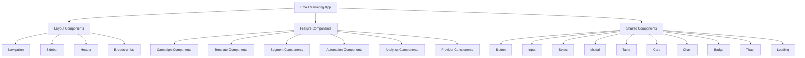
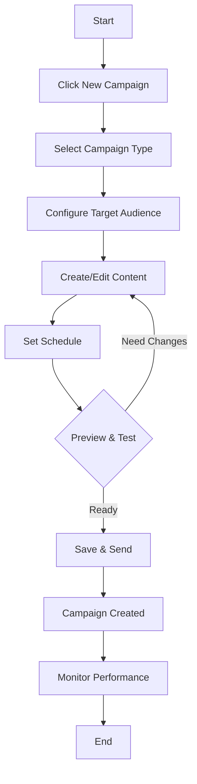
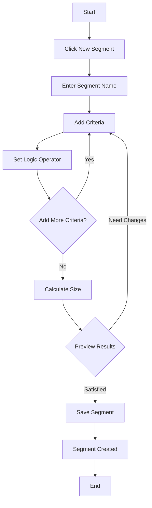
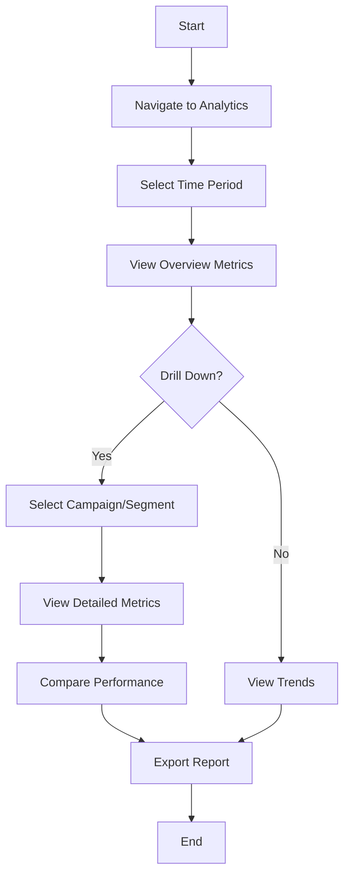

# Email Marketing Integration - Part 7: Frontend Components and UI Design

## Executive Summary

This document outlines the frontend components and user interface design for the email marketing system. It details the component architecture, UI patterns, user flows, and design system integration with the existing CRM application.

## 1. UI Architecture Overview

### 1.1 Design Principles

1. **Consistency**: Align with existing CRM design system
2. **Simplicity**: Intuitive workflows with minimal clicks
3. **Responsiveness**: Mobile-first responsive design
4. **Accessibility**: WCAG 2.1 AA compliance
5. **Performance**: Fast loading and smooth interactions
6. **Feedback**: Clear visual feedback for all actions

### 1.2 Component Hierarchy



## 2. Page Structure

### 2.1 Email Marketing Dashboard

**Route**: `/email-marketing`

**Layout**:
```
┌─────────────────────────────────────────────────────────┐
│ Header: Email Marketing                               │
├─────────────────────────────────────────────────────────┤
│ Navigation: Campaigns | Templates | Segments |        │
│            Automations | Analytics | Settings             │
├─────────────────────────────────────────────────────────┤
│                                                         │
│  Key Metrics Cards                                      │
│  ┌──────────┐ ┌──────────┐ ┌──────────┐ ┌──────────┐ │
│  │ Emails   │ │ Open Rate│ │ Click Rt │ │ Revenue  │ │
│  │ Sent     │ │          │ │          │ │          │ │
│  └──────────┘ └──────────┘ └──────────┘ └──────────┘ │
│                                                         │
│  Recent Campaigns Table                                │
│  ┌─────────────────────────────────────────────────────┐ │
│  │ Campaign | Type | Status | Sent | Open | Click   │ │
│  └─────────────────────────────────────────────────────┘ │
│                                                         │
│  Quick Actions                                         │
│  [Create Campaign] [Create Template] [Create Segment]   │
│                                                         │
└─────────────────────────────────────────────────────────┘
```

### 2.2 Campaigns Page

**Route**: `/email-marketing/campaigns`

**Layout**:
```
┌─────────────────────────────────────────────────────────┐
│ Header: Campaigns                    [+ New Campaign]  │
├─────────────────────────────────────────────────────────┤
│ Filters: [Status ▼] [Type ▼] [Date Range ▼]          │
│ Search: [Search campaigns...]                          │
├─────────────────────────────────────────────────────────┤
│                                                         │
│  Campaign List                                         │
│  ┌─────────────────────────────────────────────────────┐ │
│  │ Campaign Name          Type  Status  Sent  Actions │ │
│  │ Welcome Series        Drip  Active   1.2K  [⋮]    │ │
│  │ Product Launch        Broadcast Sent    5.0K  [⋮]    │ │
│  │ Newsletter           Broadcast Scheduled 3.0K [⋮]    │ │
│  └─────────────────────────────────────────────────────┘ │
│                                                         │
│  Pagination: [< 1 2 3 4 5 >]                         │
│                                                         │
└─────────────────────────────────────────────────────────┘
```

### 2.3 Campaign Detail Page

**Route**: `/email-marketing/campaigns/:id`

**Layout**:
```
┌─────────────────────────────────────────────────────────┐
│ Header: Campaign Name              [Edit] [Send] [⋮]   │
├─────────────────────────────────────────────────────────┤
│ Tabs: Overview | Recipients | Analytics | Settings    │
├─────────────────────────────────────────────────────────┤
│                                                         │
│  Overview Tab                                          │
│  ┌─────────────────────────────────────────────────────┐ │
│  │ Campaign Information                                │ │
│  │ Type: Broadcast                                   │ │
│  │ Status: Sent                                      │ │
│  │ Created: Jan 15, 2026                            │ │
│  │ Sent: Jan 16, 2026                                │ │
│  └─────────────────────────────────────────────────────┘ │
│                                                         │
│  ┌─────────────────────────────────────────────────────┐ │
│  │ Performance Metrics                                │ │
│  │ ┌──────────┐ ┌──────────┐ ┌──────────┐ ┌──────┐ │ │
│  │ │Delivered │ │ Open Rate│ │Click Rate│ │ ROI  │ │ │
│  │ │  98.5%   │ │  24.3%   │ │  4.2%    │ │ 320% │ │ │
│  │ └──────────┘ └──────────┘ └──────────┘ └──────┘ │ │
│  └─────────────────────────────────────────────────────┘ │
│                                                         │
│  ┌─────────────────────────────────────────────────────┐ │
│  │ Engagement Funnel                                 │ │
│  │ Sent → Delivered → Opened → Clicked → Converted   │ │
│  │ 5.0K  →   4.9K   →  1.2K  →   210   →   45   │ │
│  └─────────────────────────────────────────────────────┘ │
│                                                         │
└─────────────────────────────────────────────────────────┘
```

### 2.4 Campaign Builder Page

**Route**: `/email-marketing/campaigns/new`

**Layout**:
```
┌─────────────────────────────────────────────────────────┐
│ Header: Create Campaign              [Save Draft] [Send] │
├─────────────────────────────────────────────────────────┤
│ Step 1 of 4: Campaign Type                         │
│                                                         │
│  Select Campaign Type:                                │
│  ┌─────────────┐ ┌─────────────┐ ┌─────────────┐   │
│  │ Broadcast   │ │    Drip     │ │  Triggered  │   │
│  │ One-time    │ │ Automated   │ │ Event-based │   │
│  │ email blast │ │ sequence    │ │ automation  │   │
│  └─────────────┘ └─────────────┘ └─────────────┘   │
│                                                         │
│  [Previous] [Next]                                    │
│                                                         │
└─────────────────────────────────────────────────────────┘
```

### 2.5 Templates Page

**Route**: `/email-marketing/templates`

**Layout**:
```
┌─────────────────────────────────────────────────────────┐
│ Header: Templates                      [+ New Template]  │
├─────────────────────────────────────────────────────────┤
│ Filters: [Type ▼] [Status ▼]                          │
│ Search: [Search templates...]                           │
├─────────────────────────────────────────────────────────┤
│                                                         │
│  Template Grid                                        │
│  ┌─────────────┐ ┌─────────────┐ ┌─────────────┐   │
│  │ Welcome     │ │ Newsletter  │ │ Promotional│   │
│  │ Email       │ │ Template    │ │ Email      │   │
│  │             │ │             │ │             │   │
│  │ [Edit] [⋮] │ │ [Edit] [⋮] │ │ [Edit] [⋮] │   │
│  └─────────────┘ └─────────────┘ └─────────────┘   │
│                                                         │
└─────────────────────────────────────────────────────────┘
```

### 2.6 Template Editor Page

**Route**: `/email-marketing/templates/:id/edit`

**Layout**:
```
┌─────────────────────────────────────────────────────────┐
│ Header: Edit Template                [Save] [Preview]  │
├─────────────────────────────────────────────────────────┤
│ ┌─────────────────┐ ┌───────────────────────────────┐ │
│ │                 │ │ Template Details              │ │
│ │                 │ │ Name: [Welcome Email]         │ │
│ │                 │ │ Type: [Marketing ▼]          │ │
│ │   Email         │ │ Subject: [Welcome to...]      │ │
│ │   Editor        │ │                             │ │
│ │                 │ │ Variables:                   │ │
│ │                 │ │ {{firstName}} {{lastName}}   │ │
│ │                 │ │ {{company}} {{position}}      │ │
│ │                 │ │                             │ │
│ │                 │ │ [+ Add Variable]             │ │
│ │                 │ └───────────────────────────────┘ │
│ │                 │                                 │ │
│ │                 │ ┌───────────────────────────────┐ │
│ │                 │ │ Preview                      │ │
│ │                 │ │ [Desktop] [Mobile]           │ │
│ │                 │ │ ┌─────────────────────────┐   │ │
│ │                 │ │ │                       │   │ │
│ │                 │ │ │  Email Preview        │   │ │
│ │                 │ │ │                       │   │ │
│ │                 │ │ └─────────────────────────┘   │ │
│ │                 │ │ [Send Test Email]            │ │
│ │                 │ └───────────────────────────────┘ │
│ └─────────────────┘                                 │
│                                                         │
└─────────────────────────────────────────────────────────┘
```

### 2.7 Segments Page

**Route**: `/email-marketing/segments`

**Layout**:
```
┌─────────────────────────────────────────────────────────┐
│ Header: Segments                       [+ New Segment]  │
├─────────────────────────────────────────────────────────┤
│ Filters: [Status ▼]                                    │
│ Search: [Search segments...]                             │
├─────────────────────────────────────────────────────────┤
│                                                         │
│  Segment List                                         │
│  ┌─────────────────────────────────────────────────────┐ │
│  │ Segment Name      Size  Last Updated  Actions      │ │
│  │ New Leads        245   2 hours ago   [⋮]         │ │
│  │ High Value       89    1 day ago    [⋮]         │ │
│  │ Decision Makers 156   3 days ago   [⋮]         │ │
│  └─────────────────────────────────────────────────────┘ │
│                                                         │
└─────────────────────────────────────────────────────────┘
```

### 2.8 Segment Builder Page

**Route**: `/email-marketing/segments/new`

**Layout**:
```
┌─────────────────────────────────────────────────────────┐
│ Header: Create Segment                 [Save] [Preview] │
├─────────────────────────────────────────────────────────┤
│ Segment Name: [High Value Opportunities]                │
│ Description: [Leads with deal value > $10,000]       │
│                                                         │
│  Segment Criteria                                     │
│  Logic: [AND ▼]                                      │
│                                                         │
│  ┌─────────────────────────────────────────────────────┐ │
│  │ Field: [Deal Value ▼]                             │ │
│  │ Operator: [Greater than or equal to ▼]            │ │
│  │ Value: [10000]                                    │ │
│  │ [Remove]                                          │ │
│  └─────────────────────────────────────────────────────┘ │
│                                                         │
│  [+ Add Criteria]                                     │
│                                                         │
│  Estimated Size: 89 leads                              │
│                                                         │
│  [Preview Segment]                                     │
│                                                         │
└─────────────────────────────────────────────────────────┘
```

### 2.9 Analytics Dashboard Page

**Route**: `/email-marketing/analytics`

**Layout**:
```
┌─────────────────────────────────────────────────────────┐
│ Header: Analytics                                     │
├─────────────────────────────────────────────────────────┤
│ Period: [Last 7 Days ▼]                               │
├─────────────────────────────────────────────────────────┤
│                                                         │
│  Key Metrics                                          │
│  ┌──────────┐ ┌──────────┐ ┌──────────┐ ┌──────────┐ │
│  │ Emails   │ │ Open Rate│ │ Click Rt │ │ Revenue  │ │
│  │ Sent     │ │          │ │          │ │          │ │
│  │ 12,543   │ │  24.3%   │ │  4.2%    │ │ $45,230  │ │
│  │ +12.5%   │ │  +2.3%    │ │  -0.5%   │ │ +15.2%   │ │
│  └──────────┘ └──────────┘ └──────────┘ └──────────┘ │
│                                                         │
│  Email Volume Chart                                    │
│  ┌─────────────────────────────────────────────────────┐ │
│  │                                                   │ │
│  │  Line Chart: Emails Sent Over Time                 │ │
│  │                                                   │ │
│  └─────────────────────────────────────────────────────┘ │
│                                                         │
│  Engagement Funnel                                    │
│  ┌─────────────────────────────────────────────────────┐ │
│  │ Sent → Delivered → Opened → Clicked → Converted   │ │
│  │ 12.5K →   12.3K   →  3.0K  →   530   →   120  │ │
│  └─────────────────────────────────────────────────────┘ │
│                                                         │
│  Device Breakdown                                      │
│  ┌─────────────────────────────────────────────────────┐ │
│  │ Pie Chart: Desktop 45% | Mobile 50% | Tablet 5%   │ │
│  └─────────────────────────────────────────────────────┘ │
│                                                         │
└─────────────────────────────────────────────────────────┘
```

## 3. Component Specifications

### 3.1 CampaignCard Component

```typescript
interface CampaignCardProps {
  campaign: CampaignListItem
  onClick?: () => void
  onEdit?: () => void
  onDelete?: () => void
  onDuplicate?: () => void
}

const CampaignCard: React.FC<CampaignCardProps> = ({
  campaign,
  onClick,
  onEdit,
  onDelete,
  onDuplicate
}) => {
  return (
    <Card className="campaign-card" onClick={onClick}>
      <CardHeader>
        <div className="campaign-header">
          <h3>{campaign.name}</h3>
          <Badge variant={getStatusVariant(campaign.status)}>
            {campaign.status}
          </Badge>
        </div>
        <p className="campaign-type">{campaign.type}</p>
      </CardHeader>
      <CardContent>
        <div className="campaign-stats">
          <Stat label="Sent" value={campaign.sentCount} />
          <Stat label="Opened" value={campaign.openedCount} />
          <Stat label="Clicked" value={campaign.clickedCount} />
        </div>
      </CardContent>
      <CardFooter>
        <Button variant="ghost" onClick={onEdit}>Edit</Button>
        <Button variant="ghost" onClick={onDuplicate}>Duplicate</Button>
        <Button variant="ghost" onClick={onDelete}>Delete</Button>
      </CardFooter>
    </Card>
  )
}
```

### 3.2 CampaignBuilder Component

```typescript
interface CampaignBuilderProps {
  campaign?: EmailCampaign
  onSave: (campaign: CampaignConfig) => Promise<void>
  onCancel: () => void
}

const CampaignBuilder: React.FC<CampaignBuilderProps> = ({
  campaign,
  onSave,
  onCancel
}) => {
  const [currentStep, setCurrentStep] = useState(0)
  const [campaignData, setCampaignData] = useState<Partial<CampaignConfig>>(
    campaign || {}
  )
  
  const steps = [
    { title: 'Campaign Type', component: CampaignTypeStep },
    { title: 'Target Audience', component: TargetAudienceStep },
    { title: 'Content', component: ContentStep },
    { title: 'Schedule', component: ScheduleStep }
  ]
  
  const handleNext = () => {
    if (currentStep < steps.length - 1) {
      setCurrentStep(currentStep + 1)
    }
  }
  
  const handlePrevious = () => {
    if (currentStep > 0) {
      setCurrentStep(currentStep - 1)
    }
  }
  
  const handleSave = async () => {
    await onSave(campaignData as CampaignConfig)
  }
  
  const CurrentStepComponent = steps[currentStep].component
  
  return (
    <div className="campaign-builder">
      <div className="campaign-builder-header">
        <h2>Create Campaign</h2>
        <div className="step-indicator">
          {steps.map((step, index) => (
            <StepIndicator
              key={index}
              step={index + 1}
              title={step.title}
              active={index === currentStep}
              completed={index < currentStep}
            />
          ))}
        </div>
      </div>
      
      <div className="campaign-builder-content">
        <CurrentStepComponent
          data={campaignData}
          onChange={setCampaignData}
        />
      </div>
      
      <div className="campaign-builder-footer">
        <Button variant="ghost" onClick={handlePrevious}>
          Previous
        </Button>
        <Button variant="ghost" onClick={onCancel}>
          Cancel
        </Button>
        {currentStep === steps.length - 1 ? (
          <Button onClick={handleSave}>Save Campaign</Button>
        ) : (
          <Button onClick={handleNext}>Next</Button>
        )}
      </div>
    </div>
  )
}
```

### 3.3 EmailEditor Component

```typescript
interface EmailEditorProps {
  template?: EmailTemplate
  onSave: (template: EmailTemplate) => Promise<void>
  onCancel: () => void
}

const EmailEditor: React.FC<EmailEditorProps> = ({
  template,
  onSave,
  onCancel
}) => {
  const [subject, setSubject] = useState(template?.subject || '')
  const [htmlContent, setHtmlContent] = useState(template?.htmlContent || '')
  const [textContent, setTextContent] = useState(template?.textContent || '')
  const [previewMode, setPreviewMode] = useState<'desktop' | 'mobile'>('desktop')
  const [showPreview, setShowPreview] = useState(false)
  
  const handleSave = async () => {
    await onSave({
      ...template,
      subject,
      htmlContent,
      textContent
    })
  }
  
  const handleSendTest = async () => {
    // Send test email logic
  }
  
  return (
    <div className="email-editor">
      <div className="email-editor-header">
        <h2>Edit Template</h2>
        <div className="email-editor-actions">
          <Button variant="ghost" onClick={onCancel}>
            Cancel
          </Button>
          <Button variant="ghost" onClick={handleSendTest}>
            Send Test
          </Button>
          <Button variant="ghost" onClick={() => setShowPreview(!showPreview)}>
            {showPreview ? 'Hide Preview' : 'Show Preview'}
          </Button>
          <Button onClick={handleSave}>Save</Button>
        </div>
      </div>
      
      <div className="email-editor-content">
        <div className="email-editor-main">
          <div className="email-editor-form">
            <Input
              label="Subject"
              value={subject}
              onChange={setSubject}
              placeholder="Email subject..."
            />
            
            <RichTextEditor
              label="HTML Content"
              value={htmlContent}
              onChange={setHtmlContent}
              placeholder="Email content..."
            />
            
            <TextArea
              label="Text Content"
              value={textContent}
              onChange={setTextContent}
              placeholder="Plain text version..."
              rows={10}
            />
          </div>
        </div>
        
        {showPreview && (
          <div className="email-editor-preview">
            <div className="preview-controls">
              <Button
                variant={previewMode === 'desktop' ? 'primary' : 'ghost'}
                onClick={() => setPreviewMode('desktop')}
              >
                Desktop
              </Button>
              <Button
                variant={previewMode === 'mobile' ? 'primary' : 'ghost'}
                onClick={() => setPreviewMode('mobile')}
              >
                Mobile
              </Button>
            </div>
            <div className={`preview-frame preview-${previewMode}`}>
              <iframe
                srcDoc={htmlContent}
                title="Email Preview"
                className="preview-iframe"
              />
            </div>
          </div>
        )}
      </div>
    </div>
  )
}
```

### 3.4 SegmentBuilder Component

```typescript
interface SegmentBuilderProps {
  segment?: SegmentationRule
  onSave: (segment: SegmentationRule) => Promise<void>
  onCancel: () => void
}

const SegmentBuilder: React.FC<SegmentBuilderProps> = ({
  segment,
  onSave,
  onCancel
}) => {
  const [name, setName] = useState(segment?.name || '')
  const [description, setDescription] = useState(segment?.description || '')
  const [criteria, setCriteria] = useState<Criterion[]>(
    segment?.criteria || []
  )
  const [logicOperator, setLogicOperator] = useState<'AND' | 'OR'>(
    segment?.logicOperator || 'AND'
  )
  const [estimatedSize, setEstimatedSize] = useState<number | null>(null)
  
  const handleAddCriteria = () => {
    setCriteria([...criteria, {
      field: '',
      operator: 'equals',
      value: ''
    }])
  }
  
  const handleRemoveCriteria = (index: number) => {
    setCriteria(criteria.filter((_, i) => i !== index))
  }
  
  const handleUpdateCriteria = (index: number, updated: Criterion) => {
    const newCriteria = [...criteria]
    newCriteria[index] = updated
    setCriteria(newCriteria)
  }
  
  const handleCalculate = async () => {
    // Calculate segment size
    const size = await calculateSegmentSize({
      name,
      description,
      criteria,
      logicOperator
    })
    setEstimatedSize(size)
  }
  
  const handleSave = async () => {
    await onSave({
      ...segment,
      name,
      description,
      criteria,
      logicOperator
    })
  }
  
  return (
    <div className="segment-builder">
      <div className="segment-builder-header">
        <h2>Create Segment</h2>
        <div className="segment-builder-actions">
          <Button variant="ghost" onClick={onCancel}>
            Cancel
          </Button>
          <Button variant="ghost" onClick={handleCalculate}>
            Calculate Size
          </Button>
          <Button onClick={handleSave}>Save Segment</Button>
        </div>
      </div>
      
      <div className="segment-builder-content">
        <div className="segment-builder-form">
          <Input
            label="Segment Name"
            value={name}
            onChange={setName}
            placeholder="Segment name..."
          />
          
          <TextArea
            label="Description"
            value={description}
            onChange={setDescription}
            placeholder="Segment description..."
            rows={3}
          />
          
          <div className="segment-logic">
            <label>Logic</label>
            <Select
              value={logicOperator}
              onChange={setLogicOperator}
              options={[
                { value: 'AND', label: 'AND (All conditions must match)' },
                { value: 'OR', label: 'OR (Any condition can match)' }
              ]}
            />
          </div>
          
          <div className="segment-criteria">
            <h3>Criteria</h3>
            {criteria.map((criterion, index) => (
              <CriterionEditor
                key={index}
                criterion={criterion}
                onChange={(updated) => handleUpdateCriteria(index, updated)}
                onRemove={() => handleRemoveCriteria(index)}
              />
            ))}
            <Button variant="ghost" onClick={handleAddCriteria}>
              + Add Criteria
            </Button>
          </div>
        </div>
        
        {estimatedSize !== null && (
          <div className="segment-preview">
            <Card>
              <CardContent>
                <h3>Segment Preview</h3>
                <Stat label="Estimated Size" value={estimatedSize} />
              </CardContent>
            </Card>
          </div>
        )}
      </div>
    </div>
  )
}
```

### 3.5 AnalyticsDashboard Component

```typescript
interface AnalyticsDashboardProps {
  workspaceId: string
  period?: MetricsPeriod
}

const AnalyticsDashboard: React.FC<AnalyticsDashboardProps> = ({
  workspaceId,
  period
}) => {
  const [metrics, setMetrics] = useState<AggregateMetrics | null>(null)
  const [loading, setLoading] = useState(true)
  
  useEffect(() => {
    fetchMetrics()
  }, [workspaceId, period])
  
  const fetchMetrics = async () => {
    setLoading(true)
    try {
      const data = await getOverviewMetrics(workspaceId, period)
      setMetrics(data)
    } catch (error) {
      console.error('Failed to fetch metrics:', error)
    } finally {
      setLoading(false)
    }
  }
  
  if (loading) {
    return <Loading />
  }
  
  if (!metrics) {
    return <div>No metrics available</div>
  }
  
  return (
    <div className="analytics-dashboard">
      <div className="analytics-header">
        <h2>Analytics Dashboard</h2>
        <PeriodSelector value={period} onChange={fetchMetrics} />
      </div>
      
      <div className="analytics-metrics">
        <MetricCard
          title="Emails Sent"
          value={metrics.totalEmailsSent}
          change={calculateChange(metrics.trends, 'sent')}
        />
        <MetricCard
          title="Open Rate"
          value={`${metrics.averageOpenRate.toFixed(1)}%`}
          change={calculateChange(metrics.trends, 'openRate')}
        />
        <MetricCard
          title="Click Rate"
          value={`${metrics.averageClickRate.toFixed(1)}%`}
          change={calculateChange(metrics.trends, 'clickRate')}
        />
        <MetricCard
          title="Revenue"
          value={`$${metrics.totalRevenue.toLocaleString()}`}
          change={calculateChange(metrics.trends, 'revenue')}
        />
      </div>
      
      <div className="analytics-charts">
        <Card>
          <CardHeader>
            <h3>Email Volume</h3>
          </CardHeader>
          <CardContent>
            <LineChart
              data={metrics.trends}
              xKey="date"
              yKey="emailsSent"
              title="Emails Sent Over Time"
            />
          </CardContent>
        </Card>
        
        <Card>
          <CardHeader>
            <h3>Engagement Funnel</h3>
          </CardHeader>
          <CardContent>
            <FunnelChart
              data={[
                { label: 'Sent', value: metrics.totalEmailsSent },
                { label: 'Delivered', value: metrics.totalEmailsDelivered },
                { label: 'Opened', value: metrics.totalEmailsOpened },
                { label: 'Clicked', value: metrics.totalEmailsClicked },
                { label: 'Converted', value: metrics.totalConversions }
              ]}
            />
          </CardContent>
        </Card>
        
        <Card>
          <CardHeader>
            <h3>Device Breakdown</h3>
          </CardHeader>
          <CardContent>
            <PieChart
              data={[
                { label: 'Desktop', value: 45 },
                { label: 'Mobile', value: 50 },
                { label: 'Tablet', value: 5 }
              ]}
            />
          </CardContent>
        </Card>
      </div>
    </div>
  )
}
```

## 4. Shared Components

### 4.1 MetricCard Component

```typescript
interface MetricCardProps {
  title: string
  value: string | number
  change?: number
  icon?: string
  color?: string
}

const MetricCard: React.FC<MetricCardProps> = ({
  title,
  value,
  change,
  icon,
  color = 'blue'
}) => {
  const isPositive = change !== undefined && change > 0
  const isNegative = change !== undefined && change < 0
  
  return (
    <Card className={`metric-card metric-card-${color}`}>
      <CardContent>
        <div className="metric-header">
          <h4>{title}</h4>
          {icon && <Icon name={icon} />}
        </div>
        <div className="metric-value">
          {typeof value === 'number' ? value.toLocaleString() : value}
        </div>
        {change !== undefined && (
          <div className={`metric-change ${isPositive ? 'positive' : ''} ${isNegative ? 'negative' : ''}`}>
            {isPositive ? '↑' : isNegative ? '↓' : '→'}
            {Math.abs(change).toFixed(1)}%
          </div>
        )}
      </CardContent>
    </Card>
  )
}
```

### 4.2 Stat Component

```typescript
interface StatProps {
  label: string
  value: number | string
  format?: 'number' | 'percentage' | 'currency'
}

const Stat: React.FC<StatProps> = ({
  label,
  value,
  format = 'number'
}) => {
  const formattedValue = useMemo(() => {
    switch (format) {
      case 'number':
        return typeof value === 'number' ? value.toLocaleString() : value
      case 'percentage':
        return `${value}%`
      case 'currency':
        return `$${typeof value === 'number' ? value.toLocaleString() : value}`
      default:
        return value
    }
  }, [value, format])
  
  return (
    <div className="stat">
      <div className="stat-label">{label}</div>
      <div className="stat-value">{formattedValue}</div>
    </div>
  )
}
```

### 4.3 Badge Component

```typescript
interface BadgeProps {
  children: React.ReactNode
  variant?: 'default' | 'success' | 'warning' | 'error' | 'info'
}

const Badge: React.FC<BadgeProps> = ({
  children,
  variant = 'default'
}) => {
  return (
    <span className={`badge badge-${variant}`}>
      {children}
    </span>
  )
}

const getStatusVariant = (status: string): BadgeProps['variant'] => {
  switch (status) {
    case 'sent':
    case 'delivered':
    case 'opened':
    case 'clicked':
    case 'converted':
      return 'success'
    case 'scheduled':
    case 'pending':
      return 'info'
    case 'paused':
      return 'warning'
    case 'failed':
    case 'bounced':
    case 'unsubscribed':
      return 'error'
    default:
      return 'default'
  }
}
```

### 4.4 Loading Component

```typescript
interface LoadingProps {
  size?: 'small' | 'medium' | 'large'
  text?: string
}

const Loading: React.FC<LoadingProps> = ({
  size = 'medium',
  text
}) => {
  return (
    <div className={`loading loading-${size}`}>
      <div className="loading-spinner" />
      {text && <div className="loading-text">{text}</div>}
    </div>
  )
}
```

### 4.5 Toast Component

```typescript
interface ToastProps {
  message: string
  type?: 'success' | 'error' | 'warning' | 'info'
  duration?: number
  onClose?: () => void
}

const Toast: React.FC<ToastProps> = ({
  message,
  type = 'info',
  duration = 3000,
  onClose
}) => {
  useEffect(() => {
    const timer = setTimeout(() => {
      onClose?.()
    }, duration)
    
    return () => clearTimeout(timer)
  }, [duration, onClose])
  
  return (
    <div className={`toast toast-${type}`}>
      <div className="toast-icon">
        {type === 'success' && <Icon name="check-circle" />}
        {type === 'error' && <Icon name="x-circle" />}
        {type === 'warning' && <Icon name="alert-triangle" />}
        {type === 'info' && <Icon name="info" />}
      </div>
      <div className="toast-message">{message}</div>
      <button className="toast-close" onClick={onClose}>
        <Icon name="x" />
      </button>
    </div>
  )
}
```

## 5. User Flows

### 5.1 Create Campaign Flow



### 5.2 Create Segment Flow



### 5.3 View Analytics Flow



## 6. Design System Integration

### 6.1 Color Palette

```css
/* Primary Colors */
--color-primary: #6366f1;
--color-primary-hover: #4f46e5;
--color-primary-light: #818cf8;

/* Secondary Colors */
--color-secondary: #8b5cf6;
--color-secondary-hover: #7c3aed;
--color-secondary-light: #a78bfa;

/* Success Color */
--color-success: #10b981;
--color-success-hover: #059669;
--color-success-light: #34d399;

/* Warning Color */
--color-warning: #f59e0b;
--color-warning-hover: #d97706;
--color-warning-light: #fbbf24;

/* Error Color */
--color-error: #ef4444;
--color-error-hover: #dc2626;
--color-error-light: #f87171;

/* Info Color */
--color-info: #3b82f6;
--color-info-hover: #2563eb;
--color-info-light: #60a5fa;

/* Neutral Colors */
--color-gray-50: #f9fafb;
--color-gray-100: #f3f4f6;
--color-gray-200: #e5e7eb;
--color-gray-300: #d1d5db;
--color-gray-400: #9ca3af;
--color-gray-500: #6b7280;
--color-gray-600: #4b5563;
--color-gray-700: #374151;
--color-gray-800: #1f2937;
--color-gray-900: #111827;
```

### 6.2 Typography

```css
/* Font Families */
--font-family-sans: -apple-system, BlinkMacSystemFont, 'Segoe UI', Roboto, Oxygen, Ubuntu, Cantarell, sans-serif;
--font-family-mono: 'SF Mono', Monaco, 'Cascadia Code', 'Roboto Mono', Consolas, 'Courier New', monospace;

/* Font Sizes */
--font-size-xs: 0.75rem;    /* 12px */
--font-size-sm: 0.875rem;   /* 14px */
--font-size-base: 1rem;      /* 16px */
--font-size-lg: 1.125rem;    /* 18px */
--font-size-xl: 1.25rem;     /* 20px */
--font-size-2xl: 1.5rem;     /* 24px */
--font-size-3xl: 1.875rem;   /* 30px */
--font-size-4xl: 2.25rem;    /* 36px */

/* Font Weights */
--font-weight-normal: 400;
--font-weight-medium: 500;
--font-weight-semibold: 600;
--font-weight-bold: 700;

/* Line Heights */
--line-height-tight: 1.25;
--line-height-normal: 1.5;
--line-height-relaxed: 1.75;
```

### 6.3 Spacing

```css
/* Spacing Scale */
--spacing-0: 0;
--spacing-1: 0.25rem;   /* 4px */
--spacing-2: 0.5rem;    /* 8px */
--spacing-3: 0.75rem;   /* 12px */
--spacing-4: 1rem;      /* 16px */
--spacing-5: 1.25rem;   /* 20px */
--spacing-6: 1.5rem;    /* 24px */
--spacing-8: 2rem;      /* 32px */
--spacing-10: 2.5rem;   /* 40px */
--spacing-12: 3rem;     /* 48px */
--spacing-16: 4rem;     /* 64px */
--spacing-20: 5rem;     /* 80px */
--spacing-24: 6rem;     /* 96px */
```

### 6.4 Border Radius

```css
/* Border Radius */
--radius-none: 0;
--radius-sm: 0.25rem;   /* 4px */
--radius-base: 0.375rem; /* 6px */
--radius-md: 0.5rem;    /* 8px */
--radius-lg: 0.75rem;   /* 12px */
--radius-xl: 1rem;      /* 16px */
--radius-2xl: 1.5rem;   /* 24px */
--radius-full: 9999px;
```

## 7. Responsive Design

### 7.1 Breakpoints

```css
/* Breakpoints */
--breakpoint-sm: 640px;   /* Small devices */
--breakpoint-md: 768px;   /* Medium devices */
--breakpoint-lg: 1024px;  /* Large devices */
--breakpoint-xl: 1280px;  /* Extra large devices */
--breakpoint-2xl: 1536px; /* 2X large devices */
```

### 7.2 Responsive Patterns

```typescript
// Mobile-first responsive components
const ResponsiveGrid: React.FC<{ children: React.ReactNode }> = ({ children }) => {
  return (
    <div className="responsive-grid">
      {children}
    </div>
  )
}

// CSS
.responsive-grid {
  display: grid;
  grid-template-columns: 1fr;
  gap: var(--spacing-4);
  
  @media (min-width: var(--breakpoint-md)) {
    grid-template-columns: repeat(2, 1fr);
  }
  
  @media (min-width: var(--breakpoint-lg)) {
    grid-template-columns: repeat(3, 1fr);
  }
  
  @media (min-width: var(--breakpoint-xl)) {
    grid-template-columns: repeat(4, 1fr);
  }
}
```

## 8. Accessibility

### 8.1 ARIA Attributes

```typescript
const AccessibleButton: React.FC<ButtonProps> = (props) => {
  return (
    <button
      {...props}
      aria-label={props.ariaLabel || props.children?.toString()}
      role={props.role || 'button'}
      tabIndex={props.tabIndex || 0}
    >
      {props.children}
    </button>
  )
}
```

### 8.2 Keyboard Navigation

```typescript
const KeyboardNavigation: React.FC = () => {
  const handleKeyDown = (event: KeyboardEvent) => {
    switch (event.key) {
      case 'Escape':
        // Close modals, dropdowns, etc.
        break
      case 'Enter':
      case ' ':
        // Activate focused element
        break
      case 'ArrowUp':
      case 'ArrowDown':
        // Navigate lists, menus, etc.
        break
    }
  }
  
  useEffect(() => {
    document.addEventListener('keydown', handleKeyDown)
    return () => {
      document.removeEventListener('keydown', handleKeyDown)
    }
  }, [])
  
  return <div>{/* Content */}</div>
}
```

### 8.3 Focus Management

```typescript
const FocusTrap: React.FC<{ children: React.ReactNode }> = ({ children }) => {
  const containerRef = useRef<HTMLDivElement>(null)
  
  useEffect(() => {
    const container = containerRef.current
    if (!container) return
    
    const focusableElements = container.querySelectorAll(
      'button, [href], input, select, textarea, [tabindex]:not([tabindex="-1"])'
    )
    
    const firstElement = focusableElements[0] as HTMLElement
    const lastElement = focusableElements[focusableElements.length - 1] as HTMLElement
    
    const handleTabKey = (e: KeyboardEvent) => {
      if (e.key !== 'Tab') return
      
      if (e.shiftKey) {
        if (document.activeElement === firstElement) {
          e.preventDefault()
          lastElement.focus()
        }
      } else {
        if (document.activeElement === lastElement) {
          e.preventDefault()
          firstElement.focus()
        }
      }
    }
    
    container.addEventListener('keydown', handleTabKey)
    firstElement?.focus()
    
    return () => {
      container.removeEventListener('keydown', handleTabKey)
    }
  }, [])
  
  return <div ref={containerRef}>{children}</div>
}
```

## 9. Performance Optimization

### 9.1 Code Splitting

```typescript
// Lazy load components
const CampaignBuilder = lazy(() => import('./CampaignBuilder'))
const EmailEditor = lazy(() => import('./EmailEditor'))
const AnalyticsDashboard = lazy(() => import('./AnalyticsDashboard'))

// Usage with Suspense
<Suspense fallback={<Loading />}>
  <CampaignBuilder />
</Suspense>
```

### 9.2 Memoization

```typescript
// Memoize expensive calculations
const expensiveCalculation = useMemo(() => {
  return calculateMetrics(data)
}, [data])

// Memoize callbacks
const handleClick = useCallback(() => {
  // Handle click
}, [dependency])
```

### 9.3 Virtual Scrolling

```typescript
// Use virtual scrolling for large lists
import { FixedSizeList } from 'react-window'

const VirtualizedList: React.FC<{ items: any[] }> = ({ items }) => {
  const Row = ({ index, style }: ListChildComponentProps) => (
    <div style={style}>
      {items[index].name}
    </div>
  )
  
  return (
    <FixedSizeList
      height={600}
      itemCount={items.length}
      itemSize={50}
      width="100%"
    >
      {Row}
    </FixedSizeList>
  )
}
```

## 10. Next Steps

This frontend and UI design provides:
1. Comprehensive component library
2. Intuitive user interfaces
3. Responsive design patterns
4. Accessibility compliance
5. Performance optimization strategies

The next part will detail the implementation roadmap and migration strategy.

---

**Document Status**: Part 7 of 8
**Related Documents**: 
- Part 1: Customer Segmentation Strategies and Logic
- Part 2: Database Schema Extensions
- Part 3: Email Service Provider Integration
- Part 4: Campaign Management Workflow
- Part 5: Performance Tracking Metrics
- Part 6: API Endpoints and Service Layer
- Part 8: Implementation Roadmap
