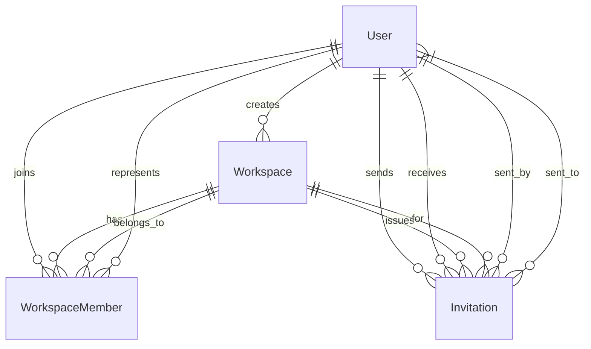
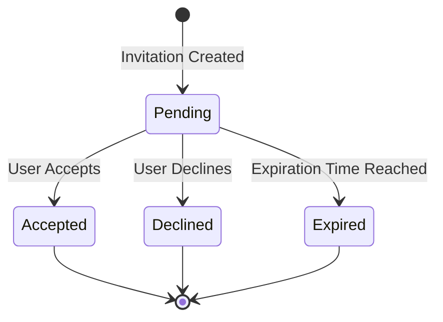
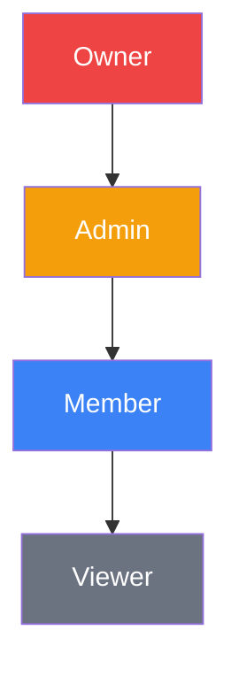
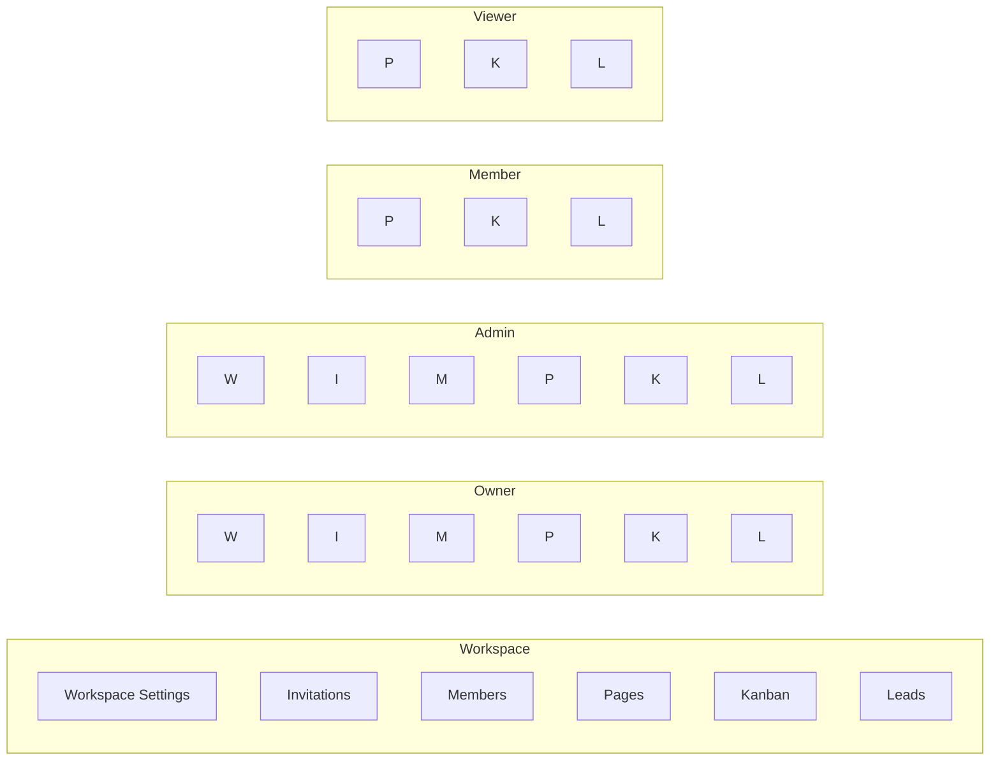

# Multi-Tenant Workspace Feature - Technical Specification

## Executive Summary

This document provides a comprehensive technical specification for implementing a multi-tenant workspace feature with email-based user invitations and Role-Based Access Control (RBAC). The solution enables authenticated users to create distinct workspaces, invite other users via email, and manage permissions through a hierarchical role system.

---

## 1. Database Schema Design

### 1.1 Enhanced Prisma Schema

```prisma
// Existing models remain unchanged
model User {
  id                   String            @id @default(cuid())
  email                String            @unique
  name                 String?
  password             String
  theme                String            @default("system")
  notificationsEmail    Boolean           @default(true)
  notificationsPush     Boolean           @default(true)
  createdAt            DateTime          @default(now())
  updatedAt            DateTime          @updatedAt
  workspaces           Workspace[]
  sessions             Session[]
  workspaceMembers      WorkspaceMember[]
  messages             Message[]
  sentInvitations      Invitation[]      @relation("InvitationSender")
  receivedInvitations  Invitation[]      @relation("InvitationReceiver")
}

model Workspace {
  id          String            @id @default(cuid())
  name        String
  description String?
  icon        String?
  ownerId     String
  owner       User              @relation(fields: [ownerId], references: [id])
  members     WorkspaceMember[]
  pages       Page[]
  kanbanCards    KanbanCard[]
  kanbanProjects  KanbanProject[]
  pipelines   Pipeline[]
  leadLists   LeadList[]
  messages    Message[]
  invitations Invitation[]
  createdAt   DateTime          @default(now())
  updatedAt   DateTime          @updatedAt
}

model WorkspaceMember {
  id          String   @id @default(cuid())
  workspaceId String
  userId      String
  role        String   // 'owner', 'admin', 'member', 'viewer'
  workspace   Workspace @relation(fields: [workspaceId], references: [id])
  user        User      @relation(fields: [userId], references: [id])
  createdAt   DateTime @default(now())
  
  @@unique([workspaceId, userId])
}

// NEW: Invitation Model
model Invitation {
  id          String   @id @default(cuid())
  email       String
  role        String   // 'admin', 'member', 'viewer'
  status      String   @default("pending") // 'pending', 'accepted', 'declined', 'expired'
  token       String   @unique // Secure token for invitation acceptance
  workspaceId String
  senderId    String
  expiresAt   DateTime
  respondedAt DateTime?
  workspace   Workspace @relation(fields: [workspaceId], references: [id], onDelete: Cascade)
  sender      User      @relation("InvitationSender", fields: [senderId], references: [id])
  receiver    User?     @relation("InvitationReceiver", fields: [email], references: [email])
  createdAt   DateTime @default(now())
  updatedAt   DateTime @updatedAt
  
  @@unique([workspaceId, email])
  @@index([email])
  @@index([token])
  @@index([status])
}
```

### 1.2 Schema Relationships



### 1.3 Database Constraints and Indexes

**Constraints:**
- `User.email`: Unique constraint for user identification
- `WorkspaceMember(workspaceId, userId)`: Composite unique constraint prevents duplicate memberships
- `Invitation.token`: Unique constraint for secure invitation links
- `Invitation(workspaceId, email)`: Composite unique constraint prevents duplicate invitations

**Indexes:**
- `Invitation.email`: For querying invitations by email address
- `Invitation.token`: For fast token-based invitation lookup
- `Invitation.status`: For filtering invitations by status
- `WorkspaceMember.userId`: For querying user's workspaces
- `WorkspaceMember.workspaceId`: For querying workspace members

---

## 2. RESTful API Endpoints

### 2.1 Workspace Management Endpoints

#### 2.1.1 Create Workspace

**Endpoint:** `POST /api/workspaces`

**Authentication:** Required

**Request Body:**
```json
{
  "name": "Marketing Team",
  "description": "Marketing campaigns and content",
  "icon": "🚀"
}
```

**Response (201 Created):**
```json
{
  "workspace": {
    "id": "clx123abc456",
    "name": "Marketing Team",
    "description": "Marketing campaigns and content",
    "icon": "🚀",
    "ownerId": "clx789def012",
    "owner": {
      "id": "clx789def012",
      "name": "John Doe",
      "email": "john@example.com"
    },
    "createdAt": "2026-03-27T15:00:00.000Z",
    "updatedAt": "2026-03-27T15:00:00.000Z"
  }
}
```

**Error Response (400 Bad Request):**
```json
{
  "error": "Name is required"
}
```

**Error Response (401 Unauthorized):**
```json
{
  "error": "Unauthorized"
}
```

#### 2.1.2 Get User's Workspaces

**Endpoint:** `GET /api/workspaces`

**Authentication:** Required

**Query Parameters:** None

**Response (200 OK):**
```json
{
  "workspaces": [
    {
      "id": "clx123abc456",
      "name": "Marketing Team",
      "description": "Marketing campaigns and content",
      "icon": "🚀",
      "ownerId": "clx789def012",
      "owner": {
        "id": "clx789def012",
        "name": "John Doe",
        "email": "john@example.com"
      },
      "members": [
        {
          "id": "clx456ghi789",
          "role": "owner",
          "user": {
            "id": "clx789def012",
            "name": "John Doe",
            "email": "john@example.com"
          }
        }
      ],
      "_count": {
        "pages": 5
      },
      "createdAt": "2026-03-27T15:00:00.000Z",
      "updatedAt": "2026-03-27T15:00:00.000Z"
    }
  ]
}
```

#### 2.1.3 Get Workspace Details

**Endpoint:** `GET /api/workspaces/{workspaceId}`

**Authentication:** Required

**Response (200 OK):**
```json
{
  "workspace": {
    "id": "clx123abc456",
    "name": "Marketing Team",
    "description": "Marketing campaigns and content",
    "icon": "🚀",
    "ownerId": "clx789def012",
    "owner": {
      "id": "clx789def012",
      "name": "John Doe",
      "email": "john@example.com"
    },
    "members": [
      {
        "id": "clx456ghi789",
        "role": "owner",
        "user": {
          "id": "clx789def012",
          "name": "John Doe",
          "email": "john@example.com"
        },
        "createdAt": "2026-03-27T15:00:00.000Z"
      },
      {
        "id": "clx789jkl012",
        "role": "admin",
        "user": {
          "id": "clx345mno678",
          "name": "Jane Smith",
          "email": "jane@example.com"
        },
        "createdAt": "2026-03-27T15:30:00.000Z"
      }
    ],
    "pages": [
      {
        "id": "clx901pqr345",
        "title": "Campaign Calendar",
        "icon": "📅",
        "order": 0,
        "children": []
      }
    ],
    "createdAt": "2026-03-27T15:00:00.000Z",
    "updatedAt": "2026-03-27T15:30:00.000Z"
  }
}
```

**Error Response (403 Forbidden):**
```json
{
  "error": "Forbidden"
}
```

**Error Response (404 Not Found):**
```json
{
  "error": "Workspace not found"
}
```

#### 2.1.4 Update Workspace

**Endpoint:** `PATCH /api/workspaces/{workspaceId}`

**Authentication:** Required (Owner only)

**Request Body:**
```json
{
  "name": "Marketing Team 2.0",
  "description": "Updated marketing campaigns",
  "icon": "🎯"
}
```

**Response (200 OK):**
```json
{
  "workspace": {
    "id": "clx123abc456",
    "name": "Marketing Team 2.0",
    "description": "Updated marketing campaigns",
    "icon": "🎯",
    "ownerId": "clx789def012",
    "createdAt": "2026-03-27T15:00:00.000Z",
    "updatedAt": "2026-03-27T16:00:00.000Z"
  }
}
```

#### 2.1.5 Delete Workspace

**Endpoint:** `DELETE /api/workspaces/{workspaceId}`

**Authentication:** Required (Owner only)

**Response (200 OK):**
```json
{
  "message": "Workspace deleted successfully"
}
```

### 2.2 Invitation Management Endpoints

#### 2.2.1 Send Invitation

**Endpoint:** `POST /api/workspaces/{workspaceId}/invitations`

**Authentication:** Required (Owner or Admin)

**Request Body:**
```json
{
  "email": "newuser@example.com",
  "role": "admin"
}
```

**Response (201 Created):**
```json
{
  "invitation": {
    "id": "clx234stu567",
    "email": "newuser@example.com",
    "role": "admin",
    "status": "pending",
    "token": "inv_abc123xyz789def456",
    "workspaceId": "clx123abc456",
    "senderId": "clx789def012",
    "sender": {
      "id": "clx789def012",
      "name": "John Doe",
      "email": "john@example.com"
    },
    "workspace": {
      "id": "clx123abc456",
      "name": "Marketing Team",
      "icon": "🚀"
    },
    "expiresAt": "2026-04-10T15:00:00.000Z",
    "createdAt": "2026-03-27T15:00:00.000Z"
  }
}
```

**Error Response (400 Bad Request):**
```json
{
  "error": "User is already a member of this workspace"
}
```

**Error Response (400 Bad Request):**
```json
{
  "error": "Invitation already sent to this email"
}
```

**Error Response (403 Forbidden):**
```json
{
  "error": "You don't have permission to send invitations"
}
```

#### 2.2.2 Get Workspace Invitations

**Endpoint:** `GET /api/workspaces/{workspaceId}/invitations`

**Authentication:** Required (Owner or Admin)

**Query Parameters:**
- `status` (optional): Filter by status (`pending`, `accepted`, `declined`, `expired`)

**Response (200 OK):**
```json
{
  "invitations": [
    {
      "id": "clx234stu567",
      "email": "newuser@example.com",
      "role": "admin",
      "status": "pending",
      "sender": {
        "id": "clx789def012",
        "name": "John Doe",
        "email": "john@example.com"
      },
      "expiresAt": "2026-04-10T15:00:00.000Z",
      "createdAt": "2026-03-27T15:00:00.000Z"
    },
    {
      "id": "clx345vwx678",
      "email": "another@example.com",
      "role": "member",
      "status": "accepted",
      "receiver": {
        "id": "clx901yza234",
        "name": "Another User",
        "email": "another@example.com"
      },
      "respondedAt": "2026-03-27T16:30:00.000Z",
      "createdAt": "2026-03-27T15:30:00.000Z"
    }
  ]
}
```

#### 2.2.3 Get User's Pending Invitations

**Endpoint:** `GET /api/invitations/pending`

**Authentication:** Required

**Response (200 OK):**
```json
{
  "invitations": [
    {
      "id": "clx234stu567",
      "email": "currentuser@example.com",
      "role": "admin",
      "status": "pending",
      "token": "inv_abc123xyz789def456",
      "workspace": {
        "id": "clx123abc456",
        "name": "Marketing Team",
        "icon": "🚀",
        "owner": {
          "name": "John Doe",
          "email": "john@example.com"
        }
      },
      "sender": {
        "name": "John Doe",
        "email": "john@example.com"
      },
      "expiresAt": "2026-04-10T15:00:00.000Z",
      "createdAt": "2026-03-27T15:00:00.000Z"
    }
  ]
}
```

#### 2.2.4 Accept Invitation

**Endpoint:** `POST /api/invitations/{invitationId}/accept`

**Authentication:** Required (invitation email must match user's email)

**Request Body:**
```json
{
  "token": "inv_abc123xyz789def456"
}
```

**Response (200 OK):**
```json
{
  "message": "Invitation accepted successfully",
  "workspace": {
    "id": "clx123abc456",
    "name": "Marketing Team",
    "icon": "🚀"
  },
  "membership": {
    "id": "clx456bcd789",
    "role": "admin",
    "workspaceId": "clx123abc456",
    "userId": "clx901yza234",
    "createdAt": "2026-03-27T16:45:00.000Z"
  }
}
```

**Error Response (400 Bad Request):**
```json
{
  "error": "Invitation token is invalid"
}
```

**Error Response (400 Bad Request):**
```json
{
  "error": "Invitation has expired"
}
```

**Error Response (400 Bad Request):**
```json
{
  "error": "You don't have permission to accept this invitation"
}
```

#### 2.2.5 Decline Invitation

**Endpoint:** `POST /api/invitations/{invitationId}/decline`

**Authentication:** Required (invitation email must match user's email)

**Request Body:**
```json
{
  "token": "inv_abc123xyz789def456"
}
```

**Response (200 OK):**
```json
{
  "message": "Invitation declined successfully",
  "invitation": {
    "id": "clx234stu567",
    "status": "declined",
    "respondedAt": "2026-03-27T16:50:00.000Z"
  }
}
```

#### 2.2.6 Cancel Invitation

**Endpoint:** `DELETE /api/workspaces/{workspaceId}/invitations/{invitationId}`

**Authentication:** Required (Owner or Admin)

**Response (200 OK):**
```json
{
  "message": "Invitation cancelled successfully"
}
```

**Error Response (403 Forbidden):**
```json
{
  "error": "You don't have permission to cancel this invitation"
}
```

#### 2.2.7 Resend Invitation

**Endpoint:** `POST /api/workspaces/{workspaceId}/invitations/{invitationId}/resend`

**Authentication:** Required (Owner or Admin)

**Response (200 OK):**
```json
{
  "message": "Invitation resent successfully",
  "invitation": {
    "id": "clx234stu567",
    "email": "newuser@example.com",
    "role": "admin",
    "status": "pending",
    "token": "inv_newtoken123xyz789",
    "expiresAt": "2026-04-10T16:00:00.000Z",
    "createdAt": "2026-03-27T15:00:00.000Z",
    "updatedAt": "2026-03-27T16:00:00.000Z"
  }
}
```

### 2.3 Member Management Endpoints

#### 2.3.1 Update Member Role

**Endpoint:** `PATCH /api/workspaces/{workspaceId}/members/{memberId}`

**Authentication:** Required (Owner only)

**Request Body:**
```json
{
  "role": "admin"
}
```

**Response (200 OK):**
```json
{
  "message": "Member role updated successfully",
  "member": {
    "id": "clx456ghi789",
    "role": "admin",
    "userId": "clx345mno678",
    "workspaceId": "clx123abc456",
    "user": {
      "id": "clx345mno678",
      "name": "Jane Smith",
      "email": "jane@example.com"
    }
  }
}
```

**Error Response (400 Bad Request):**
```json
{
  "error": "Cannot change owner role"
}
```

#### 2.3.2 Remove Member

**Endpoint:** `DELETE /api/workspaces/{workspaceId}/members/{memberId}`

**Authentication:** Required (Owner or Admin; cannot remove owner)

**Response (200 OK):**
```json
{
  "message": "Member removed successfully"
}
```

**Error Response (400 Bad Request):**
```json
{
  "error": "Cannot remove workspace owner"
}
```

**Error Response (403 Forbidden):**
```json
{
  "error": "You don't have permission to remove this member"
}
```

#### 2.3.3 Leave Workspace

**Endpoint:** `POST /api/workspaces/{workspaceId}/leave`

**Authentication:** Required (cannot leave if owner)

**Response (200 OK):**
```json
{
  "message": "You have left the workspace successfully"
}
```

**Error Response (400 Bad Request):**
```json
{
  "error": "Workspace owner cannot leave. Transfer ownership first."
}
```

---

## 3. Invitation State Management Logic

### 3.1 Invitation States



### 3.2 State Transitions and Rules

| Current State | Valid Transitions | Trigger | Notes |
|---------------|------------------|---------|-------|
| `pending` | `accepted` | User accepts invitation | Creates WorkspaceMember record |
| `pending` | `declined` | User declines invitation | Updates invitation status |
| `pending` | `expired` | System cron job | Runs every hour |
| `pending` | `pending` | Resend invitation | Updates token and expiresAt |
| `accepted` | None | - | Final state |
| `declined` | None | - | Final state |
| `expired` | None | - | Final state |

### 3.3 Invitation Lifecycle

#### 3.3.1 Creating an Invitation

**Validation Steps:**
1. Verify user has permission (Owner or Admin)
2. Check if email is already a workspace member
3. Check if there's an existing pending invitation for this email
4. Validate role assignment (cannot assign 'owner' via invitation)
5. Generate secure token (32-byte random string)
6. Set expiration time (default: 7 days from creation)
7. Create invitation record
8. Send invitation email

**Code Logic:**
```typescript
async function createInvitation(
  workspaceId: string,
  email: string,
  role: string,
  senderId: string
) {
  // 1. Check permissions
  const membership = await getWorkspaceMembership(workspaceId, senderId);
  if (!['owner', 'admin'].includes(membership.role)) {
    throw new ForbiddenError('Insufficient permissions');
  }

  // 2. Check if already a member
  const existingMember = await prisma.workspaceMember.findFirst({
    where: {
      workspaceId,
      user: { email }
    }
  });
  if (existingMember) {
    throw new BadRequestError('User is already a member');
  }

  // 3. Check existing pending invitation
  const existingInvitation = await prisma.invitation.findFirst({
    where: {
      workspaceId,
      email,
      status: 'pending'
    }
  });
  if (existingInvitation) {
    throw new BadRequestError('Invitation already pending');
  }

  // 4. Validate role
  if (role === 'owner') {
    throw new BadRequestError('Cannot assign owner role via invitation');
  }

  // 5. Generate token and expiration
  const token = generateSecureToken();
  const expiresAt = new Date();
  expiresAt.setDate(expiresAt.getDate() + 7);

  // 6. Create invitation
  const invitation = await prisma.invitation.create({
    data: {
      email,
      role,
      workspaceId,
      senderId,
      token,
      expiresAt
    }
  });

  // 7. Send email
  await sendInvitationEmail(invitation);

  return invitation;
}
```

#### 3.3.2 Accepting an Invitation

**Validation Steps:**
1. Verify user is authenticated
2. Find invitation by ID
3. Validate token matches
4. Check invitation status is 'pending'
5. Check invitation hasn't expired
6. Verify user's email matches invitation email
7. Create WorkspaceMember record
8. Update invitation status to 'accepted'
9. Set respondedAt timestamp

**Code Logic:**
```typescript
async function acceptInvitation(
  invitationId: string,
  token: string,
  userId: string
) {
  // 1. Find invitation
  const invitation = await prisma.invitation.findUnique({
    where: { id: invitationId },
    include: { workspace: true }
  });

  if (!invitation) {
    throw new NotFoundError('Invitation not found');
  }

  // 2. Validate token
  if (invitation.token !== token) {
    throw new BadRequestError('Invalid token');
  }

  // 3. Check status
  if (invitation.status !== 'pending') {
    throw new BadRequestError('Invitation is not pending');
  }

  // 4. Check expiration
  if (new Date() > invitation.expiresAt) {
    await prisma.invitation.update({
      where: { id: invitationId },
      data: { status: 'expired' }
    });
    throw new BadRequestError('Invitation has expired');
  }

  // 5. Verify email match
  const user = await prisma.user.findUnique({ where: { id: userId } });
  if (user.email !== invitation.email) {
    throw new ForbiddenError('Email mismatch');
  }

  // 6. Create membership
  const membership = await prisma.workspaceMember.create({
    data: {
      workspaceId: invitation.workspaceId,
      userId: userId,
      role: invitation.role
    }
  });

  // 7. Update invitation
  await prisma.invitation.update({
    where: { id: invitationId },
    data: {
      status: 'accepted',
      respondedAt: new Date()
    }
  });

  return { membership, workspace: invitation.workspace };
}
```

#### 3.3.3 Declining an Invitation

**Validation Steps:**
1. Verify user is authenticated
2. Find invitation by ID
3. Validate token matches
4. Check invitation status is 'pending'
5. Verify user's email matches invitation email
6. Update invitation status to 'declined'
7. Set respondedAt timestamp

**Code Logic:**
```typescript
async function declineInvitation(
  invitationId: string,
  token: string,
  userId: string
) {
  const invitation = await prisma.invitation.findUnique({
    where: { id: invitationId }
  });

  if (!invitation) {
    throw new NotFoundError('Invitation not found');
  }

  if (invitation.token !== token) {
    throw new BadRequestError('Invalid token');
  }

  if (invitation.status !== 'pending') {
    throw new BadRequestError('Invitation is not pending');
  }

  const user = await prisma.user.findUnique({ where: { id: userId } });
  if (user.email !== invitation.email) {
    throw new ForbiddenError('Email mismatch');
  }

  await prisma.invitation.update({
    where: { id: invitationId },
    data: {
      status: 'declined',
      respondedAt: new Date()
    }
  });

  return invitation;
}
```

#### 3.3.4 Expiring Invitations

**Cron Job Logic:**
```typescript
async function expirePendingInvitations() {
  const now = new Date();
  
  const expiredInvitations = await prisma.invitation.updateMany({
    where: {
      status: 'pending',
      expiresAt: { lt: now }
    },
    data: {
      status: 'expired'
    }
  });

  console.log(`Expired ${expiredInvitations.count} invitations`);
  return expiredInvitations;
}

// Run every hour
cron.schedule('0 * * * *', expirePendingInvitations);
```

### 3.4 Email Notification System

#### 3.4.1 Invitation Email Template

**Subject:** `You're invited to join {workspace_name} on Notion-Alt`

**Body:**
```html
<!DOCTYPE html>
<html>
<head>
  <style>
    body { font-family: Arial, sans-serif; line-height: 1.6; color: #333; }
    .container { max-width: 600px; margin: 0 auto; padding: 20px; }
    .header { background: #6366f1; color: white; padding: 20px; text-align: center; }
    .content { padding: 20px; background: #f9fafb; }
    .button { 
      display: inline-block; 
      padding: 12px 24px; 
      background: #6366f1; 
      color: white; 
      text-decoration: none; 
      border-radius: 6px;
      margin: 20px 0;
    }
    .footer { text-align: center; padding: 20px; color: #666; font-size: 12px; }
  </style>
</head>
<body>
  <div class="container">
    <div class="header">
      <h1>You're Invited!</h1>
    </div>
    <div class="content">
      <p>Hi there,</p>
      <p><strong>{{sender_name}}</strong> has invited you to join the <strong>{{workspace_name}}</strong> workspace on Notion-Alt.</p>
      
      <p>You've been invited as a <strong>{{role}}</strong>.</p>
      
      <div style="text-align: center;">
        <a href="{{accept_url}}" class="button">Accept Invitation</a>
      </div>
      
      <p>This invitation will expire in 7 days.</p>
      
      <p>If you didn't expect this invitation, you can safely ignore this email.</p>
    </div>
    <div class="footer">
      <p>© 2026 Notion-Alt. All rights reserved.</p>
    </div>
  </div>
</body>
</html>
```

#### 3.4.2 Email Service Integration

```typescript
interface EmailService {
  sendInvitationEmail(invitation: Invitation): Promise<void>;
  sendInvitationReminder(invitation: Invitation): Promise<void>;
}

class SMTPEmailService implements EmailService {
  async sendInvitationEmail(invitation: Invitation): Promise<void> {
    const acceptUrl = `${process.env.APP_URL}/invitations/${invitation.id}?token=${invitation.token}`;
    
    await this.transporter.sendMail({
      from: process.env.EMAIL_FROM,
      to: invitation.email,
      subject: `You're invited to join ${invitation.workspace.name}`,
      html: this.renderTemplate('invitation', {
        sender_name: invitation.sender.name,
        workspace_name: invitation.workspace.name,
        role: invitation.role,
        accept_url: acceptUrl
      })
    });
  }
}
```

---

## 4. Role-Based Access Control (RBAC)

### 4.1 Role Hierarchy



### 4.2 Role Definitions

| Role | Description | Can Create | Can Edit | Can Delete | Can Invite | Can Manage Members |
|------|-------------|------------|---------|-----------|------------|-------------------|
| **Owner** | Full control over workspace | ✓ All | ✓ All | ✓ All | ✓ | ✓ (including owner) |
| **Admin** | Can manage most aspects | ✓ Most | ✓ Most | ✓ Most (not workspace) | ✓ | ✓ (not owner) |
| **Member** | Can contribute content | ✓ Content | ✓ Own content | ✓ Own content | ✗ | ✗ |
| **Viewer** | Read-only access | ✗ | ✗ | ✗ | ✗ | ✗ |

### 4.3 Permission Matrix



### 4.4 Detailed Permissions by Resource

#### 4.4.1 Workspace Permissions

| Action | Owner | Admin | Member | Viewer |
|--------|-------|-------|--------|--------|
| View workspace | ✓ | ✓ | ✓ | ✓ |
| Update workspace settings | ✓ | ✓ | ✗ | ✗ |
| Delete workspace | ✓ | ✗ | ✗ | ✗ |
| Transfer ownership | ✓ | ✗ | ✗ | ✗ |
| Leave workspace | ✗ | ✓ | ✓ | ✓ |

#### 4.4.2 Invitation Permissions

| Action | Owner | Admin | Member | Viewer |
|--------|-------|-------|--------|--------|
| Send invitations | ✓ | ✓ | ✗ | ✗ |
| View pending invitations | ✓ | ✓ | ✗ | ✗ |
| Cancel invitations | ✓ | ✓ | ✗ | ✗ |
| Resend invitations | ✓ | ✓ | ✗ | ✗ |
| Accept own invitation | ✓ | ✓ | ✓ | ✓ |
| Decline own invitation | ✓ | ✓ | ✓ | ✓ |

#### 4.4.3 Member Management Permissions

| Action | Owner | Admin | Member | Viewer |
|--------|-------|-------|--------|--------|
| View members | ✓ | ✓ | ✓ | ✓ |
| Update member roles | ✓ | ✗ | ✗ | ✗ |
| Remove members | ✓ | ✓* | ✗ | ✗ |
| Leave workspace | ✗ | ✓ | ✓ | ✓ |

*Admins cannot remove owners or other admins

#### 4.4.4 Content Permissions

| Action | Owner | Admin | Member | Viewer |
|--------|-------|-------|--------|--------|
| Create pages | ✓ | ✓ | ✓ | ✗ |
| Edit any page | ✓ | ✓ | ✗ | ✗ |
| Edit own pages | ✓ | ✓ | ✓ | ✗ |
| Delete any page | ✓ | ✓ | ✗ | ✗ |
| Delete own pages | ✓ | ✓ | ✓ | ✗ |
| View pages | ✓ | ✓ | ✓ | ✓ |

#### 4.4.5 Kanban Permissions

| Action | Owner | Admin | Member | Viewer |
|--------|-------|-------|--------|--------|
| Create projects/cards | ✓ | ✓ | ✓ | ✗ |
| Edit any project/card | ✓ | ✓ | ✗ | ✗ |
| Edit own projects/cards | ✓ | ✓ | ✓ | ✗ |
| Delete any project/card | ✓ | ✓ | ✗ | ✗ |
| Delete own projects/cards | ✓ | ✓ | ✓ | ✗ |
| View projects/cards | ✓ | ✓ | ✓ | ✓ |

#### 4.4.6 CRM/Lead Permissions

| Action | Owner | Admin | Member | Viewer |
|--------|-------|-------|--------|--------|
| Create leads/pipelines | ✓ | ✓ | ✓ | ✗ |
| Edit any lead/pipeline | ✓ | ✓ | ✗ | ✗ |
| Edit own leads/pipelines | ✓ | ✓ | ✓ | ✗ |
| Delete any lead/pipeline | ✓ | ✓ | ✗ | ✗ |
| Delete own leads/pipelines | ✓ | ✓ | ✓ | ✗ |
| View leads/pipelines | ✓ | ✓ | ✓ | ✓ |

### 4.5 Permission Middleware

```typescript
// Permission types
type Role = 'owner' | 'admin' | 'member' | 'viewer';

type Permission = 
  | 'workspace:read'
  | 'workspace:write'
  | 'workspace:delete'
  | 'workspace:invite'
  | 'workspace:manage_members'
  | 'content:create'
  | 'content:read'
  | 'content:write'
  | 'content:delete'
  | 'content:write_own'
  | 'content:delete_own';

// Role permissions mapping
const ROLE_PERMISSIONS: Record<Role, Permission[]> = {
  owner: [
    'workspace:read',
    'workspace:write',
    'workspace:delete',
    'workspace:invite',
    'workspace:manage_members',
    'content:create',
    'content:read',
    'content:write',
    'content:delete',
    'content:write_own',
    'content:delete_own'
  ],
  admin: [
    'workspace:read',
    'workspace:write',
    'workspace:invite',
    'workspace:manage_members',
    'content:create',
    'content:read',
    'content:write',
    'content:delete',
    'content:write_own',
    'content:delete_own'
  ],
  member: [
    'workspace:read',
    'content:create',
    'content:read',
    'content:write_own',
    'content:delete_own'
  ],
  viewer: [
    'workspace:read',
    'content:read'
  ]
};

// Permission checker function
function hasPermission(role: Role, permission: Permission): boolean {
  return ROLE_PERMISSIONS[role].includes(permission);
}

// Middleware factory
function requirePermission(permission: Permission) {
  return async (req: Request, res: Response, next: NextFunction) => {
    const session = await getServerSession(authOptions);
    const workspaceId = req.params.workspaceId;
    
    if (!session?.user?.id) {
      return res.status(401).json({ error: 'Unauthorized' });
    }
    
    const membership = await prisma.workspaceMember.findUnique({
      where: {
        workspaceId_userId: {
          workspaceId,
          userId: session.user.id
        }
      }
    });
    
    if (!membership) {
      return res.status(403).json({ error: 'Forbidden' });
    }
    
    if (!hasPermission(membership.role as Role, permission)) {
      return res.status(403).json({ error: 'Insufficient permissions' });
    }
    
    req.membership = membership;
    next();
  };
}

// Usage examples
router.post('/api/workspaces/:workspaceId/invitations', 
  requirePermission('workspace:invite'),
  createInvitationHandler
);

router.delete('/api/workspaces/:workspaceId/members/:memberId',
  requirePermission('workspace:manage_members'),
  removeMemberHandler
);

router.post('/api/workspaces/:workspaceId/pages',
  requirePermission('content:create'),
  createPageHandler
);
```

### 4.6 Content Ownership Logic

For actions that require ownership (e.g., `content:write_own`, `content:delete_own`):

```typescript
function canModifyContent(
  membership: WorkspaceMember,
  contentOwnerId: string
): boolean {
  // Owner and Admin can modify any content
  if (['owner', 'admin'].includes(membership.role)) {
    return true;
  }
  
  // Members can only modify their own content
  if (membership.role === 'member') {
    return membership.userId === contentOwnerId;
  }
  
  // Viewers cannot modify content
  return false;
}

// Usage in API handlers
router.patch('/api/pages/:pageId',
  requirePermission('content:write'),
  async (req, res) => {
    const page = await prisma.page.findUnique({
      where: { id: req.params.pageId }
    });
    
    if (!canModifyContent(req.membership, page.createdBy)) {
      return res.status(403).json({ error: 'Cannot modify this content' });
    }
    
    // Proceed with update
  }
);
```

---

## 5. Security Considerations

### 5.1 Token Security

- **Token Generation:** Use cryptographically secure random number generator (32-byte token)
- **Token Storage:** Store hashed tokens in database
- **Token Expiration:** Default 7-day expiration, configurable
- **Token Usage:** Single-use tokens (invalidate after acceptance/decline)

### 5.2 Email Verification

- Validate email format before sending invitations
- Verify email ownership during acceptance
- Prevent email enumeration attacks

### 5.3 Rate Limiting

```typescript
// Rate limiting configuration
const rateLimitConfig = {
  invitations: {
    windowMs: 60 * 60 * 1000, // 1 hour
    max: 10 // Max 10 invitations per hour per workspace
  },
  acceptInvitation: {
    windowMs: 60 * 1000, // 1 minute
    max: 5 // Max 5 attempts per minute
  }
};
```

### 5.4 Audit Logging

```typescript
// Audit log model
model AuditLog {
  id          String   @id @default(cuid())
  action      String   // 'invitation_sent', 'invitation_accepted', 'role_changed', etc.
  entityType  String   // 'workspace', 'invitation', 'member'
  entityId    String
  actorId     String
  actorEmail  String
  metadata    String?  // JSON string with additional context
  ipAddress   String?
  userAgent   String?
  createdAt   DateTime @default(now())
  
  @@index([entityType, entityId])
  @@index([actorId])
}
```

---

## 6. Implementation Checklist

### 6.1 Database Changes

- [ ] Add `Invitation` model to Prisma schema
- [ ] Add `sentInvitations` and `receivedInvitations` relations to `User` model
- [ ] Add `invitations` relation to `Workspace` model
- [ ] Create database migration
- [ ] Add unique constraint on `Invitation(workspaceId, email)`
- [ ] Add indexes for performance optimization

### 6.2 API Endpoints

- [ ] `POST /api/workspaces/{workspaceId}/invitations` - Send invitation
- [ ] `GET /api/workspaces/{workspaceId}/invitations` - List workspace invitations
- [ ] `GET /api/invitations/pending` - Get user's pending invitations
- [ ] `POST /api/invitations/{invitationId}/accept` - Accept invitation
- [ ] `POST /api/invitations/{invitationId}/decline` - Decline invitation
- [ ] `DELETE /api/workspaces/{workspaceId}/invitations/{invitationId}` - Cancel invitation
- [ ] `POST /api/workspaces/{workspaceId}/invitations/{invitationId}/resend` - Resend invitation
- [ ] `PATCH /api/workspaces/{workspaceId}/members/{memberId}` - Update member role
- [ ] `DELETE /api/workspaces/{workspaceId}/members/{memberId}` - Remove member
- [ ] `POST /api/workspaces/{workspaceId}/leave` - Leave workspace

### 6.3 Email Service

- [ ] Configure SMTP or email service provider
- [ ] Create email templates
- [ ] Implement invitation email sending
- [ ] Implement invitation reminder emails
- [ ] Add email queue for reliability

### 6.4 Background Jobs

- [ ] Implement invitation expiration cron job
- [ ] Implement invitation reminder cron job (optional)
- [ ] Implement audit log cleanup job

### 6.5 Frontend Components

- [ ] Invitation management UI
- [ ] Pending invitations list
- [ ] Accept/decline invitation modals
- [ ] Member management UI
- [ ] Role assignment interface

### 6.6 Testing

- [ ] Unit tests for invitation logic
- [ ] Integration tests for API endpoints
- [ ] Permission tests for RBAC
- [ ] Email sending tests
- [ ] Security tests (token validation, rate limiting)

---

## 7. Migration Strategy

### 7.1 Database Migration

```sql
-- Migration SQL
CREATE TABLE "Invitation" (
    "id" TEXT NOT NULL PRIMARY KEY,
    "email" TEXT NOT NULL,
    "role" TEXT NOT NULL,
    "status" TEXT NOT NULL DEFAULT 'pending',
    "token" TEXT NOT NULL UNIQUE,
    "workspaceId" TEXT NOT NULL,
    "senderId" TEXT NOT NULL,
    "expiresAt" DATETIME NOT NULL,
    "respondedAt" DATETIME,
    "createdAt" DATETIME NOT NULL DEFAULT CURRENT_TIMESTAMP,
    "updatedAt" DATETIME NOT NULL,
    FOREIGN KEY ("workspaceId") REFERENCES "Workspace"("id") ON DELETE CASCADE,
    FOREIGN KEY ("senderId") REFERENCES "User"("id") ON DELETE CASCADE,
    FOREIGN KEY ("email") REFERENCES "User"("email") ON DELETE SET NULL
);

CREATE UNIQUE INDEX "Invitation_workspaceId_email_key" ON "Invitation"("workspaceId", "email");
CREATE INDEX "Invitation_email_idx" ON "Invitation"("email");
CREATE INDEX "Invitation_token_idx" ON "Invitation"("token");
CREATE INDEX "Invitation_status_idx" ON "Invitation"("status");
```

### 7.2 Rollback Plan

```sql
-- Rollback SQL
DROP TABLE IF EXISTS "Invitation";
```

---

## 8. Performance Considerations

### 8.1 Database Optimization

- Use composite indexes for frequently queried fields
- Implement database connection pooling
- Consider read replicas for high-traffic workspaces
- Implement query result caching for workspace lists

### 8.2 API Optimization

- Implement pagination for invitation lists
- Use GraphQL or batch queries to reduce N+1 problems
- Implement response compression
- Cache permission checks in memory

### 8.3 Email Optimization

- Use email queue to prevent blocking API responses
- Implement email batching for bulk invitations
- Use email service provider's webhooks for delivery tracking

---

## 9. Monitoring and Metrics

### 9.1 Key Metrics to Track

- Invitation creation rate
- Invitation acceptance rate
- Invitation expiration rate
- Average time to accept invitation
- Workspace member growth rate
- Permission check latency
- Email delivery rate

### 9.2 Alerts to Configure

- High rate of failed email deliveries
- Unusual invitation creation patterns (potential abuse)
- Permission check failures
- Database query performance degradation

---

## 10. Future Enhancements

### 10.1 Planned Features

- **Bulk Invitations:** CSV upload for inviting multiple users
- **Invitation Groups:** Pre-defined roles for batch invitations
- **Workspace Templates:** Pre-configured workspaces for quick setup
- **Advanced Permissions:** Granular permissions per resource type
- **Activity Feed:** Real-time workspace activity tracking
- **SSO Integration:** Single sign-on for enterprise customers

### 10.2 Scalability Considerations

- **Multi-region Deployment:** Deploy to multiple regions for global users
- **Database Sharding:** Shard workspaces across multiple database instances
- **Microservices Architecture:** Split workspace service into separate microservice
- **Event-Driven Architecture:** Use message queues for asynchronous operations

---

## Appendix A: Environment Variables

```env
# Email Configuration
EMAIL_FROM=noreply@notion-alt.com
SMTP_HOST=smtp.example.com
SMTP_PORT=587
SMTP_USER=apikey
SMTP_PASSWORD=your-smtp-password

# Application Configuration
APP_URL=https://notion-alt.com
INVITATION_EXPIRATION_DAYS=7
MAX_INVITATIONS_PER_HOUR=10

# Security
NEXTAUTH_SECRET=your-secret-key
```

---

## Appendix B: Error Codes

| Code | Description | HTTP Status |
|------|-------------|-------------|
| `INVITATION_NOT_FOUND` | Invitation does not exist | 404 |
| `INVITATION_EXPIRED` | Invitation has expired | 400 |
| `INVITATION_ALREADY_PENDING` | Pending invitation exists for this email | 400 |
| `INVALID_TOKEN` | Invitation token is invalid | 400 |
| `ALREADY_MEMBER` | User is already a workspace member | 400 |
| `INSUFFICIENT_PERMISSIONS` | User lacks required permissions | 403 |
| `CANNOT_REMOVE_OWNER` | Cannot remove workspace owner | 400 |
| `CANNOT_LEAVE_AS_OWNER` | Owner cannot leave workspace | 400 |
| `INVALID_ROLE` | Invalid role specified | 400 |
| `RATE_LIMIT_EXCEEDED` | Too many requests | 429 |

---

## Conclusion

This technical specification provides a comprehensive blueprint for implementing a multi-tenant workspace feature with email invitations and RBAC. The design prioritizes security, scalability, and user experience while maintaining flexibility for future enhancements.

Key deliverables:
1. Enhanced database schema with Invitation model
2. Complete RESTful API specification
3. Invitation state management logic
4. Comprehensive RBAC strategy
5. Security and performance considerations

The implementation should follow this specification to ensure consistency, security, and maintainability across the application.
