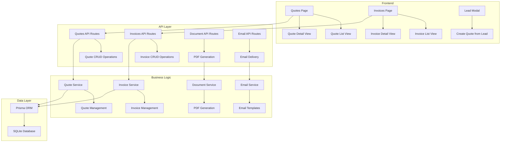
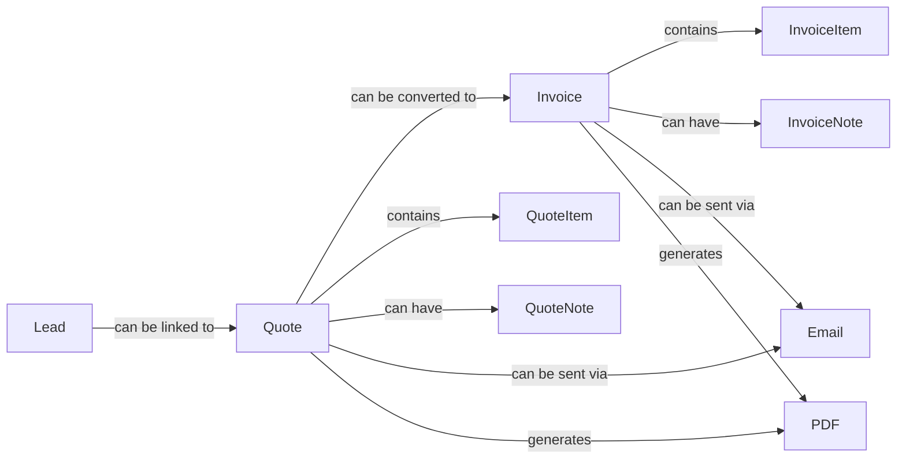
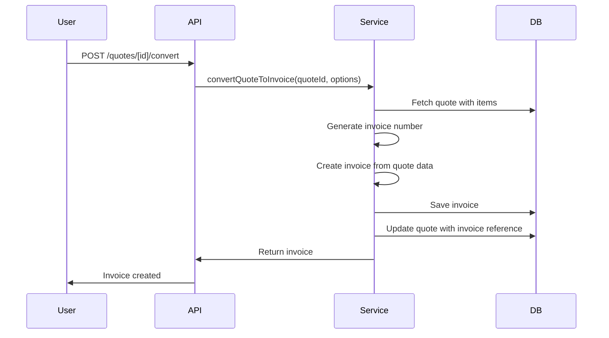
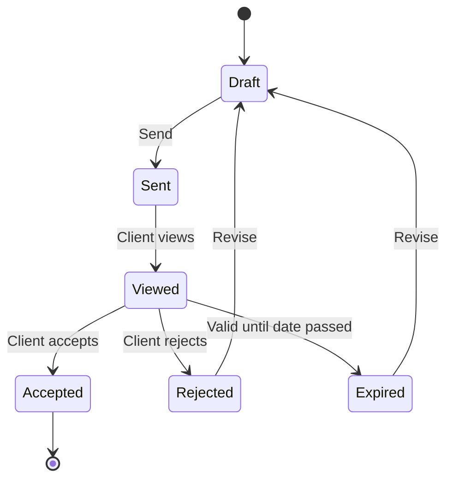
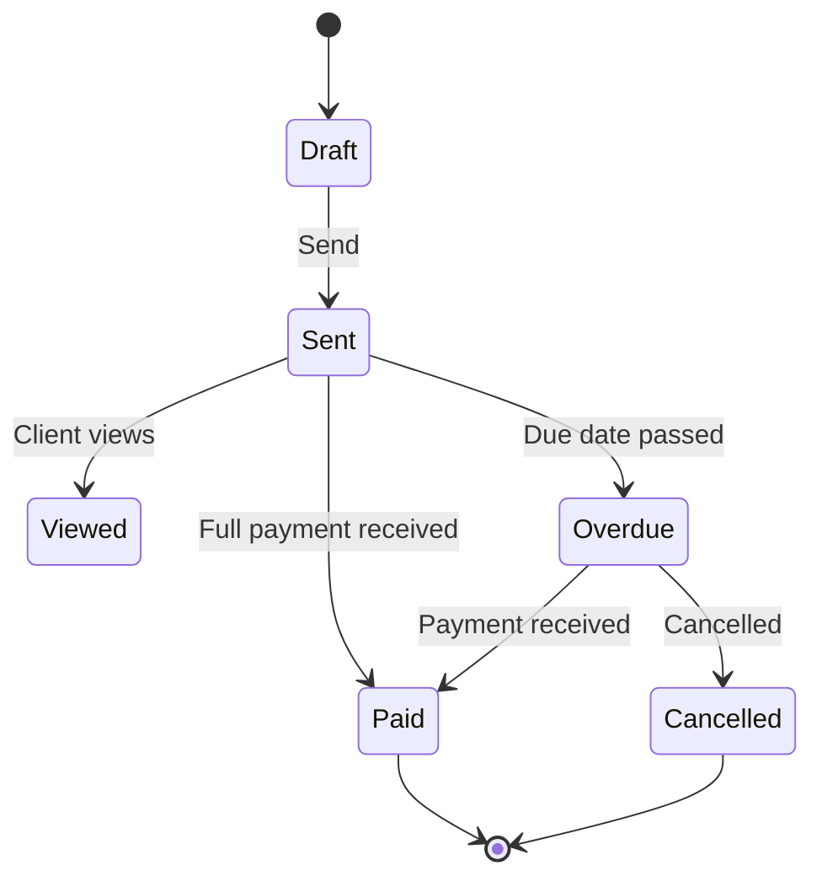

# Quote and Invoice Generation - Comprehensive Implementation Plan

## Executive Summary

This document outlines the comprehensive implementation plan for integrating quote and invoice generation features into the existing CRM system. The system will enable seamless financial management capabilities including document creation, tracking, email delivery, and lead integration.

**Key Requirements:**
- Quotes and invoices as separate entities with independent management interfaces
- Optional linking to CRM leads for context
- PDF generation using @react-pdf/renderer
- Email delivery functionality
- No payment gateway integration (Phase 1)
- Multi-tenant workspace support

---

## Table of Contents

1. [System Architecture Overview](#system-architecture-overview)
2. [Database Schema Design](#database-schema-design)
3. [User Interface Components](#user-interface-components)
4. [API Endpoints](#api-endpoints)
5. [Automated Workflows](#automated-workflows)
6. [Document Generation Architecture](#document-generation-architecture)
7. [Email Delivery System](#email-delivery-system)
8. [TypeScript Type Definitions](#typescript-type-definitions)
9. [Implementation Phases](#implementation-phases)
10. [Security Considerations](#security-considerations)
11. [Testing Strategy](#testing-strategy)

---

## 1. System Architecture Overview

### 1.1 High-Level Architecture



### 1.2 Component Relationships



---

## 2. Database Schema Design

### 2.1 New Models to Add

#### Quote Model

```prisma
model Quote {
  id                String      @id @default(cuid())
  quoteNumber       String      @unique
  workspaceId       String
  leadId            String?
  lead              Lead?       @relation(fields: [leadId], references: [id])
  clientName        String
  clientEmail       String?
  clientPhone       String?
  clientCompany     String?
  clientAddress     String?     // JSON object with address fields
  status            String      @default("draft") // 'draft', 'sent', 'viewed', 'accepted', 'rejected', 'expired'
  issueDate         DateTime    @default(now())
  validUntil        DateTime?
  currency          String      @default("USD")
  subtotal          Float       @default(0)
  taxRate           Float       @default(0)
  taxAmount         Float       @default(0)
  discountType      String?     // 'percentage', 'fixed'
  discountValue     Float       @default(0)
  discountAmount    Float       @default(0)
  total             Float       @default(0)
  notes             String?
  terms             String?
  internalNotes     String?     // Private notes for team
  sentAt            DateTime?
  viewedAt          DateTime?
  acceptedAt        DateTime?
  rejectedAt        DateTime?
  createdBy         String
  updatedBy         String?
  items             QuoteItem[]
  notes             QuoteNote[]
  workspace         Workspace   @relation(fields: [workspaceId], references: [id])
  createdAt         DateTime    @default(now())
  updatedAt         DateTime    @updatedAt

  @@index([workspaceId])
  @@index([leadId])
  @@index([status])
  @@index([quoteNumber])
}
```

#### QuoteItem Model

```prisma
model QuoteItem {
  id          String   @id @default(cuid())
  quoteId     String
  quote       Quote    @relation(fields: [quoteId], references: [id], onDelete: Cascade)
  description String
  quantity    Float    @default(1)
  unitPrice   Float    @default(0)
  discount    Float    @default(0)
  taxRate     Float    @default(0)
  total       Float    @default(0)
  order       Int      @default(0)
  createdAt   DateTime @default(now())
  updatedAt   DateTime @updatedAt

  @@index([quoteId])
}
```

#### QuoteNote Model

```prisma
model QuoteNote {
  id        String   @id @default(cuid())
  quoteId   String
  quote     Quote    @relation(fields: [quoteId], references: [id], onDelete: Cascade)
  content   String
  isPrivate Boolean  @default(false) // true = internal notes, false = client-visible
  createdBy String
  createdAt DateTime @default(now())
  updatedAt DateTime @updatedAt

  @@index([quoteId])
}
```

#### Invoice Model

```prisma
model Invoice {
  id                String        @id @default(cuid())
  invoiceNumber     String        @unique
  workspaceId       String
  leadId            String?
  lead              Lead?         @relation(fields: [leadId], references: [id])
  quoteId           String?
  quote             Quote?        @relation(fields: [quoteId], references: [id])
  clientName        String
  clientEmail       String?
  clientPhone       String?
  clientCompany     String?
  clientAddress     String?       // JSON object with address fields
  status            String        @default("draft") // 'draft', 'sent', 'viewed', 'paid', 'overdue', 'cancelled'
  issueDate         DateTime      @default(now())
  dueDate           DateTime?
  paidDate          DateTime?
  currency          String        @default("USD")
  subtotal          Float         @default(0)
  taxRate           Float         @default(0)
  taxAmount         Float         @default(0)
  discountType      String?       // 'percentage', 'fixed'
  discountValue     Float         @default(0)
  discountAmount    Float         @default(0)
  total             Float         @default(0)
  amountPaid        Float         @default(0)
  amountDue         Float         @default(0)
  paymentMethod     String?       // For manual payment tracking
  paymentReference  String?      // Reference number for payments
  notes             String?
  terms             String?
  internalNotes     String?       // Private notes for team
  sentAt            DateTime?
  viewedAt          DateTime?
  createdBy         String
  updatedBy         String?
  items             InvoiceItem[]
  notes             InvoiceNote[]
  payments          Payment[]
  workspace         Workspace     @relation(fields: [workspaceId], references: [id])
  createdAt         DateTime      @default(now())
  updatedAt         DateTime      @updatedAt

  @@index([workspaceId])
  @@index([leadId])
  @@index([quoteId])
  @@index([status])
  @@index([invoiceNumber])
  @@index([dueDate])
}
```

#### InvoiceItem Model

```prisma
model InvoiceItem {
  id          String   @id @default(cuid())
  invoiceId   String
  invoice     Invoice  @relation(fields: [invoiceId], references: [id], onDelete: Cascade)
  description String
  quantity    Float    @default(1)
  unitPrice   Float    @default(0)
  discount    Float    @default(0)
  taxRate     Float    @default(0)
  total       Float    @default(0)
  order       Int      @default(0)
  createdAt   DateTime @default(now())
  updatedAt   DateTime @updatedAt

  @@index([invoiceId])
}
```

#### InvoiceNote Model

```prisma
model InvoiceNote {
  id        String   @id @default(cuid())
  invoiceId String
  invoice   Invoice  @relation(fields: [invoiceId], references: [id], onDelete: Cascade)
  content   String
  isPrivate Boolean  @default(false) // true = internal notes, false = client-visible
  createdBy String
  createdAt DateTime @default(now())
  updatedAt DateTime @updatedAt

  @@index([invoiceId])
}
```

#### Payment Model

```prisma
model Payment {
  id              String   @id @default(cuid())
  invoiceId       String
  invoice         Invoice  @relation(fields: [invoiceId], references: [id], onDelete: Cascade)
  amount          Float
  paymentDate     DateTime @default(now())
  paymentMethod   String   // 'cash', 'bank_transfer', 'check', 'credit_card', 'other'
  referenceNumber String?
  notes           String?
  createdBy       String
  createdAt       DateTime @default(now())
  updatedAt       DateTime @updatedAt

  @@index([invoiceId])
  @@index([paymentDate])
}
```

### 2.2 Updates to Existing Models

#### Update Lead Model

```prisma
model Lead {
  // ... existing fields ...
  quotes   Quote[]
  invoices Invoice[]
}
```

#### Update Workspace Model

```prisma
model Workspace {
  // ... existing fields ...
  quotes   Quote[]
  invoices Invoice[]
}
```

---

## 3. User Interface Components

### 3.1 Page Structure

```
src/app/
├── quotes/
│   └── page.tsx                    # Quotes list and management page
├── quotes/
│   └── [id]/
│       └── page.tsx                # Quote detail view
├── invoices/
│   └── page.tsx                    # Invoices list and management page
├── invoices/
│   └── [id]/
│       └── page.tsx                # Invoice detail view
```

### 3.2 Component Structure

```
src/components/
├── quotes/
│   ├── QuoteList.tsx              # List view of quotes
│   ├── QuoteCard.tsx              # Quote card for list view
│   ├── QuoteModal.tsx              # Create/Edit quote modal
│   ├── QuoteDetail.tsx            # Quote detail view
│   ├── QuoteItemsEditor.tsx       # Items editor component
│   ├── QuoteStatusBadge.tsx       # Status badge component
│   └── QuoteActions.tsx           # Action buttons (send, convert, etc.)
├── invoices/
│   ├── InvoiceList.tsx             # List view of invoices
│   ├── InvoiceCard.tsx             # Invoice card for list view
│   ├── InvoiceModal.tsx            # Create/Edit invoice modal
│   ├── InvoiceDetail.tsx           # Invoice detail view
│   ├── InvoiceItemsEditor.tsx      # Items editor component
│   ├── InvoiceStatusBadge.tsx      # Status badge component
│   ├── InvoiceActions.tsx          # Action buttons (send, record payment, etc.)
│   └── PaymentModal.tsx            # Record payment modal
└── documents/
    ├── DocumentPreview.tsx        # PDF preview component
    ├── DocumentEmail.tsx           # Email sending component
    └── DocumentTemplate.tsx        # Document template selector
```

### 3.3 Key UI Components

#### QuoteList Component

**Features:**
- Filterable list (by status, date range, client)
- Search functionality
- Sort options (date, amount, status)
- Quick actions (view, edit, delete, send, convert to invoice)
- Summary cards (total quotes, pending, accepted, etc.)
- Export functionality

**Props:**
```typescript
interface QuoteListProps {
  workspaceId: string;
  filters?: QuoteFilters;
  onQuoteSelect?: (quote: Quote) => void;
}
```

#### QuoteModal Component

**Features:**
- Create/Edit quote form
- Client information fields
- Items editor with add/remove/reorder
- Tax and discount calculations
- Terms and notes editor
- Lead selector (optional)
- Validation

**Props:**
```typescript
interface QuoteModalProps {
  isOpen: boolean;
  onClose: () => void;
  onSave: (quote: Partial<Quote>) => Promise<void>;
  quote?: Quote; // If provided, edit mode
  workspaceId: string;
  leadId?: string; // Pre-select lead if provided
}
```

#### QuoteDetail Component

**Features:**
- Quote information display
- Items table
- Client information
- Status timeline
- Notes section (public and private)
- Activity log
- Action buttons (send, convert to invoice, download PDF, email)

**Props:**
```typescript
interface QuoteDetailProps {
  quoteId: string;
  workspaceId: string;
}
```

#### QuoteItemsEditor Component

**Features:**
- Dynamic item rows
- Auto-calculate line totals
- Add/remove items
- Reorder items
- Bulk operations

**Props:**
```typescript
interface QuoteItemsEditorProps {
  items: QuoteItem[];
  onChange: (items: QuoteItem[]) => void;
  currency: string;
  taxRate: number;
}
```

#### DocumentPreview Component

**Features:**
- PDF preview in iframe
- Download button
- Print button
- Email button

**Props:**
```typescript
interface DocumentPreviewProps {
  documentType: 'quote' | 'invoice';
  documentId: string;
  workspaceId: string;
}
```

#### DocumentEmail Component

**Features:**
- Email template selection
- Recipient email (auto-filled from client)
- Subject line customization
- Message body editor
- Attach PDF
- Send preview

**Props:**
```typescript
interface DocumentEmailProps {
  documentType: 'quote' | 'invoice';
  documentId: string;
  workspaceId: string;
  onSend: (emailData: EmailData) => Promise<void>;
}
```

### 3.4 Navigation Integration

Update AppShell to include quotes and invoices in navigation:

```typescript
// Add to navigation menu
const navigationItems = [
  // ... existing items
  {
    label: 'Quotes',
    href: '/quotes',
    icon: FileText,
  },
  {
    label: 'Invoices',
    href: '/invoices',
    icon: DollarSign,
  },
];
```

---

## 4. API Endpoints

### 4.1 Quotes API

```
src/app/api/quotes/
├── route.ts                        # GET (list), POST (create)
├── [id]/
│   ├── route.ts                    # GET (detail), PUT (update), DELETE
│   ├── items/
│   │   └── route.ts                # GET, POST (items)
│   ├── items/[itemId]/
│   │   └── route.ts                # PUT, DELETE
│   ├── notes/
│   │   └── route.ts                # GET, POST (notes)
│   ├── notes/[noteId]/
│   │   └── route.ts                # PUT, DELETE
│   ├── send/
│   │   └── route.ts                # POST (send via email)
│   ├── convert/
│   │   └── route.ts                # POST (convert to invoice)
│   └── pdf/
│       └── route.ts                # GET (generate PDF)
```

#### GET /api/quotes

**Query Parameters:**
- `workspaceId` (required)
- `status` (optional)
- `leadId` (optional)
- `search` (optional)
- `page` (optional, default: 1)
- `limit` (optional, default: 20)

**Response:**
```json
{
  "quotes": [
    {
      "id": "string",
      "quoteNumber": "string",
      "status": "string",
      "clientName": "string",
      "total": number,
      "issueDate": "ISO8601",
      "validUntil": "ISO8601 | null",
      "lead": { "id": "string", "firstName": "string", "lastName": "string" }
    }
  ],
  "pagination": {
    "total": number,
    "page": number,
    "limit": number,
    "totalPages": number
  }
}
```

#### POST /api/quotes

**Request Body:**
```json
{
  "workspaceId": "string",
  "leadId": "string | null",
  "clientName": "string",
  "clientEmail": "string | null",
  "clientPhone": "string | null",
  "clientCompany": "string | null",
  "clientAddress": "object | null",
  "issueDate": "ISO8601",
  "validUntil": "ISO8601 | null",
  "currency": "string",
  "taxRate": number,
  "discountType": "string | null",
  "discountValue": number,
  "notes": "string | null",
  "terms": "string | null",
  "internalNotes": "string | null",
  "items": [
    {
      "description": "string",
      "quantity": number,
      "unitPrice": number,
      "discount": number,
      "taxRate": number,
      "order": number
    }
  ]
}
```

**Response:**
```json
{
  "quote": {
    "id": "string",
    "quoteNumber": "string",
    // ... all quote fields
  }
}
```

#### POST /api/quotes/[id]/send

**Request Body:**
```json
{
  "to": "string",
  "subject": "string",
  "message": "string",
  "template": "string"
}
```

**Response:**
```json
{
  "success": true,
  "message": "Quote sent successfully",
  "sentAt": "ISO8601"
}
```

#### POST /api/quotes/[id]/convert

**Request Body:**
```json
{
  "dueDate": "ISO8601",
  "notes": "string | null"
}
```

**Response:**
```json
{
  "invoice": {
    "id": "string",
    "invoiceNumber": "string",
    // ... all invoice fields
  }
}
```

#### GET /api/quotes/[id]/pdf

**Response:** PDF file (application/pdf)

### 4.2 Invoices API

```
src/app/api/invoices/
├── route.ts                        # GET (list), POST (create)
├── [id]/
│   ├── route.ts                    # GET (detail), PUT (update), DELETE
│   ├── items/
│   │   └── route.ts                # GET, POST (items)
│   ├── items/[itemId]/
│   │   └── route.ts                # PUT, DELETE
│   ├── notes/
│   │   └── route.ts                # GET, POST (notes)
│   ├── notes/[noteId]/
│   │   └── route.ts                # PUT, DELETE
│   ├── send/
│   │   └── route.ts                # POST (send via email)
│   ├── payments/
│   │   └── route.ts                # GET, POST (payments)
│   ├── payments/[paymentId]/
│   │   └── route.ts                # PUT, DELETE
│   └── pdf/
│       └── route.ts                # GET (generate PDF)
```

#### GET /api/invoices

**Query Parameters:**
- `workspaceId` (required)
- `status` (optional)
- `leadId` (optional)
- `quoteId` (optional)
- `search` (optional)
- `page` (optional, default: 1)
- `limit` (optional, default: 20)

**Response:**
```json
{
  "invoices": [
    {
      "id": "string",
      "invoiceNumber": "string",
      "status": "string",
      "clientName": "string",
      "total": number,
      "amountDue": number,
      "issueDate": "ISO8601",
      "dueDate": "ISO8601 | null",
      "lead": { "id": "string", "firstName": "string", "lastName": "string" }
    }
  ],
  "pagination": {
    "total": number,
    "page": number,
    "limit": number,
    "totalPages": number
  }
}
```

#### POST /api/invoices

**Request Body:**
```json
{
  "workspaceId": "string",
  "leadId": "string | null",
  "quoteId": "string | null",
  "clientName": "string",
  "clientEmail": "string | null",
  "clientPhone": "string | null",
  "clientCompany": "string | null",
  "clientAddress": "object | null",
  "issueDate": "ISO8601",
  "dueDate": "ISO8601 | null",
  "currency": "string",
  "taxRate": number,
  "discountType": "string | null",
  "discountValue": number,
  "notes": "string | null",
  "terms": "string | null",
  "internalNotes": "string | null",
  "items": [
    {
      "description": "string",
      "quantity": number,
      "unitPrice": number,
      "discount": number,
      "taxRate": number,
      "order": number
    }
  ]
}
```

#### POST /api/invoices/[id]/payments

**Request Body:**
```json
{
  "amount": number,
  "paymentDate": "ISO8601",
  "paymentMethod": "string",
  "referenceNumber": "string | null",
  "notes": "string | null"
}
```

**Response:**
```json
{
  "payment": {
    "id": "string",
    "amount": number,
    "paymentDate": "ISO8601",
    "paymentMethod": "string",
    "referenceNumber": "string | null"
  },
  "invoice": {
    "id": "string",
    "amountPaid": number,
    "amountDue": number,
    "status": "string"
  }
}
```

#### GET /api/invoices/[id]/pdf

**Response:** PDF file (application/pdf)

---

## 5. Automated Workflows

### 5.1 Quote Number Generation

**Workflow:**
```typescript
// Generate sequential quote number per workspace
async function generateQuoteNumber(workspaceId: string): Promise<string> {
  const year = new Date().getFullYear();
  const prefix = `Q-${year}`;
  
  const lastQuote = await prisma.quote.findFirst({
    where: {
      workspaceId,
      quoteNumber: { startsWith: prefix }
    },
    orderBy: { quoteNumber: 'desc' }
  });
  
  const nextNumber = lastQuote 
    ? parseInt(lastQuote.quoteNumber.split('-')[2]) + 1
    : 1;
  
  return `${prefix}-${nextNumber.toString().padStart(4, '0')}`;
}
```

**Example Output:** `Q-2026-0001`, `Q-2026-0002`, etc.

### 5.2 Invoice Number Generation

**Workflow:**
```typescript
// Generate sequential invoice number per workspace
async function generateInvoiceNumber(workspaceId: string): Promise<string> {
  const year = new Date().getFullYear();
  const prefix = `INV-${year}`;
  
  const lastInvoice = await prisma.invoice.findFirst({
    where: {
      workspaceId,
      invoiceNumber: { startsWith: prefix }
    },
    orderBy: { invoiceNumber: 'desc' }
  });
  
  const nextNumber = lastInvoice 
    ? parseInt(lastInvoice.invoiceNumber.split('-')[2]) + 1
    : 1;
  
  return `${prefix}-${nextNumber.toString().padStart(4, '0')}`;
}
```

**Example Output:** `INV-2026-0001`, `INV-2026-0002`, etc.

### 5.3 Quote to Invoice Conversion

**Workflow:**


**Implementation:**
```typescript
async function convertQuoteToInvoice(
  quoteId: string,
  options: { dueDate?: Date; notes?: string }
): Promise<Invoice> {
  const quote = await prisma.quote.findUnique({
    where: { id: quoteId },
    include: { items: true, lead: true }
  });
  
  if (!quote) throw new Error('Quote not found');
  
  const invoiceNumber = await generateInvoiceNumber(quote.workspaceId);
  
  const invoice = await prisma.invoice.create({
    data: {
      invoiceNumber,
      workspaceId: quote.workspaceId,
      leadId: quote.leadId,
      quoteId: quote.id,
      clientName: quote.clientName,
      clientEmail: quote.clientEmail,
      clientPhone: quote.clientPhone,
      clientCompany: quote.clientCompany,
      clientAddress: quote.clientAddress,
      issueDate: new Date(),
      dueDate: options.dueDate || addDays(new Date(), 30),
      currency: quote.currency,
      subtotal: quote.subtotal,
      taxRate: quote.taxRate,
      taxAmount: quote.taxAmount,
      discountType: quote.discountType,
      discountValue: quote.discountValue,
      discountAmount: quote.discountAmount,
      total: quote.total,
      amountPaid: 0,
      amountDue: quote.total,
      notes: options.notes || quote.notes,
      terms: quote.terms,
      createdBy: quote.createdBy,
      items: {
        create: quote.items.map(item => ({
          description: item.description,
          quantity: item.quantity,
          unitPrice: item.unitPrice,
          discount: item.discount,
          taxRate: item.taxRate,
          total: item.total,
          order: item.order
        }))
      }
    },
    include: { items: true }
  });
  
  return invoice;
}
```

### 5.4 Quote Status Transitions

**State Machine:**


**Transitions:**
- `draft` → `sent`: When quote is sent to client
- `sent` → `viewed`: When client opens the quote (tracked via email link)
- `viewed` → `accepted`: When client accepts the quote
- `viewed` → `rejected`: When client rejects the quote
- `viewed` → `expired`: When validUntil date passes
- `expired` → `draft`: When quote is revised and resent
- `rejected` → `draft`: When quote is revised and resent

### 5.5 Invoice Status Transitions

**State Machine:**


**Transitions:**
- `draft` → `sent`: When invoice is sent to client
- `sent` → `viewed`: When client opens the invoice
- `sent` → `paid`: When full payment is received
- `sent` → `overdue`: When due date passes without full payment
- `overdue` → `paid`: When payment is received after due date
- `overdue` → `cancelled`: When invoice is cancelled

### 5.6 Automatic Calculations

**Quote/Invoice Totals Calculation:**
```typescript
function calculateTotals(items: QuoteItem[] | InvoiceItem[], taxRate: number, discountType?: string, discountValue?: number) {
  // Calculate subtotal
  const subtotal = items.reduce((sum, item) => {
    const lineTotal = item.quantity * item.unitPrice * (1 - item.discount / 100);
    return sum + lineTotal;
  }, 0);
  
  // Calculate discount
  let discountAmount = 0;
  if (discountType && discountValue) {
    discountAmount = discountType === 'percentage' 
      ? subtotal * (discountValue / 100)
      : discountValue;
  }
  
  const afterDiscount = subtotal - discountAmount;
  
  // Calculate tax
  const taxAmount = afterDiscount * (taxRate / 100);
  
  // Calculate total
  const total = afterDiscount + taxAmount;
  
  return {
    subtotal,
    discountAmount,
    taxAmount,
    total
  };
}
```

**Payment Status Calculation:**
```typescript
function updateInvoiceStatus(invoice: Invoice, paymentAmount: number): string {
  const newAmountPaid = invoice.amountPaid + paymentAmount;
  const newAmountDue = invoice.total - newAmountPaid;
  
  if (newAmountDue <= 0) {
    return 'paid';
  } else if (invoice.dueDate && new Date() > invoice.dueDate) {
    return 'overdue';
  } else {
    return invoice.status;
  }
}
```

### 5.7 Email Tracking

**Workflow:**
```typescript
// Generate tracking link for quote/invoice viewing
function generateTrackingLink(documentType: 'quote' | 'invoice', documentId: string): string {
  const token = generateSecureToken();
  // Store token in database with document ID
  return `${process.env.APP_URL}/view/${documentType}/${documentId}?token=${token}`;
}

// Track when document is viewed
async function trackDocumentView(documentType: 'quote' | 'invoice', documentId: string, token: string) {
  // Validate token
  const isValid = await validateTrackingToken(documentType, documentId, token);
  if (!isValid) throw new Error('Invalid token');
  
  // Update viewedAt timestamp
  if (documentType === 'quote') {
    await prisma.quote.update({
      where: { id: documentId },
      data: { viewedAt: new Date() }
    });
  } else {
    await prisma.invoice.update({
      where: { id: documentId },
      data: { viewedAt: new Date() }
    });
  }
}
```

### 5.8 Scheduled Tasks

**Check for Expired Quotes:**
```typescript
// Run daily via cron job
async function checkExpiredQuotes() {
  const expiredQuotes = await prisma.quote.findMany({
    where: {
      status: 'sent',
      validUntil: { lte: new Date() }
    }
  });
  
  await prisma.quote.updateMany({
    where: {
      id: { in: expiredQuotes.map(q => q.id) }
    },
    data: { status: 'expired' }
  });
}
```

**Check for Overdue Invoices:**
```typescript
// Run daily via cron job
async function checkOverdueInvoices() {
  const overdueInvoices = await prisma.invoice.findMany({
    where: {
      status: 'sent',
      dueDate: { lte: new Date() },
      amountDue: { gt: 0 }
    }
  });
  
  await prisma.invoice.updateMany({
    where: {
      id: { in: overdueInvoices.map(i => i.id) }
    },
    data: { status: 'overdue' }
  });
  
  // Optionally send reminder emails
  for (const invoice of overdueInvoices) {
    await sendOverdueReminder(invoice);
  }
}
```

---

## 6. Document Generation Architecture

### 6.1 Technology Stack

**Primary Library:** `@react-pdf/renderer`

**Installation:**
```bash
npm install @react-pdf/renderer
npm install --save-dev @types/react-pdf
```

### 6.2 Document Templates

#### Quote Document Template

```typescript
// src/lib/documents/QuoteDocument.tsx
import { Document, Page, Text, View, StyleSheet, Font } from '@react-pdf/renderer';

Font.register({
  family: 'Helvetica',
  fonts: [
    { src: 'https://fonts.gstatic.com/s/helvetica/v15/...', fontWeight: 'normal' },
    { src: 'https://fonts.gstatic.com/s/helvetica/v15/...', fontWeight: 'bold' },
  ],
});

const styles = StyleSheet.create({
  page: {
    padding: 50,
    fontFamily: 'Helvetica',
  },
  header: {
    marginBottom: 30,
  },
  title: {
    fontSize: 24,
    fontWeight: 'bold',
    marginBottom: 10,
  },
  meta: {
    fontSize: 10,
    color: '#666',
  },
  section: {
    marginBottom: 20,
  },
  sectionTitle: {
    fontSize: 14,
    fontWeight: 'bold',
    marginBottom: 10,
  },
  table: {
    display: 'table',
    width: '100%',
    marginBottom: 20,
  },
  tableRow: {
    flexDirection: 'row',
  },
  tableHeader: {
    backgroundColor: '#f0f0f0',
    padding: 8,
    fontSize: 10,
    fontWeight: 'bold',
  },
  tableCell: {
    padding: 8,
    fontSize: 10,
    borderBottom: '1 solid #e0e0e0',
  },
  totalSection: {
    marginTop: 30,
    alignSelf: 'flex-end',
    width: '40%',
  },
  totalRow: {
    flexDirection: 'row',
    justifyContent: 'space-between',
    marginBottom: 5,
  },
  totalLabel: {
    fontSize: 10,
  },
  totalValue: {
    fontSize: 10,
    fontWeight: 'bold',
  },
  grandTotal: {
    fontSize: 12,
    fontWeight: 'bold',
    marginTop: 10,
    paddingTop: 10,
    borderTop: '2 solid #000',
  },
  footer: {
    position: 'absolute',
    bottom: 30,
    left: 50,
    right: 50,
    fontSize: 8,
    color: '#999',
    textAlign: 'center',
  },
});

interface QuoteDocumentProps {
  quote: Quote & { items: QuoteItem[] };
  workspace: Workspace;
}

export function QuoteDocument({ quote, workspace }: QuoteDocumentProps) {
  return (
    <Document>
      <Page size="A4" style={styles.page}>
        {/* Header */}
        <View style={styles.header}>
          <Text style={styles.title}>QUOTE</Text>
          <View style={styles.meta}>
            <Text>Quote Number: {quote.quoteNumber}</Text>
            <Text>Date: {formatDate(quote.issueDate)}</Text>
            {quote.validUntil && (
              <Text>Valid Until: {formatDate(quote.validUntil)}</Text>
            )}
          </View>
        </View>

        {/* Workspace Info */}
        <View style={styles.section}>
          <Text style={styles.sectionTitle}>From:</Text>
          <Text>{workspace.name}</Text>
          {/* Add workspace address, contact info */}
        </View>

        {/* Client Info */}
        <View style={styles.section}>
          <Text style={styles.sectionTitle}>To:</Text>
          <Text>{quote.clientName}</Text>
          {quote.clientCompany && <Text>{quote.clientCompany}</Text>}
          {quote.clientEmail && <Text>{quote.clientEmail}</Text>
          {quote.clientPhone && <Text>{quote.clientPhone}</Text>}
        </View>

        {/* Items Table */}
        <View style={styles.table}>
          <View style={styles.tableRow}>
            <Text style={[styles.tableHeader, { flex: 3 }]}>Description</Text>
            <Text style={[styles.tableHeader, { flex: 1 }]}>Quantity</Text>
            <Text style={[styles.tableHeader, { flex: 1 }]}>Unit Price</Text>
            <Text style={[styles.tableHeader, { flex: 1 }]}>Total</Text>
          </View>
          {quote.items.map((item, index) => (
            <View key={item.id} style={styles.tableRow}>
              <Text style={[styles.tableCell, { flex: 3 }]}>{item.description}</Text>
              <Text style={[styles.tableCell, { flex: 1 }]}>{item.quantity}</Text>
              <Text style={[styles.tableCell, { flex: 1 }]}>
                {formatCurrency(item.unitPrice, quote.currency)}
              </Text>
              <Text style={[styles.tableCell, { flex: 1 }]}>
                {formatCurrency(item.total, quote.currency)}
              </Text>
            </View>
          ))}
        </View>

        {/* Totals */}
        <View style={styles.totalSection}>
          <View style={styles.totalRow}>
            <Text style={styles.totalLabel}>Subtotal:</Text>
            <Text style={styles.totalValue}>
              {formatCurrency(quote.subtotal, quote.currency)}
            </Text>
          </View>
          {quote.discountAmount > 0 && (
            <View style={styles.totalRow}>
              <Text style={styles.totalLabel}>Discount:</Text>
              <Text style={styles.totalValue}>
                -{formatCurrency(quote.discountAmount, quote.currency)}
              </Text>
            </View>
          )}
          <View style={styles.totalRow}>
            <Text style={styles.totalLabel}>Tax ({quote.taxRate}%):</Text>
            <Text style={styles.totalValue}>
              {formatCurrency(quote.taxAmount, quote.currency)}
            </Text>
          </View>
          <View style={[styles.totalRow, styles.grandTotal]}>
            <Text style={styles.totalLabel}>Total:</Text>
            <Text style={styles.totalValue}>
              {formatCurrency(quote.total, quote.currency)}
            </Text>
          </View>
        </View>

        {/* Notes */}
        {quote.notes && (
          <View style={styles.section}>
            <Text style={styles.sectionTitle}>Notes:</Text>
            <Text style={{ fontSize: 10 }}>{quote.notes}</Text>
          </View>
        )}

        {/* Terms */}
        {quote.terms && (
          <View style={styles.section}>
            <Text style={styles.sectionTitle}>Terms & Conditions:</Text>
            <Text style={{ fontSize: 10 }}>{quote.terms}</Text>
          </View>
        )}

        {/* Footer */}
        <Text style={styles.footer}>
          This quote is valid until {quote.validUntil ? formatDate(quote.validUntil) : 'further notice'}. 
          Thank you for your business!
        </Text>
      </Page>
    </Document>
  );
}
```

#### Invoice Document Template

```typescript
// src/lib/documents/InvoiceDocument.tsx
import { Document, Page, Text, View, StyleSheet } from '@react-pdf/renderer';

const styles = StyleSheet.create({
  // Similar to QuoteDocument styles
  // Add invoice-specific styles
  paymentInfo: {
    marginTop: 20,
    padding: 15,
    backgroundColor: '#f9f9f9',
    borderRadius: 5,
  },
  statusBadge: {
    padding: 5,
    borderRadius: 3,
    fontSize: 10,
    fontWeight: 'bold',
    textAlign: 'center',
  },
  paid: { backgroundColor: '#d4edda', color: '#155724' },
  overdue: { backgroundColor: '#f8d7da', color: '#721c24' },
});

interface InvoiceDocumentProps {
  invoice: Invoice & { items: InvoiceItem[]; payments: Payment[] };
  workspace: Workspace;
}

export function InvoiceDocument({ invoice, workspace }: InvoiceDocumentProps) {
  return (
    <Document>
      <Page size="A4" style={styles.page}>
        {/* Header */}
        <View style={styles.header}>
          <Text style={styles.title}>INVOICE</Text>
          <View style={styles.meta}>
            <Text>Invoice Number: {invoice.invoiceNumber}</Text>
            <Text>Date: {formatDate(invoice.issueDate)}</Text>
            {invoice.dueDate && (
              <Text>Due Date: {formatDate(invoice.dueDate)}</Text>
            )}
          </View>
        </View>

        {/* Status Badge */}
        <View style={{ marginBottom: 20 }}>
          <View style={[styles.statusBadge, styles[invoice.status]]}>
            <Text>{invoice.status.toUpperCase()}</Text>
          </View>
        </View>

        {/* Workspace Info */}
        <View style={styles.section}>
          <Text style={styles.sectionTitle}>From:</Text>
          <Text>{workspace.name}</Text>
        </View>

        {/* Client Info */}
        <View style={styles.section}>
          <Text style={styles.sectionTitle}>Bill To:</Text>
          <Text>{invoice.clientName}</Text>
          {invoice.clientCompany && <Text>{invoice.clientCompany}</Text>}
          {invoice.clientEmail && <Text>{invoice.clientEmail}</Text>}
        </View>

        {/* Items Table */}
        {/* Similar to QuoteDocument */}

        {/* Totals */}
        {/* Similar to QuoteDocument */}

        {/* Payment Summary */}
        {invoice.payments.length > 0 && (
          <View style={styles.paymentInfo}>
            <Text style={styles.sectionTitle}>Payment History:</Text>
            {invoice.payments.map((payment) => (
              <View key={payment.id} style={styles.totalRow}>
                <Text style={styles.totalLabel}>
                  {formatDate(payment.paymentDate)} - {payment.paymentMethod}
                </Text>
                <Text style={styles.totalValue}>
                  {formatCurrency(payment.amount, invoice.currency)}
                </Text>
              </View>
            ))}
            <View style={[styles.totalRow, styles.grandTotal]}>
              <Text style={styles.totalLabel}>Amount Due:</Text>
              <Text style={styles.totalValue}>
                {formatCurrency(invoice.amountDue, invoice.currency)}
              </Text>
            </View>
          </View>
        )}

        {/* Payment Instructions */}
        <View style={styles.section}>
          <Text style={styles.sectionTitle}>Payment Information:</Text>
          <Text style={{ fontSize: 10 }}>
            Please include invoice number {invoice.invoiceNumber} in your payment reference.
          </Text>
        </View>

        {/* Footer */}
        <Text style={styles.footer}>
          Thank you for your business! If you have any questions, please contact us.
        </Text>
      </Page>
    </Document>
  );
}
```

### 6.3 PDF Generation Service

```typescript
// src/lib/documents/pdfGenerator.ts
import { pdf } from '@react-pdf/renderer';
import { QuoteDocument } from './QuoteDocument';
import { InvoiceDocument } from './InvoiceDocument';

export async function generateQuotePDF(
  quote: Quote & { items: QuoteItem[] },
  workspace: Workspace
): Promise<Buffer> {
  const doc = <QuoteDocument quote={quote} workspace={workspace} />;
  const pdfBuffer = await pdf(doc).toBuffer();
  return pdfBuffer;
}

export async function generateInvoicePDF(
  invoice: Invoice & { items: InvoiceItem[]; payments: Payment[] },
  workspace: Workspace
): Promise<Buffer> {
  const doc = <InvoiceDocument invoice={invoice} workspace={workspace} />;
  const pdfBuffer = await pdf(doc).toBuffer();
  return pdfBuffer;
}
```

### 6.4 API Endpoint for PDF Generation

```typescript
// src/app/api/quotes/[id]/pdf/route.ts
import { NextRequest, NextResponse } from 'next/server';
import { prisma } from '@/lib/prisma';
import { generateQuotePDF } from '@/lib/documents/pdfGenerator';

export async function GET(
  request: NextRequest,
  { params }: { params: { id: string } }
) {
  try {
    const quote = await prisma.quote.findUnique({
      where: { id: params.id },
      include: { items: true, workspace: true }
    });

    if (!quote) {
      return NextResponse.json({ error: 'Quote not found' }, { status: 404 });
    }

    const pdfBuffer = await generateQuotePDF(quote, quote.workspace);

    return new NextResponse(pdfBuffer, {
      headers: {
        'Content-Type': 'application/pdf',
        'Content-Disposition': `attachment; filename="quote-${quote.quoteNumber}.pdf"`,
      },
    });
  } catch (error) {
    console.error('Error generating PDF:', error);
    return NextResponse.json(
      { error: 'Failed to generate PDF' },
      { status: 500 }
    );
  }
}
```

---

## 7. Email Delivery System

### 7.1 Email Templates

#### Quote Email Template

```typescript
// src/lib/email/templates/quoteTemplate.ts
interface QuoteEmailData {
  quote: Quote;
  clientName: string;
  trackingLink: string;
  workspaceName: string;
}

export function getQuoteEmailTemplate(data: QuoteEmailData) {
  return {
    subject: `Quote ${data.quote.quoteNumber} from ${data.workspaceName}`,
    html: `
      <!DOCTYPE html>
      <html>
        <head>
          <style>
            body { font-family: Arial, sans-serif; line-height: 1.6; color: #333; }
            .container { max-width: 600px; margin: 0 auto; padding: 20px; }
            .header { background: #4f46e5; color: white; padding: 20px; text-align: center; }
            .content { padding: 20px; background: #f9f9f9; }
            .button { 
              display: inline-block; 
              padding: 12px 24px; 
              background: #4f46e5; 
              color: white; 
              text-decoration: none; 
              border-radius: 5px;
              margin: 20px 0;
            }
            .footer { padding: 20px; text-align: center; color: #666; font-size: 12px; }
            .total { font-size: 24px; font-weight: bold; color: #4f46e5; }
          </style>
        </head>
        <body>
          <div class="container">
            <div class="header">
              <h1>Quote Ready</h1>
            </div>
            <div class="content">
              <p>Hi ${data.clientName},</p>
              <p>We've prepared a quote for you. Please review the details below:</p>
              
              <h2>Quote ${data.quote.quoteNumber}</h2>
              <p><strong>Date:</strong> ${new Date(data.quote.issueDate).toLocaleDateString()}</p>
              ${data.quote.validUntil ? `<p><strong>Valid Until:</strong> ${new Date(data.quote.validUntil).toLocaleDateString()}</p>` : ''}
              
              <p class="total">Total: ${data.quote.currency} ${data.quote.total.toFixed(2)}</p>
              
              <a href="${data.trackingLink}" class="button">View Quote Online</a>
              
              <p>The PDF is attached to this email for your records.</p>
              
              ${data.quote.notes ? `<p><strong>Notes:</strong> ${data.quote.notes}</p>` : ''}
              
              <p>If you have any questions or would like to discuss this quote, please don't hesitate to contact us.</p>
              
              <p>Best regards,<br>${data.workspaceName} Team</p>
            </div>
            <div class="footer">
              <p>This email was sent from ${data.workspaceName}. If you have any questions, please reply to this email.</p>
            </div>
          </div>
        </body>
      </html>
    `,
    text: `
      Quote ${data.quote.quoteNumber} from ${data.workspaceName}
      
      Hi ${data.clientName},
      
      We've prepared a quote for you. Please review the details:
      
      Quote Number: ${data.quote.quoteNumber}
      Date: ${new Date(data.quote.issueDate).toLocaleDateString()}
      ${data.quote.validUntil ? `Valid Until: ${new Date(data.quote.validUntil).toLocaleDateString()}` : ''}
      Total: ${data.quote.currency} ${data.quote.total.toFixed(2)}
      
      View your quote online: ${data.trackingLink}
      
      The PDF is attached to this email for your records.
      
      ${data.quote.notes ? `Notes: ${data.quote.notes}` : ''}
      
      If you have any questions, please don't hesitate to contact us.
      
      Best regards,
      ${data.workspaceName} Team
    `
  };
}
```

#### Invoice Email Template

```typescript
// src/lib/email/templates/invoiceTemplate.ts
interface InvoiceEmailData {
  invoice: Invoice;
  clientName: string;
  trackingLink: string;
  workspaceName: string;
}

export function getInvoiceEmailTemplate(data: InvoiceEmailData) {
  return {
    subject: `Invoice ${data.invoice.invoiceNumber} from ${data.workspaceName}`,
    html: `
      <!DOCTYPE html>
      <html>
        <head>
          <style>
            body { font-family: Arial, sans-serif; line-height: 1.6; color: #333; }
            .container { max-width: 600px; margin: 0 auto; padding: 20px; }
            .header { background: #059669; color: white; padding: 20px; text-align: center; }
            .content { padding: 20px; background: #f9f9f9; }
            .button { 
              display: inline-block; 
              padding: 12px 24px; 
              background: #059669; 
              color: white; 
              text-decoration: none; 
              border-radius: 5px;
              margin: 20px 0;
            }
            .footer { padding: 20px; text-align: center; color: #666; font-size: 12px; }
            .total { font-size: 24px; font-weight: bold; color: #059669; }
            .due-date { font-size: 18px; color: #dc2626; }
          </style>
        </head>
        <body>
          <div class="container">
            <div class="header">
              <h1>Invoice Ready</h1>
            </div>
            <div class="content">
              <p>Hi ${data.clientName},</p>
              <p>Please find your invoice below:</p>
              
              <h2>Invoice ${data.invoice.invoiceNumber}</h2>
              <p><strong>Date:</strong> ${new Date(data.invoice.issueDate).toLocaleDateString()}</p>
              ${data.invoice.dueDate ? `<p class="due-date"><strong>Due Date:</strong> ${new Date(data.invoice.dueDate).toLocaleDateString()}</p>` : ''}
              
              <p class="total">Total: ${data.invoice.currency} ${data.invoice.total.toFixed(2)}</p>
              ${data.invoice.amountDue > 0 ? `<p><strong>Amount Due:</strong> ${data.invoice.currency} ${data.invoice.amountDue.toFixed(2)}</p>` : '<p><strong>Status:</strong> Paid</p>'}
              
              <a href="${data.trackingLink}" class="button">View Invoice Online</a>
              
              <p>The PDF is attached to this email for your records.</p>
              
              <h3>Payment Information</h3>
              <p>Please include invoice number <strong>${data.invoice.invoiceNumber}</strong> in your payment reference.</p>
              
              ${data.invoice.notes ? `<p><strong>Notes:</strong> ${data.invoice.notes}</p>` : ''}
              
              <p>Thank you for your business!</p>
              
              <p>Best regards,<br>${data.workspaceName} Team</p>
            </div>
            <div class="footer">
              <p>This email was sent from ${data.workspaceName}. If you have any questions, please reply to this email.</p>
            </div>
          </div>
        </body>
      </html>
    `,
    text: `
      Invoice ${data.invoice.invoiceNumber} from ${data.workspaceName}
      
      Hi ${data.clientName},
      
      Please find your invoice below:
      
      Invoice Number: ${data.invoice.invoiceNumber}
      Date: ${new Date(data.invoice.issueDate).toLocaleDateString()}
      ${data.invoice.dueDate ? `Due Date: ${new Date(data.invoice.dueDate).toLocaleDateString()}` : ''}
      Total: ${data.invoice.currency} ${data.invoice.total.toFixed(2)}
      ${data.invoice.amountDue > 0 ? `Amount Due: ${data.invoice.currency} ${data.invoice.amountDue.toFixed(2)}` : 'Status: Paid'}
      
      View your invoice online: ${data.trackingLink}
      
      The PDF is attached to this email for your records.
      
      Payment Information:
      Please include invoice number ${data.invoice.invoiceNumber} in your payment reference.
      
      ${data.invoice.notes ? `Notes: ${data.invoice.notes}` : ''}
      
      Thank you for your business!
      
      Best regards,
      ${data.workspaceName} Team
    `
  };
}
```

### 7.2 Email Sending Service

```typescript
// src/lib/email/sendDocument.ts
import nodemailer from 'nodemailer';
import { generateQuotePDF, generateInvoicePDF } from '@/lib/documents/pdfGenerator';
import { getQuoteEmailTemplate } from './templates/quoteTemplate';
import { getInvoiceEmailTemplate } from './templates/invoiceTemplate';
import { generateTrackingLink } from '@/lib/documents/tracking';

const transporter = nodemailer.createTransport({
  host: process.env.SMTP_HOST,
  port: parseInt(process.env.SMTP_PORT || '587'),
  secure: false,
  auth: {
    user: process.env.SMTP_USER,
    pass: process.env.SMTP_PASS,
  },
});

export async function sendQuoteEmail(
  quote: Quote & { items: QuoteItem[]; workspace: Workspace },
  recipientEmail: string,
  options?: { subject?: string; message?: string }
) {
  const trackingLink = generateTrackingLink('quote', quote.id);
  const pdfBuffer = await generateQuotePDF(quote, quote.workspace);
  
  const template = getQuoteEmailTemplate({
    quote,
    clientName: quote.clientName,
    trackingLink,
    workspaceName: quote.workspace.name,
  });

  const mailOptions = {
    from: process.env.SMTP_FROM,
    to: recipientEmail,
    subject: options?.subject || template.subject,
    html: template.html,
    text: template.text,
    attachments: [
      {
        filename: `quote-${quote.quoteNumber}.pdf`,
        content: pdfBuffer,
        contentType: 'application/pdf',
      },
    ],
  };

  await transporter.sendMail(mailOptions);
  
  // Update quote status
  await prisma.quote.update({
    where: { id: quote.id },
    data: { 
      status: 'sent',
      sentAt: new Date()
    }
  });
}

export async function sendInvoiceEmail(
  invoice: Invoice & { items: InvoiceItem[]; payments: Payment[]; workspace: Workspace },
  recipientEmail: string,
  options?: { subject?: string; message?: string }
) {
  const trackingLink = generateTrackingLink('invoice', invoice.id);
  const pdfBuffer = await generateInvoicePDF(invoice, invoice.workspace);
  
  const template = getInvoiceEmailTemplate({
    invoice,
    clientName: invoice.clientName,
    trackingLink,
    workspaceName: invoice.workspace.name,
  });

  const mailOptions = {
    from: process.env.SMTP_FROM,
    to: recipientEmail,
    subject: options?.subject || template.subject,
    html: template.html,
    text: template.text,
    attachments: [
      {
        filename: `invoice-${invoice.invoiceNumber}.pdf`,
        content: pdfBuffer,
        contentType: 'application/pdf',
      },
    ],
  };

  await transporter.sendMail(mailOptions);
  
  // Update invoice status
  await prisma.invoice.update({
    where: { id: invoice.id },
    data: { 
      status: 'sent',
      sentAt: new Date()
    }
  });
}
```

### 7.3 Environment Variables

Add to `.env`:

```env
# Email Configuration
SMTP_HOST=smtp.gmail.com
SMTP_PORT=587
SMTP_USER=your-email@gmail.com
SMTP_PASS=your-app-password
SMTP_FROM=your-email@gmail.com
```

---

## 8. TypeScript Type Definitions

### 8.1 Core Types

```typescript
// src/types/quotes.ts
export interface Quote {
  id: string;
  quoteNumber: string;
  workspaceId: string;
  leadId: string | null;
  clientName: string;
  clientEmail: string | null;
  clientPhone: string | null;
  clientCompany: string | null;
  clientAddress: Address | null;
  status: QuoteStatus;
  issueDate: Date;
  validUntil: Date | null;
  currency: string;
  subtotal: number;
  taxRate: number;
  taxAmount: number;
  discountType: DiscountType | null;
  discountValue: number;
  discountAmount: number;
  total: number;
  notes: string | null;
  terms: string | null;
  internalNotes: string | null;
  sentAt: Date | null;
  viewedAt: Date | null;
  acceptedAt: Date | null;
  rejectedAt: Date | null;
  createdBy: string;
  updatedBy: string | null;
  items: QuoteItem[];
  notes: QuoteNote[];
  createdAt: Date;
  updatedAt: Date;
}

export type QuoteStatus = 
  | 'draft' 
  | 'sent' 
  | 'viewed' 
  | 'accepted' 
  | 'rejected' 
  | 'expired';

export interface QuoteItem {
  id: string;
  quoteId: string;
  description: string;
  quantity: number;
  unitPrice: number;
  discount: number;
  taxRate: number;
  total: number;
  order: number;
  createdAt: Date;
  updatedAt: Date;
}

export interface QuoteNote {
  id: string;
  quoteId: string;
  content: string;
  isPrivate: boolean;
  createdBy: string;
  createdAt: Date;
  updatedAt: Date;
}

// src/types/invoices.ts
export interface Invoice {
  id: string;
  invoiceNumber: string;
  workspaceId: string;
  leadId: string | null;
  quoteId: string | null;
  clientName: string;
  clientEmail: string | null;
  clientPhone: string | null;
  clientCompany: string | null;
  clientAddress: Address | null;
  status: InvoiceStatus;
  issueDate: Date;
  dueDate: Date | null;
  paidDate: Date | null;
  currency: string;
  subtotal: number;
  taxRate: number;
  taxAmount: number;
  discountType: DiscountType | null;
  discountValue: number;
  discountAmount: number;
  total: number;
  amountPaid: number;
  amountDue: number;
  paymentMethod: string | null;
  paymentReference: string | null;
  notes: string | null;
  terms: string | null;
  internalNotes: string | null;
  sentAt: Date | null;
  viewedAt: Date | null;
  createdBy: string;
  updatedBy: string | null;
  items: InvoiceItem[];
  notes: InvoiceNote[];
  payments: Payment[];
  createdAt: Date;
  updatedAt: Date;
}

export type InvoiceStatus = 
  | 'draft' 
  | 'sent' 
  | 'viewed' 
  | 'paid' 
  | 'overdue' 
  | 'cancelled';

export interface InvoiceItem {
  id: string;
  invoiceId: string;
  description: string;
  quantity: number;
  unitPrice: number;
  discount: number;
  taxRate: number;
  total: number;
  order: number;
  createdAt: Date;
  updatedAt: Date;
}

export interface InvoiceNote {
  id: string;
  invoiceId: string;
  content: string;
  isPrivate: boolean;
  createdBy: string;
  createdAt: Date;
  updatedAt: Date;
}

export interface Payment {
  id: string;
  invoiceId: string;
  amount: number;
  paymentDate: Date;
  paymentMethod: PaymentMethod;
  referenceNumber: string | null;
  notes: string | null;
  createdBy: string;
  createdAt: Date;
  updatedAt: Date;
}

export type PaymentMethod = 
  | 'cash' 
  | 'bank_transfer' 
  | 'check' 
  | 'credit_card' 
  | 'other';

// src/types/common.ts
export type DiscountType = 'percentage' | 'fixed';

export interface Address {
  street: string;
  city: string;
  state: string;
  postalCode: string;
  country: string;
}

export interface QuoteFilters {
  status?: QuoteStatus;
  leadId?: string;
  search?: string;
  dateFrom?: Date;
  dateTo?: Date;
}

export interface InvoiceFilters {
  status?: InvoiceStatus;
  leadId?: string;
  quoteId?: string;
  search?: string;
  dateFrom?: Date;
  dateTo?: Date;
}

export interface EmailData {
  to: string;
  subject?: string;
  message?: string;
  template?: string;
}
```

---

## 9. Implementation Phases

### Phase 1: Database Schema (Week 1)

**Tasks:**
1. Design database schema for quotes and invoices
2. Create Prisma migration
3. Update existing Lead and Workspace models
4. Test database relationships

**Deliverables:**
- Updated [`schema.prisma`](prisma/schema.prisma)
- Database migration file
- Schema documentation

### Phase 2: API Endpoints (Week 2-3)

**Tasks:**
1. Create quotes API routes (CRUD operations)
2. Create invoices API routes (CRUD operations)
3. Implement document generation endpoints
4. Implement email sending endpoints
5. Add validation and error handling

**Deliverables:**
- Quotes API routes
- Invoices API routes
- PDF generation endpoints
- Email sending endpoints

### Phase 3: Document Generation (Week 3)

**Tasks:**
1. Install @react-pdf/renderer
2. Create quote document template
3. Create invoice document template
4. Implement PDF generation service
5. Test PDF output

**Deliverables:**
- Quote document template
- Invoice document template
- PDF generation service
- Sample PDF outputs

### Phase 4: Email System (Week 4)

**Tasks:**
1. Design email templates
2. Implement email sending service
3. Add tracking link generation
4. Configure SMTP settings
5. Test email delivery

**Deliverables:**
- Quote email template
- Invoice email template
- Email sending service
- SMTP configuration

### Phase 5: Frontend Components (Week 5-6)

**Tasks:**
1. Create quotes list page
2. Create quote detail page
3. Create quote modal component
4. Create invoice list page
5. Create invoice detail page
6. Create invoice modal component
7. Create document preview component
8. Create email sending component
9. Integrate with existing CRM

**Deliverables:**
- Quotes pages and components
- Invoices pages and components
- Document preview component
- Email sending component

### Phase 6: Automated Workflows (Week 7)

**Tasks:**
1. Implement quote number generation
2. Implement invoice number generation
3. Implement quote to invoice conversion
4. Implement status transitions
5. Implement automatic calculations
6. Create scheduled tasks for expired quotes and overdue invoices

**Deliverables:**
- Number generation services
- Conversion workflow
- Status transition logic
- Scheduled tasks

### Phase 7: Testing & Polish (Week 8)

**Tasks:**
1. Write unit tests
2. Write integration tests
3. Test end-to-end workflows
4. Fix bugs and issues
5. Optimize performance
6. Update documentation

**Deliverables:**
- Test suite
- Bug fixes
- Performance optimizations
- Updated documentation

---

## 10. Security Considerations

### 10.1 Authentication & Authorization

**Workspace Isolation:**
- All API endpoints must validate workspace membership
- Users can only access quotes/invoices from their workspaces
- Implement role-based access control (owner, admin, member, viewer)

**Example:**
```typescript
async function checkWorkspaceAccess(userId: string, workspaceId: string, requiredRole?: string) {
  const member = await prisma.workspaceMember.findUnique({
    where: {
      workspaceId_userId: { workspaceId, userId }
    }
  });
  
  if (!member) {
    throw new Error('Access denied: Not a workspace member');
  }
  
  if (requiredRole && !hasRequiredRole(member.role, requiredRole)) {
    throw new Error('Access denied: Insufficient permissions');
  }
  
  return member;
}
```

### 10.2 Data Validation

**Input Validation:**
- Validate all user inputs
- Use Zod or similar schema validation
- Sanitize data before storage

**Example:**
```typescript
import { z } from 'zod';

const QuoteSchema = z.object({
  clientName: z.string().min(1, 'Client name is required'),
  clientEmail: z.string().email().optional().nullable(),
  currency: z.string().length(3, 'Invalid currency code'),
  taxRate: z.number().min(0).max(100),
  items: z.array(z.object({
    description: z.string().min(1),
    quantity: z.number().positive(),
    unitPrice: z.number().nonnegative(),
  })).min(1, 'At least one item is required'),
});
```

### 10.3 Email Security

**Tracking Tokens:**
- Use cryptographically secure tokens for tracking links
- Set expiration on tracking tokens
- Validate tokens before allowing access

**Example:**
```typescript
import crypto from 'crypto';

function generateSecureToken(): string {
  return crypto.randomBytes(32).toString('hex');
}

async function validateTrackingToken(
  documentType: 'quote' | 'invoice',
  documentId: string,
  token: string
): Promise<boolean> {
  const storedToken = await prisma.trackingToken.findUnique({
    where: {
      documentType_documentId: {
        documentType,
        documentId
      }
    }
  });
  
  if (!storedToken || storedToken.expiresAt < new Date()) {
    return false;
  }
  
  return storedToken.token === token;
}
```

### 10.4 File Storage

**PDF Storage:**
- Store PDFs temporarily for email attachment
- Consider using cloud storage (S3, Cloudinary) for long-term storage
- Implement access controls for stored files

---

## 11. Testing Strategy

### 11.1 Unit Tests

**Database Operations:**
- Test quote creation, update, deletion
- Test invoice creation, update, deletion
- Test item management
- Test payment recording

**Business Logic:**
- Test number generation
- Test calculations (subtotal, tax, discount, total)
- Test status transitions
- Test quote to invoice conversion

**Document Generation:**
- Test PDF generation
- Test template rendering
- Test different currencies and formats

**Email System:**
- Test email template generation
- Test email sending (mock SMTP)
- Test tracking link generation

### 11.2 Integration Tests

**API Endpoints:**
- Test all CRUD operations
- Test error handling
- Test authentication and authorization
- Test file uploads/downloads

**Workflows:**
- Test quote creation → send → view → accept
- Test quote → invoice conversion
- Test invoice creation → send → payment
- Test email tracking

### 11.3 End-to-End Tests

**User Workflows:**
- Create quote from lead
- Send quote via email
- Convert quote to invoice
- Record payment on invoice
- Generate and download PDFs

**Edge Cases:**
- Handle expired quotes
- Handle overdue invoices
- Handle partial payments
- Handle invalid inputs

### 11.4 Performance Testing

**Load Testing:**
- Test with large numbers of quotes/invoices
- Test PDF generation performance
- Test email sending performance

**Database Optimization:**
- Add appropriate indexes
- Optimize queries
- Test query performance

---

## Appendix

### A. Sample Data

**Sample Quote:**
```json
{
  "id": "clx1234567890",
  "quoteNumber": "Q-2026-0001",
  "workspaceId": "clx0987654321",
  "leadId": "clx1111111111",
  "clientName": "John Doe",
  "clientEmail": "john@example.com",
  "clientPhone": "+1-555-0123",
  "clientCompany": "Acme Corp",
  "status": "sent",
  "issueDate": "2026-03-27T00:00:00.000Z",
  "validUntil": "2026-04-27T00:00:00.000Z",
  "currency": "USD",
  "subtotal": 1000,
  "taxRate": 10,
  "taxAmount": 100,
  "discountType": "percentage",
  "discountValue": 5,
  "discountAmount": 50,
  "total": 1050,
  "items": [
    {
      "id": "clx2222222222",
      "quoteId": "clx1234567890",
      "description": "Web Development Services",
      "quantity": 1,
      "unitPrice": 1000,
      "discount": 5,
      "taxRate": 10,
      "total": 1050,
      "order": 0
    }
  ]
}
```

**Sample Invoice:**
```json
{
  "id": "clx3333333333",
  "invoiceNumber": "INV-2026-0001",
  "workspaceId": "clx0987654321",
  "leadId": "clx1111111111",
  "quoteId": "clx1234567890",
  "clientName": "John Doe",
  "clientEmail": "john@example.com",
  "clientCompany": "Acme Corp",
  "status": "sent",
  "issueDate": "2026-03-27T00:00:00.000Z",
  "dueDate": "2026-04-26T00:00:00.000Z",
  "currency": "USD",
  "subtotal": 1000,
  "taxRate": 10,
  "taxAmount": 100,
  "discountType": "percentage",
  "discountValue": 5,
  "discountAmount": 50,
  "total": 1050,
  "amountPaid": 0,
  "amountDue": 1050,
  "items": [
    {
      "id": "clx4444444444",
      "invoiceId": "clx3333333333",
      "description": "Web Development Services",
      "quantity": 1,
      "unitPrice": 1000,
      "discount": 5,
      "taxRate": 10,
      "total": 1050,
      "order": 0
    }
  ]
}
```

### B. Currency Codes

Supported currency codes (ISO 4217):
- USD - US Dollar
- EUR - Euro
- GBP - British Pound
- CAD - Canadian Dollar
- AUD - Australian Dollar
- JPY - Japanese Yen
- CNY - Chinese Yuan
- INR - Indian Rupee
- NGN - Nigerian Naira
- And more...

### C. Status Color Mapping

**Quote Status Colors:**
- `draft`: Gray (#6b7280)
- `sent`: Blue (#3b82f6)
- `viewed`: Purple (#8b5cf6)
- `accepted`: Green (#10b981)
- `rejected`: Red (#ef4444)
- `expired`: Orange (#f59e0b)

**Invoice Status Colors:**
- `draft`: Gray (#6b7280)
- `sent`: Blue (#3b82f6)
- `viewed`: Purple (#8b5cf6)
- `paid`: Green (#10b981)
- `overdue`: Red (#ef4444)
- `cancelled`: Gray (#9ca3af)

---

## Conclusion

This comprehensive implementation plan provides a detailed roadmap for integrating quote and invoice generation features into the CRM system. The plan covers all aspects including database schema, API endpoints, user interface components, automated workflows, document generation, and email delivery.

The implementation is divided into 8 phases over approximately 8 weeks, with clear deliverables for each phase. The system is designed to be scalable, secure, and user-friendly, with proper attention to multi-tenant workspace support and integration with existing CRM features.

Following this plan will result in a robust financial management system that enables seamless quote and invoice creation, tracking, and delivery within the CRM platform.
