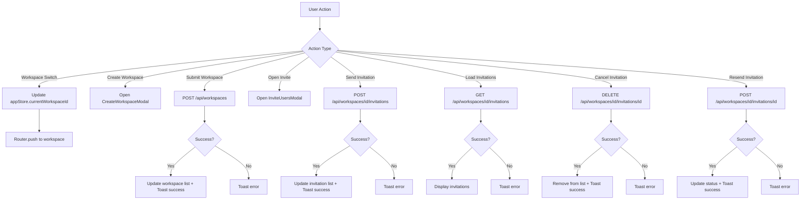
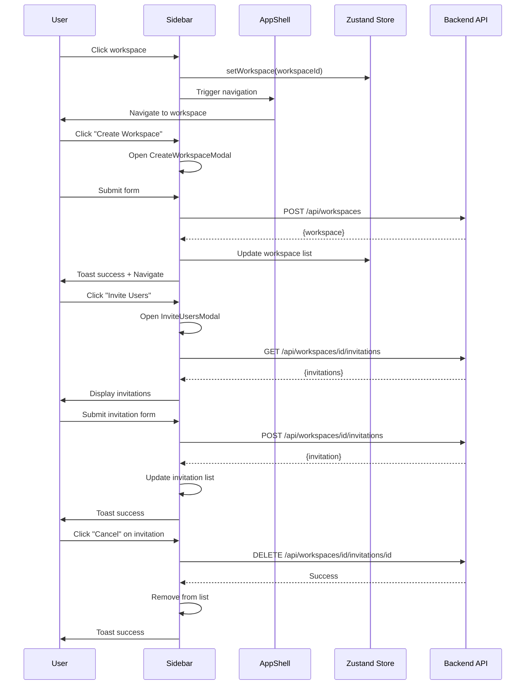

# Workspace Sidebar Implementation Plan

## Overview

This plan outlines the implementation of a feature-rich sidebar component for workspace management, including workspace creation, selection, and comprehensive member invitation workflows.

## Requirements Summary

1. **Dynamic Workspace List** - Render user's workspaces with active selection highlighting
2. **Instant Workspace Switching** - Seamless transition between workspaces
3. **Create Workspace** - Modal form to capture and submit workspace details
4. **Invite Users Workflow** - Full invitation management (send, view, resend, cancel, history)
5. **State Management** - Proper handling of component state and global app state
6. **Loading States** - Visual feedback during API calls
7. **Error Handling** - Graceful error handling for all user interactions

## Architecture

### Component Hierarchy

```
AppShell (Enhanced)
├── Sidebar (Enhanced)
│   ├── WorkspaceList
│   │   ├── WorkspaceItem (for each workspace)
│   │   └── CreateWorkspaceButton
│   ├── NavigationMenu (existing)
│   ├── NewPageButton (existing)
│   └── WorkspaceActions
│       ├── InviteUsersButton
│       └── ManageMembersButton
├── CreateWorkspaceModal (New)
├── InviteUsersModal (New)
│   ├── InvitationForm
│   └── InvitationsList
│       └── InvitationItem (for each invitation)
└── Toast (existing)
```

### State Management Flow



### Data Flow



## Component Specifications

### 1. WorkspaceList Component

**Purpose**: Display list of user's workspaces with active highlighting

**Props**:
```typescript
interface WorkspaceListProps {
  workspaces: Workspace[];
  currentWorkspaceId: string | null;
  onWorkspaceSelect: (workspaceId: string) => void;
  onCreateWorkspace: () => void;
  isLoading?: boolean;
}
```

**Features**:
- Display workspace icon/name with initials fallback
- Highlight active workspace with visual indicator
- Show loading state while fetching
- Empty state when no workspaces exist
- Hover effects for better UX
- Truncate long names with ellipsis

**State**:
- None (controlled component)

### 2. CreateWorkspaceModal Component

**Purpose**: Modal form for creating new workspaces

**Props**:
```typescript
interface CreateWorkspaceModalProps {
  isOpen: boolean;
  onClose: () => void;
  onSuccess: (workspace: Workspace) => void;
}
```

**Features**:
- Form fields: name, description (optional), icon (optional)
- Real-time validation
- Loading state during submission
- Error display with clear messages
- Success callback for parent to update state
- Keyboard shortcuts (Esc to close, Enter to submit)
- Focus management

**State**:
- `name`: string
- `description`: string
- `icon`: string
- `errors`: Record<string, string>
- `isSubmitting`: boolean

### 3. InviteUsersModal Component

**Purpose**: Modal for managing workspace invitations

**Props**:
```typescript
interface InviteUsersModalProps {
  isOpen: boolean;
  onClose: () => void;
  workspaceId: string;
  userRole: Role;
}
```

**Features**:
- Tabbed interface: "Send Invitation" | "Pending Invitations" | "History"
- Send Invitation form with email and role selection
- List of pending invitations with actions (resend, cancel)
- List of past invitations (accepted, declined, expired)
- Role-based permission checks
- Real-time validation
- Loading states for all operations

**State**:
- `activeTab`: 'send' | 'pending' | 'history'
- `email`: string
- `role`: Role
- `invitations`: Invitation[]
- `isLoadingInvitations`: boolean
- `isSending`: boolean
- `errors`: Record<string, string>

### 4. InvitationsList Component

**Purpose**: Display list of invitations with status and actions

**Props**:
```typescript
interface InvitationsListProps {
  invitations: Invitation[];
  status?: 'pending' | 'accepted' | 'declined' | 'expired' | 'all';
  onResend?: (invitationId: string) => void;
  onCancel?: (invitationId: string) => void;
  isLoading?: boolean;
  currentUserRole: Role;
}
```

**Features**:
- Filter by status
- Display invitation details (email, role, sender, date, status)
- Action buttons based on status and user permissions
- Status badges with color coding
- Loading skeleton
- Empty state

### 5. InvitationItem Component

**Purpose**: Individual invitation display with actions

**Props**:
```typescript
interface InvitationItemProps {
  invitation: Invitation;
  onResend?: () => void;
  onCancel?: () => void;
  currentUserRole: Role;
}
```

**Features**:
- Display email, role, sender info
- Status badge (pending/accepted/declined/expired)
- Expiration date display
- Action buttons (resend, cancel) based on permissions
- Loading state for actions

## API Integration

### Existing API Endpoints

1. **GET /api/workspaces** - Fetch user's workspaces
2. **POST /api/workspaces** - Create new workspace
3. **GET /api/workspaces/[id]/invitations** - Fetch workspace invitations
4. **POST /api/workspaces/[id]/invitations** - Send invitation
5. **DELETE /api/workspaces/[id]/invitations/[invitationId]** - Cancel invitation

### Additional API Needs

The existing API endpoints cover all required functionality. No new endpoints needed.

## Implementation Steps

### Phase 1: Core Components

1. **Create WorkspaceList Component**
   - Set up component structure
   - Implement workspace display with icons
   - Add active state highlighting
   - Add loading and empty states
   - Integrate with appStore for workspace switching

2. **Create CreateWorkspaceModal Component**
   - Set up modal structure
   - Implement form fields
   - Add validation logic
   - Integrate with workspace API
   - Add loading and error states
   - Handle success callback

3. **Create InviteUsersModal Component**
   - Set up modal with tabs
   - Implement invitation form
   - Add role selection dropdown
   - Integrate with invitation API
   - Add permission checks

4. **Create InvitationsList Component**
   - Set up list structure
   - Implement status filtering
   - Add invitation display
   - Add action buttons

5. **Create InvitationItem Component**
   - Set up item structure
   - Display invitation details
   - Add status badges
   - Implement action handlers

### Phase 2: AppShell Integration

6. **Enhance AppShell Sidebar**
   - Replace existing workspace section with WorkspaceList
   - Add WorkspaceActions section
   - Integrate CreateWorkspaceModal
   - Integrate InviteUsersModal
   - Update state management
   - Add toast notifications

7. **Add Workspace Fetching Logic**
   - Implement workspace fetching on mount
   - Add caching to avoid unnecessary requests
   - Handle workspace updates
   - Sync with appStore

8. **Add Loading States**
   - Add loading spinners for all async operations
   - Add skeleton screens for lists
   - Add disabled states for buttons during loading

9. **Add Error Handling**
   - Add try-catch for all API calls
   - Display user-friendly error messages
   - Add retry functionality where appropriate
   - Log errors for debugging

10. **Add Toast Notifications**
    - Success notifications for all operations
    - Error notifications with details
    - Auto-dismiss after timeout
    - Manual dismiss option

### Phase 3: Polish & Testing

11. **Add Accessibility**
    - ARIA labels for all interactive elements
    - Keyboard navigation support
    - Focus management for modals
    - Screen reader support

12. **Add Responsive Design**
    - Ensure sidebar works on mobile
    - Adjust modal sizes for different screens
    - Touch-friendly interactions

13. **Performance Optimization**
    - Memoize components where appropriate
    - Optimize re-renders
    - Lazy load modals if needed

14. **Testing**
    - Test all user flows
    - Test error scenarios
    - Test edge cases
    - Test with different user roles

## File Structure

```
src/
├── components/
│   ├── workspace/
│   │   ├── WorkspaceList.tsx (NEW)
│   │   ├── WorkspaceItem.tsx (NEW)
│   │   ├── CreateWorkspaceModal.tsx (NEW)
│   │   ├── InviteUsersModal.tsx (NEW)
│   │   ├── InvitationsList.tsx (NEW)
│   │   └── InvitationItem.tsx (NEW)
│   └── AppShell.tsx (MODIFIED)
```

## Key Design Decisions

### 1. Component Organization
- Keep workspace-related components in `src/components/workspace/`
- Maintain clear separation of concerns
- Reusable components where possible

### 2. State Management
- Use existing Zustand store for global state (currentWorkspaceId)
- Use local state for component-specific state
- Keep API calls in parent components for better control

### 3. Error Handling
- Display errors inline near the action
- Also show toast notifications for visibility
- Provide clear, actionable error messages

### 4. Loading States
- Show loading spinners for buttons
- Show skeleton screens for lists
- Disable interactions during loading

### 5. Permission Handling
- Check user permissions before showing actions
- Hide/disable features based on role
- Show appropriate messages for unauthorized actions

## Success Criteria

- [ ] Users can see all their workspaces in the sidebar
- [ ] Active workspace is clearly highlighted
- [ ] Users can switch between workspaces instantly
- [ ] Users can create new workspaces via modal
- [ ] Users with appropriate permissions can invite others
- [ ] Users can view pending invitations
- [ ] Users can resend invitations
- [ ] Users can cancel pending invitations
- [ ] Users can view invitation history
- [ ] All operations show loading states
- [ ] All errors are handled gracefully
- [ ] Success/error feedback is provided via toasts
- [ ] Component is responsive on mobile devices
- [ ] Keyboard navigation works properly
- [ ] ARIA labels are present for accessibility

## Dependencies

### Existing
- React (useState, useEffect, useRef, useMemo, useCallback)
- Next.js (useRouter, usePathname)
- Lucide React (icons)
- Zustand (state management)
- NextAuth (session management)

### No New Dependencies Required
All required functionality can be implemented with existing dependencies.

## Timeline Estimate

This is a complex feature that requires careful implementation. The work should be broken down into manageable iterations:

**Iteration 1**: Core workspace list and switching (2-3 components)
**Iteration 2**: Create workspace modal (1 component)
**Iteration 3**: Invitation modals and lists (3-4 components)
**Iteration 4**: AppShell integration and state management
**Iteration 5**: Error handling, loading states, and polish
**Iteration 6**: Testing and bug fixes

## Notes

- The existing WorkspaceSwitcher component can be used as a reference but will be replaced by the new WorkspaceList
- The existing invitation API is comprehensive and covers all needed functionality
- Permission checking should use the existing `checkWorkspacePermission` utility
- Email sending is already implemented (placeholder) in `src/lib/email.ts`
- The Toast component already exists and should be reused
